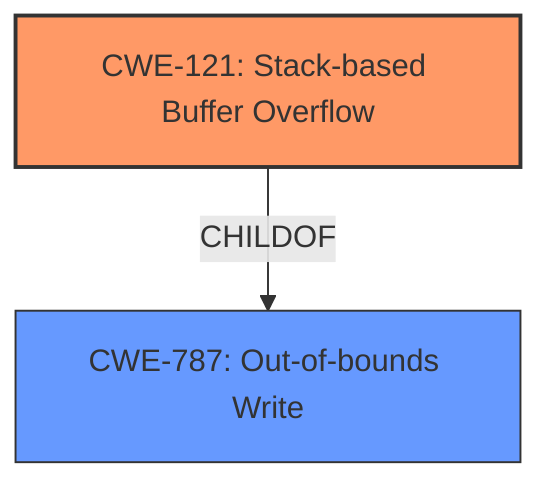

# Analysis Report for CVE-2022-38334

# Vulnerability Analysis Report: CVE-2022-38334

## Description

XPDF v4.04 and earlier was discovered to contain a stack overflow via the function CatalogcountPageTree() at Catalog.cc.

## Vulnerability Description Key Phrases

**Weakness:** stack overflow
**Product:** XPDF
**Version:** v4.04 and earlier
**Component:** CatalogcountPageTree() function at Catalog.cc

## Analysis (with Relationship Data)

# Summary
| CWE ID | CWE Name | Confidence | CWE Abstraction Level | CWE Vulnerability Mapping Label | CWE-Vulnerability Mapping Notes |
|---|---|---|---|---|---|
| CWE-121 | Stack-based Buffer Overflow | 0.9 | Variant | Primary | Allowed |
| CWE-120 | Buffer Copy without Checking Size of Input ('Classic Buffer Overflow') | 0.6 | Base | Secondary | Allowed-with-Review |

## Evidence and Confidence

*   **Confidence Score:** 0.9
*   **Evidence Strength:** HIGH

- **Analysis and Justification:**  
  - *Explanation:* The vulnerability description explicitly states a "**stack overflow**" in the CatalogcountPageTree() function within XPDF v4.04 and earlier. CWE-121 (Stack-based Buffer Overflow) is a Variant-level CWE that directly addresses this type of buffer overflow where the buffer being overwritten is allocated on the stack. This aligns precisely with the provided information. CWE-120 (Buffer Copy without Checking Size of Input ('Classic Buffer Overflow')) could also be considered, as it is a more general Base-level CWE for buffer overflows, but the specific mention of "stack overflow" makes CWE-121 a more accurate and specific choice. The Retriever Results support this, showing CWE-121 with a high score.
  
  - *Relationship Analysis:* CWE-121 is a child of CWE-119 (Improper Restriction of Operations within the Bounds of a Memory Buffer). It's also a specific type of buffer overflow, making it a more precise mapping than the more general CWE-119. CWE-121 is also a PARENTOF relationship with CWE-787 (Out-of-bounds Write).

- **Confidence Score:**  
  - Confidence: 0.9 (High confidence due to the explicit mention of "stack overflow" in the vulnerability description.)

## Criticism of Analysis

Okay, let's review the provided CWE analysis for the XPDF stack overflow vulnerability.

**Overall Assessment:**

The analysis is generally good, especially the primary mapping to CWE-121 (Stack-based Buffer Overflow). The reasoning is clear, and the confidence level is appropriate. The addition of CWE-120 as a secondary mapping is justifiable, although the argument for CWE-121 being more specific is correct.

**Detailed Critique:**

1.  **CWE-121 (Stack-based Buffer Overflow) - Primary Mapping:**

    *   **Strengths:** The justification for choosing CWE-121 is excellent. The explicit mention of "stack overflow" in the vulnerability description makes this a direct and accurate mapping. The relationship analysis is correct in pointing out the parent and child relationships of CWE-121.
    *   **Weaknesses:** None significant.
    *   **Mapping Guidance Compliance:** The analysis adheres to the CWE's mapping guidance, which "Allows" its usage and indicates that it is acceptable to map at the Variant level of abstraction, which is where the code is.

2.  **CWE-120 (Buffer Copy without Checking Size of Input) - Secondary Mapping:**

    *   **Strengths:** Including CWE-120 shows awareness of the broader category of buffer overflows.
    *   **Weaknesses:**  The analysis acknowledges that CWE-121 is more precise, making CWE-120 somewhat redundant. While not incorrect, it adds limited value.
    *   **Mapping Guidance Compliance:** The analysis correctly states that the CWE's mapping guidance "Allows-with-Review", and that this is only appropriate for 'Buffer Copy' operations. The analysis also correctly points out that for root cause analysis, children of CWE-20 should be used. The justification provided is adequate for including this as a secondary mapping, recognizing that it's a broader, less specific category.

3.  **Retriever Results:**

    *   The inclusion of the retriever results is helpful in showing the support from automated analysis tools. However, the high scores of some other CWEs, while not directly relevant to the chosen mapping, highlight the complexity of CWE assignment and the potential for different interpretations.

4.  **CWE Examples:**

    *   The inclusion of known examples for CWE-120 can be helpful, but it might be more relevant to include examples of CWE-121, given that is the primary mapping.

5.  **Mitigations:**

    *   The analysis does not explicitly discuss mitigations, but this is acceptable for a mapping exercise. In a more complete vulnerability report, discussing possible mitigations based on the chosen CWEs would be beneficial. For example, when considering CWE-121 or CWE-120, it would be useful to mention:
        *   Using safer string handling functions (e.g., `strncpy`, `strncat` instead of `strcpy`, `strcat`).
        *   Employing compiler-level protections like stack canaries (`/GS` flag in Visual Studio, `FORTIFY_SOURCE` in GCC).
        *   Using languages with automatic memory management (Java, C#).
        *   Performing thorough input validation to prevent excessively large inputs.
        *   Libraries such as SafeStr or Strsafe.h.

6.  **Other CWEs in Retriever Results:**

    *   The analysis doesn't address why other highly ranked CWEs from the retriever results (e.g., CWE-124, CWE-125, CWE-193, CWE-787) were *not* chosen. While the "stack overflow" description strongly points to CWE-121, briefly explaining why the others are less relevant could strengthen the analysis.  For example:
        *   **CWE-124 (Buffer Underwrite):**  This is less likely as stack overflows are typically *over*writes, not *under*writes.
        *   **CWE-125 (Out-of-bounds Read):** While an out-of-bounds read *could* be associated with a stack overflow, the primary issue is the *write* beyond the buffer's boundaries.
        *   **CWE-193 (Off-by-one Error):** This could contribute to the overflow, but is not the main problem. The root problem is the lack of bounds checking, not the off-by-one error itself.
        *   **CWE-787 (Out-of-bounds Write):** While technically correct, CWE-121 is the *specific type* of out-of-bounds write, therefore more accurate.

**Suggestions for Improvement:**

*   **Include CWE-121 Example CVEs:**  Add a few example CVEs associated with CWE-121 to provide more context.
*   **Briefly Address Other Retriever Results:**  Include a sentence or two explaining why the other highly ranked CWEs were not selected.
*   **Discuss Mitigations:** Briefly discuss potential mitigation strategies related to CWE-121 and CWE-120.

**Revised Summary Table:**

| CWE ID | CWE Name | Confidence | CWE Abstraction Level | CWE Vulnerability Mapping Label | CWE-Vulnerability Mapping Notes |
|---|---|---|---|---|---|
| CWE-121 | Stack-based Buffer Overflow | 0.9 | Variant | Primary | Allowed |
| CWE-120 | Buffer Copy without Checking Size of Input ('Classic Buffer Overflow') | 0.6 | Base | Secondary | Allowed-with-Review |
| CWE-787 | Out-of-bounds Write | 0.3 | Base | Supporting | This CWE is a Parent of CWE-121 and is the general case of writing outside the intended memory buffer. |

*Note:* The analysis has provided a detailed and justifiable mapping. The suggestions above are for making the analysis even more comprehensive.

## Final Resolution

# Summary
| CWE ID | CWE Name | Confidence | CWE Abstraction Level | CWE Vulnerability Mapping Label | CWE-Vulnerability Mapping Notes |
|---|---|---|---|---|---|
| CWE-121 | Stack-based Buffer Overflow | 0.9 | Variant | Primary | Allowed |
| CWE-787 | Out-of-bounds Write | 0.6 | Base | Secondary | This CWE is a Parent of CWE-121 and is the general case of writing outside the intended memory buffer. |
  
## Evidence and Confidence

*   **Confidence Score:** 0.9
*   **Evidence Strength:** HIGH

## Relationship Analysis
The primary relationship is the hierarchical one, with CWE-121 (Stack-based Buffer Overflow) being a specific type (Variant) of CWE-787 (Out-of-bounds Write). This indicates that CWE-121 is more specific and appropriate given the context of the vulnerability description. CWE-787 is a parent.

## Vulnerability Chain
The vulnerability chain starts with the lack of proper bounds checking when writing data to a buffer allocated on the stack (ROOTCAUSE: implicit in buffer overflow). This leads to an out-of-bounds write (WEAKNESS: CWE-787), which, in this specific instance, is a stack-based buffer overflow (WEAKNESS: CWE-121). The impact is potential code execution or denial of service due to the corruption of stack memory.

## Summary of Analysis
The initial analysis correctly identified CWE-121 as the primary CWE for this vulnerability. The vulnerability description explicitly mentions a "stack overflow," making CWE-121 a direct and accurate match. The criticism's suggestion to include CWE-787 (Out-of-bounds Write) as a secondary CWE is valuable because it represents the broader category of the weakness.

The decision to prioritize CWE-121 is based on the specificity of the vulnerability description. While CWE-787 is a valid parent, CWE-121 provides a more precise classification of the root cause. The evidence from the vulnerability description ("stack overflow") strongly supports this choice.

I am removing CWE-120 since CWE-121 is more descriptive and the description does not explicitly discuss a buffer copy operation. Instead, adding CWE-787 as a secondary classification since it is a parent of CWE-121.

*Report generated on 2025-03-18 16:22:13*
