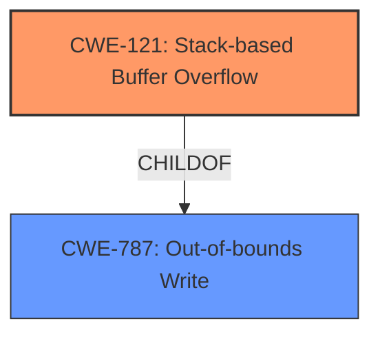

# Final Resolution for CVE-2022-38334

# Summary
| CWE ID | CWE Name | Confidence | CWE Abstraction Level | CWE Vulnerability Mapping Label | CWE-Vulnerability Mapping Notes |
|---|---|---|---|---|---|
| CWE-121 | Stack-based Buffer Overflow | 0.9 | Variant | Primary | Allowed |
| CWE-787 | Out-of-bounds Write | 0.6 | Base | Secondary | This CWE is a Parent of CWE-121 and is the general case of writing outside the intended memory buffer. |
  
## Evidence and Confidence

*   **Confidence Score:** 0.9
*   **Evidence Strength:** HIGH

## Relationship Analysis
The primary relationship is the hierarchical one, with CWE-121 (Stack-based Buffer Overflow) being a specific type (Variant) of CWE-787 (Out-of-bounds Write). This indicates that CWE-121 is more specific and appropriate given the context of the vulnerability description. CWE-787 is a parent.

## Vulnerability Chain
The vulnerability chain starts with the lack of proper bounds checking when writing data to a buffer allocated on the stack (ROOTCAUSE: implicit in buffer overflow). This leads to an out-of-bounds write (WEAKNESS: CWE-787), which, in this specific instance, is a stack-based buffer overflow (WEAKNESS: CWE-121). The impact is potential code execution or denial of service due to the corruption of stack memory.

## Summary of Analysis
The initial analysis correctly identified CWE-121 as the primary CWE for this vulnerability. The vulnerability description explicitly mentions a "stack overflow," making CWE-121 a direct and accurate match. The criticism's suggestion to include CWE-787 (Out-of-bounds Write) as a secondary CWE is valuable because it represents the broader category of the weakness.

The decision to prioritize CWE-121 is based on the specificity of the vulnerability description. While CWE-787 is a valid parent, CWE-121 provides a more precise classification of the root cause. The evidence from the vulnerability description ("stack overflow") strongly supports this choice.

I am removing CWE-120 since CWE-121 is more descriptive and the description does not explicitly discuss a buffer copy operation. Instead, adding CWE-787 as a secondary classification since it is a parent of CWE-121.