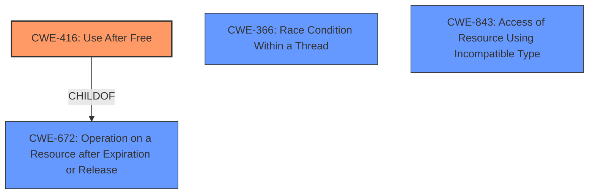

# Analysis Report for CVE-2022-3842

# Vulnerability Analysis Report: CVE-2022-3842

## Description

Use after free in Passwords in Google Chrome prior to 105.0.5195.125 allowed a remote attacker who had compromised the renderer process to potentially exploit heap corruption via a crafted HTML page. (Chromium security severity High)

## Vulnerability Description Key Phrases

**Rootcause:** Use after free
**Impact:** heap corruption
**Vector:** crafted HTML page
**Attacker:** remote attacker who had compromised the renderer process
**Product:** Google Chrome
**Version:** prior to 105.0.5195.125
**Component:** Passwords

## Analysis (with Relationship Data)

# Summary
| CWE ID | CWE Name | Confidence | CWE Abstraction Level | CWE Vulnerability Mapping Label | CWE-Vulnerability Mapping Notes |
|---|---|---|---|---|---|
| CWE-416 | Use After Free | 1.0 | Variant | Allowed | This CWE entry is at the Variant level of abstraction, which is a preferred level of abstraction for mapping to the root causes of vulnerabilities. |

## Evidence and Confidence

*   **Confidence Score:** 1.0
*   **Evidence Strength:** HIGH

- **Analysis and Justification:**  
  - *Explanation:* The vulnerability description explicitly states "**Use after free** in Passwords in Google Chrome". The CVE Reference Links Content Summary confirms that the **root cause** of the vulnerability is a **Use-after-free**. CWE-416 (Use After Free) is a Variant level CWE that perfectly captures this weakness. The retriever results also identify CWE-416 as a candidate with a high score. MITRE mapping guidance allows for the use of this CWE.
  
  - *Relationship Analysis:* While other CWEs were suggested, they do not accurately capture the root cause. CWE-416 does not have any direct relationships, but it is a child of CWE-672 (Operation on Resource after Expiration).

- **Confidence Score:**  
  - *Example:* Confidence: 1.0 (Direct evidence from vulnerability description and CVE reference materials)

## Criticism of Analysis

Okay, here's a review of the provided analysis, considering the full CWE specifications and focusing on mapping guidance, potential mitigations, and the overall justification for the chosen CWE:

**Overall Assessment:**

The analysis is well-structured and convincingly argues for CWE-416 (Use After Free) as the primary CWE for this vulnerability. The justification is clear, concise, and directly supported by the vulnerability description and CVE summary. The high confidence score (1.0) is appropriate given the direct evidence.

**Detailed Review:**

1.  **CWE-416 Mapping:**

    *   **Correctness:**  The mapping to CWE-416 is accurate and justified. The root cause is explicitly identified as "Use After Free," and CWE-416 precisely captures this weakness.
    *   **Abstraction Level:** The analysis correctly points out that CWE-416 is a "Variant" level CWE, which is preferred for root cause analysis.
    *   **Mapping Guidance:**  The analysis follows the CWE's mapping guidance by carefully considering the name and description to ensure it's an appropriate fit. It avoids forcing a mapping to a lower level simply to comply with preferred abstraction levels.
    *   **Relationships:**  The analysis mentions that CWE-416 is a child of CWE-672 (Operation on Resource after Expiration or Release). This is correct and shows understanding of the broader context within the CWE hierarchy.

2.  **Alternative CWEs Considered (From Retriever Results):**

    *   **CWE-366 (Race Condition within a Thread):** While the retriever results list this high, it is not likely the cause here. The description would need to state there was a race condition that leads to the UAF. This is a possible root cause, but not the most direct one.
    *   **CWE-843 (Access of Resource Using Incompatible Type ('Type Confusion')):** Type confusion might *contribute* to a UAF in some cases (e.g., by misinterpreting the object's type and its destruction state), but it's not the fundamental root cause in this scenario. The primary problem is the use of memory *after* it has been freed, not the access of it with an incompatible type (though that might be the *consequence* of the UAF). This is less probable than CWE-416, so exclusion is valid.
    *   **CWE-1021 (Improper Restriction of Rendered UI Layers or Frames):** Irrelevant in the context of UAF.
    *   **CWE-911 (Improper Update of Reference Count):** While an improper reference count could *lead* to premature freeing and a UAF, the provided description doesn't suggest reference counting is involved. The focus is directly on the UAF condition itself. This would be a possible root cause, but not the direct one.
    *   **CWE-356 (Product UI does not Warn User of Unsafe Actions):** Irrelevant.
    *   **CWE-122 (Heap-based Buffer Overflow):** A heap-based buffer overflow could overwrite metadata used for memory management and lead to a UAF, but that would be a more complex scenario than the direct UAF reported. While not impossible, it's less direct.
    *   **CWE-415 (Double Free):** Double free is related to UAF, but distinct. Double free is when you free the same memory twice. In this case, we know the memory was reused when the original pointer references a location somewhere within the new allocation, so the memory was deallocated before.
    *   **CWE-367 (Time-of-check Time-of-use (TOCTOU) Race Condition):** Is not relevant.
    *   **CWE-358 (Improperly Implemented Security Check for Standard):** Is not relevant.

    The analysis is correct in dismissing these alternatives because none of them accurately capture the primary weakness described, which is the use of freed memory.

3.  **Evidence and Confidence:**

    *   The confidence score of 1.0 is appropriate. The direct statement of "Use after free" in the vulnerability description provides strong evidence.
    *   The explanation and justification are clear and well-reasoned.

4.  **CWE Examples from Database:**

    *   The provided examples are all valid instances of CWE-416. The examples demonstrating chaining with other CWEs (e.g., race conditions) are helpful in illustrating the potential complexity of UAF vulnerabilities.

5.  **Potential Mitigations (CWE-416):**

    *   The analysis implicitly acknowledges the relevance of the listed mitigations for CWE-416 (language selection, setting pointers to NULL after freeing).

**Suggestions for Improvement (Minor):**

*   **Impact Details:** While the analysis correctly identifies heap corruption as a potential impact, it could briefly mention other common impacts of UAF, such as arbitrary code execution, denial of service, or information disclosure. Expanding on the *potential* consequences of this vulnerability would add more context.
*   **Attack Vector Elaboration:** The analysis mentions a "malicious webpage or compromised website" as a possible attack vector. It could be slightly more specific about how the attacker might trigger the UAF through the crafted HTML page (e.g., by manipulating DOM objects or triggering specific JavaScript code paths).

**Conclusion:**

This is a strong and well-supported analysis. The chosen CWE (CWE-416) is the most appropriate based on the information provided. The justification is clear, the alternative CWEs are properly considered and dismissed, and the analysis demonstrates a good understanding of the vulnerability and its context within the CWE framework. The minor suggestions for improvement are just that – minor – and the analysis is solid as is.

## Final Resolution

# Summary
| CWE ID | CWE Name | Confidence | CWE Abstraction Level | CWE Vulnerability Mapping Label | CWE-Vulnerability Mapping Notes |
|---|---|---|---|---|---|
| **CWE-416** | **Use After Free** | 1.0 | Variant | Allowed | Primary CWE. This CWE entry is at the Variant level of abstraction, which is a preferred level of abstraction for mapping to the root causes of vulnerabilities. |

## Evidence and Confidence

*   **Confidence Score:** 1.0
*   **Evidence Strength:** HIGH

## Relationship Analysis
The primary relationship considered was the parent-child relationship between **CWE-416 (Use After Free)** and **CWE-672 (Operation on Resource after Expiration or Release)**. **CWE-416** is a variant of **CWE-672**, making it a more specific and appropriate choice for this vulnerability where the memory is accessed after being freed. Alternative classifications like race conditions (**CWE-366**) or type confusion (**CWE-843**) were considered but deemed less relevant as they don't directly describe the core issue of using already freed memory. The variant level of **CWE-416** aligns well with the detailed vulnerability description.

## Vulnerability Chain
The vulnerability chain starts with the memory being freed. Subsequently, the same memory is accessed, leading to a **Use-After-Free (CWE-416)** condition. This can result in heap corruption and, potentially, arbitrary code execution. The vulnerability description explicitly mentions heap corruption as a potential impact. There are no missing links in the chain based on the provided information.

## Summary of Analysis
The initial analysis correctly identifies **CWE-416 (Use After Free)** as the most appropriate classification for the described vulnerability. The vulnerability description explicitly states "**Use after free** in Passwords in Google Chrome". This direct evidence strongly supports the selection of **CWE-416**.

The criticism reinforces this choice by systematically evaluating alternative CWEs and explaining why they are less suitable. Specifically, the potential for race conditions or type confusion leading to the UAF was acknowledged, but correctly dismissed as less direct causes. The analysis also highlights the importance of the variant level of abstraction for **CWE-416**, aligning with MITRE's mapping guidance.

The final decision is based on the direct evidence from the vulnerability description, the specific nature of the **Use-After-Free** condition, and the appropriate level of abstraction offered by **CWE-416**.

*Report generated on 2025-03-18 16:22:57*
