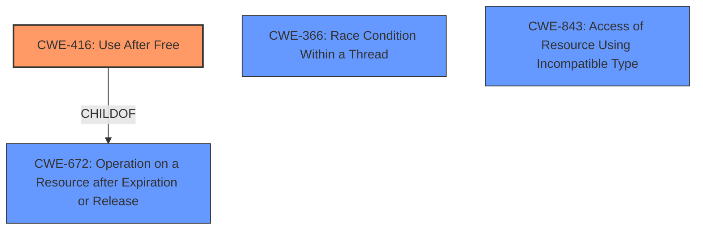

# Final Resolution for CVE-2022-3842

# Summary
| CWE ID | CWE Name | Confidence | CWE Abstraction Level | CWE Vulnerability Mapping Label | CWE-Vulnerability Mapping Notes |
|---|---|---|---|---|---|
| **CWE-416** | **Use After Free** | 1.0 | Variant | Allowed | Primary CWE. This CWE entry is at the Variant level of abstraction, which is a preferred level of abstraction for mapping to the root causes of vulnerabilities. |

## Evidence and Confidence

*   **Confidence Score:** 1.0
*   **Evidence Strength:** HIGH

## Relationship Analysis
The primary relationship considered was the parent-child relationship between **CWE-416 (Use After Free)** and **CWE-672 (Operation on Resource after Expiration or Release)**. **CWE-416** is a variant of **CWE-672**, making it a more specific and appropriate choice for this vulnerability where the memory is accessed after being freed. Alternative classifications like race conditions (**CWE-366**) or type confusion (**CWE-843**) were considered but deemed less relevant as they don't directly describe the core issue of using already freed memory. The variant level of **CWE-416** aligns well with the detailed vulnerability description.

## Vulnerability Chain
The vulnerability chain starts with the memory being freed. Subsequently, the same memory is accessed, leading to a **Use-After-Free (CWE-416)** condition. This can result in heap corruption and, potentially, arbitrary code execution. The vulnerability description explicitly mentions heap corruption as a potential impact. There are no missing links in the chain based on the provided information.

## Summary of Analysis
The initial analysis correctly identifies **CWE-416 (Use After Free)** as the most appropriate classification for the described vulnerability. The vulnerability description explicitly states "**Use after free** in Passwords in Google Chrome". This direct evidence strongly supports the selection of **CWE-416**.

The criticism reinforces this choice by systematically evaluating alternative CWEs and explaining why they are less suitable. Specifically, the potential for race conditions or type confusion leading to the UAF was acknowledged, but correctly dismissed as less direct causes. The analysis also highlights the importance of the variant level of abstraction for **CWE-416**, aligning with MITRE's mapping guidance.

The final decision is based on the direct evidence from the vulnerability description, the specific nature of the **Use-After-Free** condition, and the appropriate level of abstraction offered by **CWE-416**.