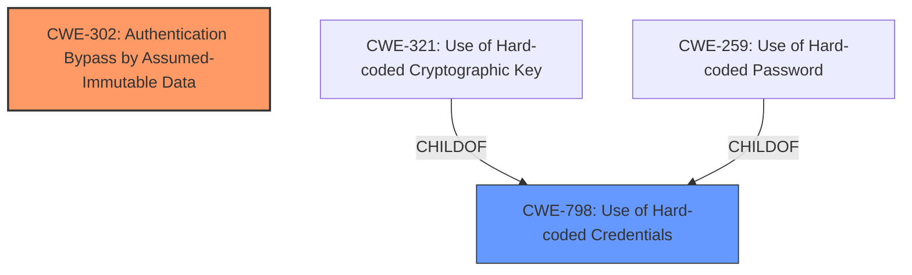

# Final Resolution for CVE-2022-3875

# Summary

| CWE ID | CWE Name | Confidence | CWE Abstraction Level | CWE Vulnerability Mapping Label | CWE-Vulnerability Mapping Notes |
|---|---|---|---|---|---|
| CWE-302 | Authentication Bypass by Assumed-Immutable Data | 0.95 | Base | Primary | Allowed |
| CWE-798 | Use of Hard-coded Credentials | 0.85 | Base | Secondary | Allowed |

## Evidence and Confidence

*   **Confidence Score:** 0.93
*   **Evidence Strength:** HIGH

## Relationship Analysis
The primary **weakness** is correctly identified as CWE-302, which is a Base level CWE. CWE-798 is selected as a secondary **weakness** because the use of a hard-coded key directly enables the authentication bypass. Although CWE-798 has children like CWE-321 and CWE-259, the description is more general than a key or password and thus is most applicable.

## Vulnerability Chain
The vulnerability chain starts with the use of a **hard-coded cryptographic key** (CWE-798). This key is used in conjunction with user-controlled data (username) to generate an authentication token. The system incorrectly assumes that the username is immutable, which allows an attacker to modify the username and forge a valid token, leading to **authentication bypass** (CWE-302).

## Summary of Analysis
The initial analysis correctly identifies the primary and secondary CWEs. The vulnerability description explicitly mentions the "authentication bypass by assumed-immutable data," directly aligning with CWE-302. The CVE reference summary provides additional evidence, stating that the API relies on a token generated with a hardcoded key. The criticism is valid in that it highlights alternative CWEs but correctly concludes that CWE-302 and CWE-798 are the most appropriate. The final decision is to keep CWE-302 as the primary CWE with high confidence (0.95). The confidence score for CWE-798 is increased to 0.85 to reflect the enhanced understanding of its contribution to the vulnerability chain. The selected CWEs are at the optimal level of specificity, balancing precision and generality.