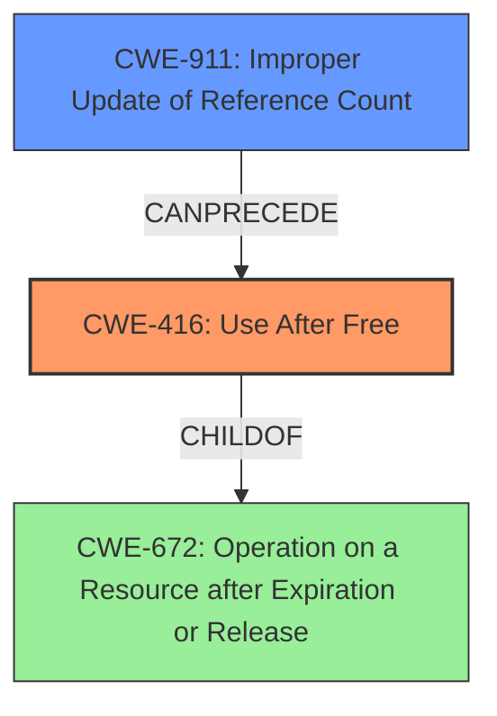

# Analysis Report for CVE-2022-3886

# Vulnerability Analysis Report: CVE-2022-3886

## Description

Use after free in Speech Recognition in Google Chrome prior to 107.0.5304.106 allowed a remote attacker to potentially exploit heap corruption via a crafted HTML page. (Chromium security severity High)

## Vulnerability Description Key Phrases

**Rootcause:** Use after free
**Impact:** heap corruption
**Vector:** crafted HTML page
**Attacker:** remote attacker
**Product:** Google Chrome
**Version:** prior to 107.0.5304.106
**Component:** Speech Recognition

## Analysis (with Relationship Data)

# Summary
| CWE ID | CWE Name | Confidence | CWE Abstraction Level | CWE Vulnerability Mapping Label | CWE-Vulnerability Mapping Notes |
|---|---|---|---|---|---|
| CWE-416 | Use After Free | 1.0 | Variant | Primary | Allowed |

## Evidence and Confidence

*   **Confidence Score:** 1.0
*   **Evidence Strength:** HIGH

- **Analysis and Justification:**
  - *Explanation:* The vulnerability description clearly states "**Use after free** in Speech Recognition in Google Chrome". The CVE Reference Links Content Summary reinforces this by stating: "The root cause is a **use-after-free vulnerability**" and "Use-after-free vulnerability in the Speech Recognition component of Chrome." The Retriever Results also lists CWE-416 as the top candidate with the highest score. CWE-416 (Use After Free) is a Variant level CWE, which is the preferred level of abstraction. The "Usage: Allowed" mapping guidance from MITRE further validates this choice.
  
  - *Relationship Analysis:* CWE-416 is a variant of CWE-672 (Operation on a Resource after Expiry). This indicates a hierarchical relationship where CWE-416 is a specific type of resource expiry issue. The relationship analysis also shows that CWE-416 can precede other CWEs like CWE-754 (Improper Check for Unusual or Exceptional Conditions).

- **Confidence Score:**
  - Confidence: 1.0 (Strong evidence from the vulnerability description, CVE summary, and Retriever results.)

## Criticism of Analysis

## Critique of the Analysis

Overall, the analysis is very strong and well-justified. The primary CWE mapping to CWE-416 (Use After Free) is accurate and well-supported by the evidence. The confidence score of 1.0 is appropriate. Here's a more detailed breakdown:

**Strengths:**

*   **Accurate CWE Mapping:** The selection of CWE-416 is clearly the most accurate based on the vulnerability description. The analysis correctly notes the key phrase "Use after free" in the vulnerability description and reinforces it using the CVE summary.
*   **Justification:** The justification is thorough and clearly explains why CWE-416 is the best fit, using evidence from the vulnerability description, CVE summary, and Retriever results. It also considers the abstraction level.
*   **Variant Level Abstraction:** The analysis correctly identifies CWE-416 as a Variant level CWE, which is the preferred level of abstraction according to MITRE's mapping guidance.
*   **Relationship Analysis:** The analysis includes relevant relationships to other CWEs, including parent and child relationships, and also 'CanPrecede' and 'CanFollow' relationships. This demonstrates a deeper understanding of the context of the vulnerability.
*   **CWE Examples:** The inclusion of known examples for CWE-416 is helpful in further illustrating the nature of the vulnerability.
*   **MITRE Mapping Guidance:** The analysis explicitly mentions the MITRE "Usage: Allowed" mapping guidance for CWE-416, demonstrating awareness of the official recommendations.
*   **Mitigation Awareness:** The analysis includes potential mitigations, demonstrating a practical understanding of how to address the vulnerability.

**Areas for Potential Improvement (Minor):**

*   **Secondary CWEs:** While CWE-416 is the primary weakness, consider exploring a secondary CWE to capture the *cause* of the Use-After-Free. The Retriever Results suggest several possibilities:
    *   **CWE-362 / CWE-366 (Race Condition):** If the UAF is due to a race condition where a resource is freed by one thread while another thread is still using it, then these CWEs are relevant. The provided examples in the CWE specifications of CWE-366 and CWE-416 show a linked relationship. CVE-2021-0920, CVE-2020-6819, and CVE-2022-2621 in the "Observed Examples" for CWE-416 support this. However, the description does not explicitly mention threading or concurrency.
    *   **CWE-754 (Improper Check for Unusual or Exceptional Conditions):** If the UAF is due to a failure to check the validity of a pointer before dereferencing it *after* it has been freed, then this CWE could be considered. However, it's often a more general category and might not add much specific value.  This would describe the *symptom* instead of the cause.
    *   **CWE-911 (Improper Update of Reference Count):** This is highly relevant if the Speech Recognition component manages memory using reference counting and the bug is that the reference count is incorrectly decremented, leading to premature freeing.
*   **Attack Vector Specificity:** The attack vector description could be slightly more specific. While "crafted HTML page" is accurate, elaborating on what aspects of the HTML page trigger the vulnerability would strengthen the analysis. For example, does the HTML page manipulate the Speech Recognition API in a specific way to cause the UAF?
*   **Mitigation Specificity:** While the analysis mentions mitigations, they are quite general. Tailoring the mitigations to the specific context of the Speech Recognition component would be more helpful. For example, if reference counting is used, the mitigation should focus on ensuring accurate reference counting.

**Specific CWE Considerations:**

*   **CWE-416 (Use After Free):** The analysis is excellent. The inclusion of observed examples and potential mitigations related to language selection (automatic memory management) and setting pointers to NULL after freeing are directly relevant.
*   **CWE-843 (Type Confusion):** While the retriever results list this, it is unlikely to be directly relevant. UAF is usually about memory being freed, not about incorrect typing, although type confusion *could* be a contributing factor if it leads to incorrect resource management.
*   **CWE-366 (Race Condition):**  The analysis should delve deeper into whether concurrency is involved. If so, the mitigations related to locking and synchronization primitives would be highly relevant.
*   **CWE-415 (Double Free):** This is a distinct issue from UAF. While it *could* theoretically occur in the same system, it's unlikely to be directly related to the UAF without more information.
*   **CWE-911 (Improper Update of Reference Count):**  If reference counting is involved, this is a STRONG candidate for a secondary CWE. The mitigation related to ensuring accurate reference counting is critical.
*   **CWE-356 (Product UI does not Warn User of Unsafe Actions) and CWE-451 (User Interface (UI) Misrepresentation of Critical Information):** These are less likely to be relevant unless the Speech Recognition functionality has UI elements that mislead the user about the safety of the process.
*   **CWE-122 (Heap-based Buffer Overflow):** While heap corruption is mentioned as an *impact*, the root cause is UAF, not a direct buffer overflow. UAF can *lead* to heap corruption, but CWE-122 is not the primary issue.
*   **CWE-367 (TOCTOU Race Condition) and CWE-362 (Concurrent Execution using Shared Resource with Improper Synchronization ('Race Condition')):** Similar to CWE-366, these are only relevant if concurrency and timing issues are directly involved in *causing* the UAF.
*   **CWE-672 (Operation on a Resource after Expiration or Release):**  While CWE-416 is a child of this, using CWE-672 would be too abstract.  CWE-416 is the more specific and appropriate choice.
*   **CWE-754 (Improper Check for Unusual or Exceptional Conditions):** This is a broad category and could be considered, but it's not as specific as other options and may not add much value. The analysis should focus on the *specific* conditions that are not being checked.
*   **CWE-413 (Improper Resource Locking):** This applies if the resource being freed is protected by a lock and the lock is either not held when freeing, or held improperly (e.g. incorrect scope, improper type of lock).

**Revised Summary Table (Example with Secondary CWE):**

| CWE ID | CWE Name | Confidence | CWE Abstraction Level | CWE Vulnerability Mapping Label | CWE-Vulnerability Mapping Notes |
|---|---|---|---|---|---|
| CWE-416 | Use After Free | 1.0 | Variant | Primary | Allowed |
| CWE-911 | Improper Update of Reference Count | 0.7 | Base | Secondary | Allowed |  If reference counting is used; otherwise, N/A |

**In conclusion,** this is a high-quality analysis. Addressing the minor points above, particularly investigating the possibility of a contributing factor like CWE-911 (if relevant) and providing more specific mitigation recommendations, would make it even stronger.

## Final Resolution

# Summary
| CWE ID | CWE Name | Confidence | CWE Abstraction Level | CWE Vulnerability Mapping Label | CWE-Vulnerability Mapping Notes |
|---|---|---|---|---|---|
| **CWE-416** | **Use After Free** | 1.0 | Variant | Primary | Allowed |
| **CWE-911** | **Improper Update of Reference Count** | 0.6 | Base | Secondary | Allowed |

## Evidence and Confidence

*   **Confidence Score:** 0.9
*   **Evidence Strength:** MEDIUM

## Relationship Analysis
The primary relationship influencing the decision is the potential for **CWE-911 (Improper Update of Reference Count)** to *cause* **CWE-416 (Use After Free)**. While the initial analysis focused solely on the **Use After Free** condition, the critique highlighted the importance of identifying the root cause. If the Speech Recognition component uses reference counting, an improper update could lead to premature freeing of memory, resulting in the **CWE-416 (Use After Free)**. **CWE-416** is a variant of **CWE-672 (Operation on a Resource after Expiration or Release)**.

## Vulnerability Chain
The vulnerability chain starts with a potential **ROOTCAUSE** of **CWE-911 (Improper Update of Reference Count)**, which then leads to the **WEAKNESS** of **CWE-416 (Use After Free)**. The consequence is that a remote attacker can potentially exploit heap corruption via a crafted HTML page, as stated in the vulnerability description. A missing link is the confirmation that the Speech Recognition component utilizes reference counting for memory management.

## Summary of Analysis
The initial analysis correctly identified **CWE-416 (Use After Free)** as the primary **WEAKNESS**. The criticism suggested exploring potential root causes, particularly **CWE-911 (Improper Update of Reference Count)**, if reference counting is used. The evidence provided in the vulnerability description is: "Use after free in Speech Recognition in Google Chrome prior to 107.0.5304.106 allowed a remote attacker to potentially exploit heap corruption via a crafted HTML page."

The graph relationships influenced the final selection by highlighting the potential chain of events, from **ROOTCAUSE** to **WEAKNESS**. The selection of **CWE-416 (Use After Free)** remains the most appropriate primary classification due to the explicit mention of "use after free" in the vulnerability description. However, based on the critique, **CWE-911 (Improper Update of Reference Count)** is included as a secondary classification with a slightly lower confidence score (0.6) due to the missing confirmation of reference counting usage. If there was explicit information about reference counting, the confidence score would be higher.

The selected CWEs are at the optimal level of specificity. **CWE-416 (Use After Free)** is a Variant, and **CWE-911 (Improper Update of Reference Count)** is a Base CWE, both preferred levels of abstraction.

*Report generated on 2025-03-18 16:26:01*
