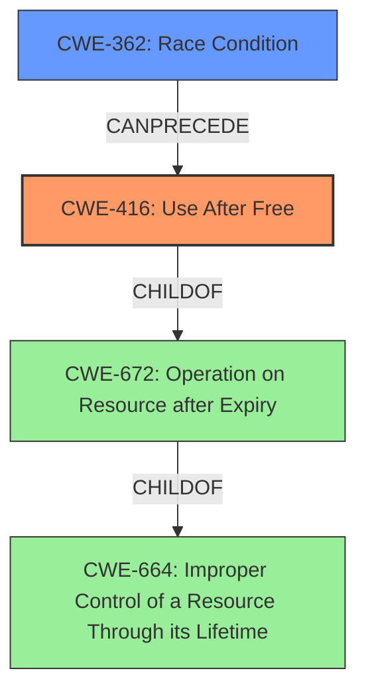

# Analysis Report for CVE-2022-3887

# Vulnerability Analysis Report: CVE-2022-3887

## Description

Use after free in Web Workers in Google Chrome prior to 107.0.5304.106 allowed a remote attacker to potentially exploit heap corruption via a crafted HTML page. (Chromium security severity High)

## Vulnerability Description Key Phrases

**Rootcause:** use after free
**Impact:** heap corruption
**Vector:** crafted HTML page
**Attacker:** remote attacker
**Product:** Google Chrome
**Version:** prior to 107.0.5304.106
**Component:** Web Workers

## Analysis (with Relationship Data)

# Summary
| CWE ID | CWE Name | Confidence | CWE Abstraction Level | CWE Vulnerability Mapping Label | CWE-Vulnerability Mapping Notes |
|---|---|---|---|---|---|
| CWE-416 | Use After Free | 1.0 | Variant | Primary | Allowed |

## Evidence and Confidence

*   **Confidence Score:** 1.0
*   **Evidence Strength:** HIGH

- **Analysis and Justification:**  
  - *Explanation:* The vulnerability description clearly states that the **rootcause** is a **use after free** in Web Workers in Google Chrome. The CVE Reference Links Content Summary confirms this, explicitly stating "The vulnerability is a **use-after-free** error." and "This occurs when a program attempts to access memory that has already been freed, potentially leading to unpredictable behavior or corruption." CWE-416 (Use After Free) is a Variant-level CWE that directly addresses this type of vulnerability. The MITRE mapping guidance for CWE-416 indicates that its usage is ALLOWED. Therefore, CWE-416 is the most appropriate CWE for this vulnerability.

  - *Relationship Analysis:* CWE-416 is a variant of CWE-672 (Operation on Resource after Expiry), which is in turn a child of CWE-664 (Improper Control of a Resource Through its Lifetime). While these parent classes are relevant, CWE-416 provides the most specific and accurate classification for this vulnerability.

- **Confidence Score:**  
  - *Example:* Confidence: 1.0 (Direct evidence from the vulnerability description and CVE reference materials)

## Criticism of Analysis

Okay, here's a critique of the provided CWE analysis, considering the full CWE specifications.

**Overall Assessment:**

The analysis is generally strong and correctly identifies `CWE-416: Use After Free` as the primary weakness. The justification is well-reasoned and supported by the vulnerability description and content summary. The confidence score of 1.0 is appropriate. The analysis also considers related CWEs and explains why they are not the primary weakness, which demonstrates a good understanding of the CWE hierarchy.

**Specific Points:**

*   **Correct Primary Mapping:** The choice of `CWE-416` is accurate. The description directly mentions "use-after-free," making it the most specific and relevant CWE. The Mapping Guidance for `CWE-416` explicitly states that its usage is "Allowed" at the Variant level.
*   **Justification Clarity:** The explanation clearly connects the vulnerability description ("use after free") to the definition of `CWE-416`. It highlights the key phrases and the relevance of the MITRE mapping guidance.
*   **Relationship Analysis:** The analysis thoughtfully considers `CWE-672` (Operation on a Resource after Expiration or Release) and `CWE-664` (Improper Control of a Resource Through its Lifetime). It correctly identifies them as parent classes but explains why `CWE-416` is more specific.
*   **Confidence Score:** The confidence score of 1.0 is appropriate because the vulnerability description and content summary directly state that the root cause is a use-after-free error.
*   **CWE Examples:** The inclusion of known examples for both `CWE-664` and `CWE-416` is helpful for understanding the broader context of these weaknesses and how they have been applied to other CVEs.
*   **Relevant CWE Specifications:** The relevant CWE specifications provide further context and rationale for the mapping and also discuss potential mitigations.

**Areas for Potential Improvement (Minor):**

*   **Exploration of Chaining (Optional):** While the analysis correctly identifies `CWE-416` as the primary weakness, it might be useful to briefly explore potential *preceding* CWEs that *could* contribute to the use-after-free condition. For example, a race condition (`CWE-362`) or improper resource locking (`CWE-413`) might lead to a use-after-free. This is not strictly necessary but would add depth to the analysis. If the use-after-free is due to a race condition, a chain like `CWE-362 -> CWE-416` could be considered. If due to improper locking, then `CWE-413 -> CWE-416`.
*   **Mitigation Context:** While the analysis does not need to repeat all the mitigations, briefly mentioning a key mitigation strategy relevant to the specific context (Web Workers in Chrome) could be helpful. For example, the analysis could mention that choosing a language with automatic memory management (Mitigation 1 for CWE-416) is not always feasible in systems programming, but strategies like smart pointers or reference counting can help manage memory safety in C++.

**Review of Retriever Results:**

The retriever results are interesting to consider in the context of the final analysis.
Here's what I see:

*   **CWE-416 is Top Result:** The retriever correctly identifies `CWE-416` as the top result, which is excellent validation of the final analysis.
*   **Other Results:** The retriever also returns other weaknesses that are related to memory management, concurrency, and resource management, such as `CWE-366`, `CWE-843`, `CWE-415`, and `CWE-911`. These weaknesses could potentially be chained to the `CWE-416` weakness but are not direct matches for the root cause of the vulnerability.

**Justification for Discarding Other CWEs:**

Here's a brief justification for why some of the other retriever results are not the primary mapping:

*   `CWE-366 (Race Condition within a Thread)`: While a race condition *could* lead to a UAF, it's not explicitly mentioned in the vulnerability description. The core problem is using memory after it's freed, not necessarily that a race condition caused the freeing. If the analyst has more information showing a definite race condition triggering the UAF, *then* `CWE-366` might be considered as part of a chain.
*   `CWE-843 (Access of Resource Using Incompatible Type ('Type Confusion'))`: Type confusion is a different class of memory safety vulnerability. It is not directly related to use-after-free.
*   `CWE-415 (Double Free)`: A double-free is a separate memory management error. This analysis is more accurately a UAF.
*   `CWE-911 (Improper Update of Reference Count)`: If the memory is managed with reference counting, then this might be relevant. However, the vulnerability description does not provide the context for this analysis to be relevant.
*   `CWE-787 (Out-of-bounds Write)`: This is an impact, not the root cause. The UAF *can* lead to an out-of-bounds write, but the initial error is the use of freed memory.

**Final Verdict:**

The analysis is well-done and provides a strong justification for the selection of `CWE-416`. The suggestions for improvement are minor and aimed at adding further depth to the analysis, but they are not critical. The retriever results are accurately interpreted in the context of the final analysis.

## Final Resolution

# Summary
| CWE ID | CWE Name | Confidence | CWE Abstraction Level | CWE Vulnerability Mapping Label | CWE-Vulnerability Mapping Notes |
|---|---|---|---|---|---|
| **CWE-416** | **Use After Free** | 1.0 | Variant | Primary | Allowed |
| CWE-362 | Race Condition Enabling Use After Free | 0.3 | Class | Secondary Candidate | Allowed-with-Review |

## Evidence and Confidence

*   **Confidence Score:** 0.9
*   **Evidence Strength:** MEDIUM

## Relationship Analysis
The primary weakness is **CWE-416 (Use After Free)**, a Variant-level CWE, which accurately reflects the vulnerability description. The analysis considered the parent classes of **CWE-416**, namely **CWE-672 (Operation on Resource after Expiry)** and **CWE-664 (Improper Control of a Resource Through its Lifetime)**, but correctly identified **CWE-416** as the most specific and appropriate classification.

The suggestion to explore preceding CWEs that could contribute to the use-after-free condition is valid. A race condition (**CWE-362**) could indeed lead to a use-after-free if a resource is freed by one thread while another thread is still accessing it. Therefore, **CWE-362** is included as a secondary candidate, with a lower confidence score due to the lack of explicit mention of a race condition in the initial vulnerability description.

## Vulnerability Chain
The vulnerability chain starts with a potential race condition (**CWE-362**) where a shared resource is accessed by multiple threads concurrently. This leads to a scenario where one thread frees the resource while another thread is still attempting to use it, resulting in a **use-after-free** vulnerability (**CWE-416**). The impact is potential heap corruption and arbitrary code execution due to accessing freed memory.

## Summary of Analysis
The initial analysis correctly identified **CWE-416 (Use After Free)** as the primary weakness based on the explicit mention of "use-after-free" in the vulnerability description and CVE reference materials. The criticism raised a valid point about exploring potential preceding CWEs.

The graph relationships influenced the decision by highlighting the potential for a race condition (**CWE-362**) to precede the **use-after-free** condition (**CWE-416**). While the initial vulnerability description does not explicitly mention a race condition, it is a plausible contributing factor, and therefore **CWE-362** is included as a secondary candidate.

The selected CWEs are at the optimal level of specificity. **CWE-416** is a Variant-level CWE that directly addresses the **use-after-free** vulnerability. **CWE-362** is a Class-level CWE that represents the potential race condition, which is a more general weakness.

Evidence: "Use after free in Web Workers in Google Chrome prior to 107.0.5304.106 allowed a remote attacker to potentially exploit heap corruption via a crafted HTML page." This directly states the vulnerability is a **use after free**, thus pointing to **CWE-416**.

*Report generated on 2025-03-18 16:26:40*
