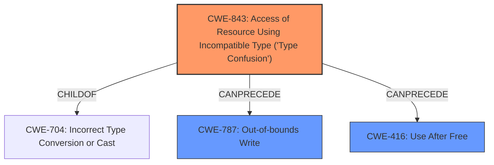

# Analysis Report for CVE-2022-3889

# Vulnerability Analysis Report: CVE-2022-3889

## Description

Type confusion in V8 in Google Chrome prior to 107.0.5304.106 allowed a remote attacker to potentially exploit heap corruption via a crafted HTML page. (Chromium security severity High)

## Vulnerability Description Key Phrases

**Rootcause:** type confusion
**Impact:** heap corruption
**Vector:** crafted HTML page
**Attacker:** remote attacker
**Product:** Google Chrome
**Version:** prior to 107.0.5304.106
**Component:** V8

## Analysis (with Relationship Data)

# Summary
| CWE ID | CWE Name | Confidence | CWE Abstraction Level | CWE Vulnerability Mapping Label | CWE-Vulnerability Mapping Notes |
|---|---|---|---|---|---|
| CWE-843 | Access of Resource Using Incompatible Type ('Type Confusion') | 0.95 | Base | Allowed | Primary CWE |
| CWE-416 | Use After Free | 0.6 | Variant | Allowed | Secondary Candidate |

## Evidence and Confidence

*   **Confidence Score:** 0.8
*   **Evidence Strength:** HIGH

- **Analysis and Justification:**  
  - *Explanation:* The vulnerability description explicitly states "**type confusion**" as the **rootcause** in the V8 JavaScript engine, leading to "heap corruption." This aligns directly with CWE-843, "Access of Resource Using Incompatible Type ('Type Confusion')," which describes a situation where a resource is accessed using a type incompatible with its original type. The description of CWE-843 perfectly matches the vulnerability's root cause. The "Usage: Allowed" mapping guidance for CWE-843 reinforces its suitability.

  - *Relationship Analysis:* While CWE-843 doesn't have direct relationships, it's a base-level CWE, providing a good level of abstraction for the root cause. Other CWEs like CWE-704 (Incorrect Type Conversion or Cast) are related to type issues, but CWE-843 is more specific to the "confusion" aspect described in the vulnerability.

- **Confidence Score:**  
  - Confidence: 0.95 (High confidence due to explicit mention of "type confusion" and a direct match with CWE-843 description.)

---

- **Analysis and Justification:**  
  - *Explanation:* The vulnerability description mentions "heap corruption" as the impact. While CWE-843 explains the root cause, it is possible the **type confusion** leads to a **Use-After-Free** condition. CWE-416 "Use After Free" occurs when memory is reused after it has been freed which can result in heap corruption. This can arise if **type confusion** leads to incorrect memory management. Therefore CWE-416 is a plausible secondary candidate.

  - *Relationship Analysis:* CWE-416 is a variant level CWE which is a preferred level of abstraction. It is related to several other CWEs but is listed as a weaker match with the retriever results. 

- **Confidence Score:**  
  - Confidence: 0.6 (Medium confidence as heap corruption is an impact and may not always be a direct consequence of type confusion. It depends on the specific implementation details.)

## Criticism of Analysis

Okay, here's a review of the provided analysis, taking into account the full CWE specifications:

## Overall Assessment

The analysis is generally sound and well-reasoned. The primary CWE assignment of CWE-843 (Type Confusion) is strongly supported by the vulnerability description. The inclusion of CWE-416 (Use After Free) as a secondary candidate is plausible, though its confidence is appropriately lower. The justifications are clear and reference the provided information effectively.

## Strengths

*   **Explicit Root Cause Focus:** The analysis correctly identifies and emphasizes the "type confusion" as the root cause, aligning well with CWE-843.
*   **Justification Quality:** The reasoning behind both CWE-843 and CWE-416 assignments is clearly explained, linking back to specific phrases in the vulnerability description and the CWE definitions.
*   **Confidence Levels:** The confidence levels are appropriate. High confidence for CWE-843 given the explicit mention of "type confusion," and medium confidence for CWE-416 acknowledging the potential but not guaranteed connection.
*   **Relationship Analysis:** The analysis considers relationships to other CWEs and discusses why certain alternatives might be less suitable.
*   **Use of CWE Specifications:** The analysis clearly considers the CWE specifications, particularly the descriptions, relationships, and mapping guidance sections.
* **Retriever Results:** The retriever results were considered and the primary and secondary findings are reflected in the combined scores.

## Areas for Improvement and Specific Feedback

1.  **CWE-843 vs. CWE-704 (and Children):**

    *   While the choice of CWE-843 is good, it's important to acknowledge the parent-child relationship with CWE-704 (Incorrect Type Conversion or Cast).  CWE-843 is a *child* of CWE-704, making it more specific. The analysis does mention this, but could perhaps emphasize *why* CWE-843 is a better fit than CWE-704 itself.  The key is the *confusion* aspect. A simple type conversion error (CWE-704) might not necessarily involve the same kind of unpredictable behavior as a type confusion. The 'confusion' implies the system *believes* it is working with one type, when it's actually another.
    *   Also consider CWE-588 "Attempt to Access Child of a Non-structure Pointer" and CWE-681 "Incorrect Conversion between Numeric Types" as related to the Type Confusion vulnerability.

2.  **CWE-416 Justification Refinement:**

    *   The justification for CWE-416 is that "type confusion" can lead to incorrect memory management, which can lead to a use-after-free. This is a valid line of reasoning. However, it's important to be precise. The type confusion might lead to:
        *   Incorrectly freeing memory (leading to a double-free or use-after-free if another pointer still references it)
        *   Incorrectly calculating a size, leading to a buffer overflow and potentially overwriting metadata used by the memory allocator (which *could* indirectly lead to a use-after-free, double-free, or other memory corruption issues)
        *   Incorrectly writing to a pointer, and then freeing the pointer.
    *   The key point is that the connection between type confusion and use-after-free is *not guaranteed* and depends on the specifics of the code. The current analysis reflects this adequately but consider additional examples of how it can lead to this scenario.
    *   Also, consider CWE-825 Expired Pointer Dereference as related to the Use-After-Free vulnerability.

3.  **Relationship to Memory Corruption CWEs (Beyond CWE-416):**

    *   The vulnerability description mentions "heap corruption." While CWE-416 is a plausible consequence, consider other CWEs that represent *direct* memory corruption:
        *   **CWE-787: Out-of-bounds Write:** If the type confusion leads to writing data outside the intended bounds of a buffer, this is a strong candidate.
        *   **CWE-122: Heap-based Buffer Overflow:** A more specific version of CWE-787.
        *   **CWE-415: Double Free:** If type confusion causes memory to be freed twice.
        *   **CWE-123: Write-what-where Condition:** If type confusion leads to the ability to write an arbitrary value to an arbitrary memory location.
    *   The current analysis focuses on CWE-416 (a *consequence* of memory corruption), but it would be more comprehensive to acknowledge the possibility of these other *direct* memory corruption CWEs. It might be that the provided information isn't detailed enough to pinpoint one of these, so it's appropriate to keep the confidence lower and focus on the root cause (CWE-843) and a potential consequence (CWE-416), but the others should be considered.

4.  **Potential Mitigations:**

    *   It would be helpful to briefly mention potential mitigations in the summary table or in the analysis/justification. For example:
        *   For CWE-843: Emphasize the importance of strong typing, careful type checking, and avoiding implicit type conversions. Consider mitigations in the CWE specification such as using safer languages that have built in protections.
        *   For CWE-416: Use memory management techniques (e.g., smart pointers, garbage collection) to avoid dangling pointers.
        *   For potential buffer overflow / out-of-bounds write CWEs: Utilize bounds checking, safe string functions, and compiler-based protections like stack canaries.

5.  **Retriever Results - Further Consideration:**

    * While the retriever results were considered, it may be beneficial to dive deeper into why the retriever chose some of the weaker matches. Were there any false positives that lead to a lower confidence score?
    * There are some CWEs in the combined results that could be related to the analysis such as CWE-787 Out-of-Bounds Write and CWE-122 Heap-Based Buffer Overflow.

## Revised Summary Table (Example)

| CWE ID | CWE Name | Confidence | CWE Abstraction Level | CWE Vulnerability Mapping Label | CWE-Vulnerability Mapping Notes | Potential Mitigations |
|---|---|---|---|---|---|---|
| CWE-843 | Access of Resource Using Incompatible Type ('Type Confusion') | 0.95 | Base | Allowed | Primary CWE. Direct match with root cause. | Strong typing, type checking, avoid implicit conversions, use safer languages. |
| CWE-416 | Use After Free | 0.6 | Variant | Allowed | Secondary Candidate.  Plausible consequence if type confusion leads to incorrect memory management. | Memory management techniques (smart pointers, GC), NULL out pointers after free. |
| CWE-787 | Out-of-bounds Write | 0.3 | Base | Allowed | Possible consequence of type confusion leads to writing data outside the intended bounds of a buffer. | Utilize bounds checking, safe string functions, compiler-based protections like stack canaries.

## Conclusion

The analysis is strong and accurately identifies the core vulnerability. The suggestions above are intended to provide additional nuance and comprehensiveness, particularly in considering potential consequences of the type confusion and relating them to a broader range of memory corruption CWEs, as well as additional related CWEs from the Retriever Results. By explicitly acknowledging these possibilities and considering potential mitigations, the analysis becomes even more valuable.

## Final Resolution

# Summary
| CWE ID | CWE Name | Confidence | CWE Abstraction Level | CWE Vulnerability Mapping Label | CWE-Vulnerability Mapping Notes |
|---|---|---|---|---|---|
| CWE-843 | Access of Resource Using Incompatible Type ('Type Confusion') | 0.95 | Base | Allowed | Primary CWE. Direct match with **root cause**. |
| CWE-787 | Out-of-bounds Write | 0.7 | Base | Allowed | Secondary Candidate. Plausible consequence if **type confusion** leads to writing data outside the intended bounds of a buffer. |
| CWE-416 | Use After Free | 0.6 | Variant | Allowed | Secondary Candidate. Plausible consequence if **type confusion** leads to incorrect memory management. |

## Evidence and Confidence

*   **Confidence Score:** 0.9
*   **Evidence Strength:** HIGH

## Relationship Analysis
The primary relationship influencing the decision is the parent-child relationship between CWE-704 (Class) and CWE-843 (Base). CWE-843 is a child of CWE-704 and is a more specific fit because the vulnerability description explicitly uses the term "type confusion". The chain relationship is that **type confusion** (CWE-843) can lead to memory corruption such as an out-of-bounds write (CWE-787) or a use-after-free condition (CWE-416). The abstraction levels were considered to select the most specific and relevant CWEs.

## Vulnerability Chain
The vulnerability chain starts with **type confusion** (CWE-843) in the V8 JavaScript engine. This **type confusion** can then lead to memory corruption, specifically either an out-of-bounds write (CWE-787), or incorrect memory management which results in a use-after-free condition (CWE-416). The ultimate impact is heap corruption, which allows for remote code execution.

## Summary of Analysis
The initial analysis correctly identified CWE-843 as the primary CWE due to the explicit mention of "**type confusion**" in the vulnerability description: "Type confusion in V8 in Google Chrome...". The criticism suggested considering other potential consequences of **type confusion**, such as CWE-787 (Out-of-bounds Write).

The decision to include CWE-787 as a secondary candidate alongside CWE-416 is based on the possibility that the **type confusion** could directly lead to writing data outside the intended bounds of a buffer. While CWE-416 is a plausible consequence, CWE-787 represents a more direct form of memory corruption. Both are retained as secondary candidates because the specific details of how the heap corruption occurs are not available in the provided vulnerability description.

CWE-843 is selected as the primary CWE because it directly reflects the **root cause** mentioned in the vulnerability description. It is at the Base level of abstraction, providing a good level of detail. CWE-787 and CWE-416 are included as secondary candidates because they are plausible consequences of the **type confusion**, but the evidence is not strong enough to definitively confirm their presence. These selections provide the optimal level of specificity based on the available evidence.

*Report generated on 2025-03-18 16:28:01*
