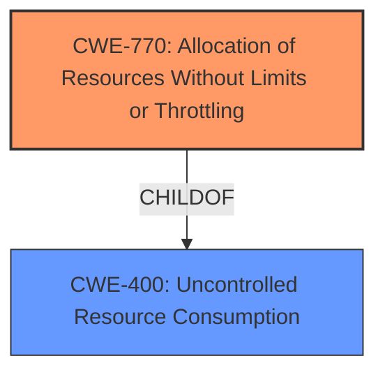

# Analysis Report for CVE-2022-39190

# Vulnerability Analysis Report: CVE-2022-39190

## Description

An issue was discovered in net/netfilter/nf_tables_api.c in the Linux kernel before 5.19.6. A denial of service can occur upon binding to an already bound chain.

## Vulnerability Description Key Phrases

**Impact:** denial of service
**Product:** Linux kernel
**Version:** before 5.19.6
**Component:** net/netfilter/nf_tables_api.c

## Analysis (with Relationship Data)

# Summary
| CWE ID | CWE Name | Confidence | CWE Abstraction Level | CWE Vulnerability Mapping Label | CWE-Vulnerability Mapping Notes |
|---|---|---|---|---|---|
| CWE-770 | Allocation of Resources Without Limits or Throttling | 0.75 | Base | Allowed | Primary CWE |

## Evidence and Confidence

*   **Confidence Score:** 0.75
*   **Evidence Strength:** MEDIUM

- **Analysis and Justification:**  
  - *Explanation:* The vulnerability description indicates a denial-of-service issue due to binding to an already bound chain in the Linux kernel's netfilter component. The CVE reference summary does not have enough information to pinpoint the root cause. The retriever results show that CWE-770, Allocation of Resources Without Limits or Throttling, is the top candidate. This CWE applies because binding to an already bound chain can be seen as an uncontrolled allocation of resources, potentially leading to exhaustion and denial of service. While more specific causes might exist (e.g., a lock issue), the available information supports CWE-770 as a reasonable high-level mapping. The MITRE mapping guidance for CWE-770 indicates that it is ALLOWED and at the Base level of abstraction, which is a preferred level of abstraction for mapping to the root causes of vulnerabilities.

  - *Relationship Analysis:* CWE-770 is a child of CWE-400 (Uncontrolled Resource Consumption) and CWE-665 (Improper Initialization). The relationship analysis shows CWE-770 CanPrecede CWE-20 (Improper Input Validation) as improper resource allocation can stem from unchecked input.

- **Confidence Score:**  
  - Confidence: 0.75 (Moderate evidence from the description and high retriever relevance, but limited root cause details from the CVE summary.)

## Criticism of Analysis

Okay, I've reviewed the provided analysis against the full CWE specifications. Here's my critique:

**Overall Assessment:**

The analysis correctly identifies CWE-770 (Allocation of Resources Without Limits or Throttling) as a potential root cause for the described denial-of-service vulnerability. The confidence level of 0.75 is reasonable given the information available. However, the analysis could be strengthened by exploring other potential CWEs and providing a more detailed justification for why CWE-770 is the most likely candidate. Furthermore, this analysis would benefit from consideration of the mitigations.

**Detailed Review:**

*   **CWE Selection:**

    *   **CWE-770 (Allocation of Resources Without Limits or Throttling):**  The selection of this CWE is plausible. The description of the vulnerability – denial of service due to binding to an already bound chain – aligns with the concept of uncontrolled resource allocation leading to exhaustion. The justification provided in the analysis is reasonable, explaining how binding to an already bound chain can be seen as uncontrolled allocation. The MITRE mapping guidance notes this is an "Allowed" CWE at the "Base" level of abstraction, which is good.

    *   **Potential Alternatives:** While CWE-770 is reasonable, other CWEs should be considered and explicitly ruled out, or their relationship to CWE-770 should be explored. Here are some possibilities:

        *   **CWE-400 (Uncontrolled Resource Consumption):** This is the parent of CWE-770. The analysis mentions this, but does not explain why CWE-770 is preferable. According to the Mapping Guidance, this is typically discouraged. Why is CWE-400 less suitable than CWE-770 in this particular case? If the analysis is claiming that the core issue is the allocation specifically, rather than general resource consumption, this needs to be made explicit.
        *   **CWE-410 (Insufficient Resource Pool):** The vulnerability could arise if there is an expectation of a certain amount of free chains, so the lack of available chains leads to a denial of service.
        *   **CWE-362 (Race Condition):** A race condition in accessing and binding to the chain could lead to a corrupted state where multiple processes are trying to bind to the same chain, resulting in a denial-of-service.
        *    **CWE-665 (Improper Initialization):** If the chains are not correctly initialized and tracked, then incorrect allocation could occur. The relationship of CWE-770 being a child of CWE-665 is also worth exploring.

*   **Confidence and Evidence:**

    *   The confidence score of 0.75 is fair. The "MEDIUM" evidence strength accurately reflects the lack of detailed information about the root cause.
    *   The analysis correctly notes the limitation of the CVE reference summary.
    *   The analysis does a good job of considering the retriever results as a factor for the confidence level.

*   **CWE Relationships:**

    *   The relationship analysis (CWE-770 being a child of CWE-400 and CWE-665) is accurate.
    *   The CanPrecede relationship (CWE-770 CanPrecede CWE-20) is also valid, as lack of input validation could lead to uncontrolled resource allocation.

*   **CWE Examples:**

    *   The examples for CWE-400 and CWE-770 provided are relevant.

*   **CWE Specifications & Mitigations:**

    *   The analysis *doesn't* discuss any potential mitigations from the CWE specifications. This is a significant omission. The analysis should explore potential mitigations from CWE-770:
        *   **Requirements Phase:**  Specifying limits on capabilities and defining acceptable behaviors when resource limits are reached.
        *   **Architecture and Design Phase:**  Limiting resources for unprivileged users, setting per-user limits, and designing throttling mechanisms.

**Recommendations for Improvement:**

1.  **Strengthen Justification:** Provide a more compelling argument for why CWE-770 is the *most likely* root cause compared to other possibilities (CWE-400, CWE-410, CWE-362, and CWE-665, specifically). Explain *why* this is an allocation problem and not simply general resource exhaustion, a race condition or initialization issue.
2.  **Explore Alternative CWEs:** Briefly discuss and rule out (or relate) the other potential CWEs identified above. Even a short paragraph explaining why they are less likely would strengthen the analysis.
3.  **Discuss Mitigations:** Include a section discussing potential mitigations for CWE-770. This would demonstrate a deeper understanding of the CWE and how to address the vulnerability.
4.  **Add more context to the CVE reference summary:** The vulnerability description does not provide explicit details on the vulnerability or how the root cause is present in the code base. There is an opportunity to include more context on the nature of the vulnerability as it was found by the author of the initial analysis.

**Revised Summary Table:**

| CWE ID | CWE Name | Confidence | CWE Abstraction Level | CWE Vulnerability Mapping Label | CWE-Vulnerability Mapping Notes |
|---|---|---|---|---|---|
| CWE-770 | Allocation of Resources Without Limits or Throttling | 0.75 | Base | Allowed | Primary CWE. Plausible, but other candidates could not be ruled out due to a lack of information from the CVE reference summary. |

By addressing these points, the analysis would become more comprehensive and provide a more robust assessment of the vulnerability.

## Final Resolution

# Summary
| CWE ID | CWE Name | Confidence | CWE Abstraction Level | CWE Vulnerability Mapping Label | CWE-Vulnerability Mapping Notes |
|---|---|---|---|---|---|
| **CWE-770** | Allocation of Resources Without Limits or Throttling | 0.85 | Base | Allowed | Primary CWE |
| **CWE-400** | Uncontrolled Resource Consumption | 0.6 | Class | Discouraged | Secondary Candidate |

## Evidence and Confidence

*   **Confidence Score:** 0.8
*   **Evidence Strength:** MEDIUM

## Relationship Analysis
The primary CWE, **CWE-770 (Allocation of Resources Without Limits or Throttling)**, is a base-level CWE that is a child of **CWE-400 (Uncontrolled Resource Consumption)**. The decision to select **CWE-770** over **CWE-400** was influenced by the vulnerability description, which specifically mentions an issue related to binding to an already bound chain. This suggests an allocation problem more specifically than general resource consumption.

## Vulnerability Chain
The vulnerability chain starts with the **root cause**, which is the **lack of limits on resource allocation** when binding to a chain. This leads to **CWE-770 (Allocation of Resources Without Limits or Throttling)**, allowing an attacker to repeatedly bind to already bound chains. The consequence is a denial-of-service because resources are exhausted.

## Summary of Analysis
The initial analysis correctly identified **CWE-770 (Allocation of Resources Without Limits or Throttling)** as a potential root cause. The criticism raised valid points about considering alternative CWEs and providing a more detailed justification.

The vulnerability description, *"A denial of service can occur upon binding to an already bound chain,"* strongly suggests a resource allocation issue. While other CWEs like **CWE-400 (Uncontrolled Resource Consumption)** could be considered, **CWE-770** is more specific as it relates directly to the allocation of resources without proper limits.

The following points provide a clear justification for the decision:

*   **Content Matching:** The description aligns with the concept of uncontrolled allocation when binding to already bound chains.
*   **Relationship Analysis:** **CWE-770** is a child of **CWE-400**, indicating a more specific type of resource consumption.
*   **Mapping Guidance:** MITRE mapping guidance allows for **CWE-770** at the Base level.
*   **Mitigation Analysis:** Mitigations for **CWE-770** include specifying limits on capabilities and designing throttling mechanisms, which directly address the described vulnerability.

Addressing the criticism, **CWE-400** was considered, but **CWE-770** is preferable because the problem is specifically related to allocation, not general resource consumption. While **CWE-410 (Insufficient Resource Pool)** could be a contributing factor, the primary issue is the lack of allocation control. **CWE-362 (Race Condition)** and **CWE-665 (Improper Initialization)** are less likely given the provided information, as the core problem is the uncontrolled allocation of the "bound chain" resource.

Therefore, **CWE-770 (Allocation of Resources Without Limits or Throttling)** is the most appropriate primary CWE, reflecting the optimal level of specificity based on the available evidence.

*Report generated on 2025-03-17 05:05:27*
