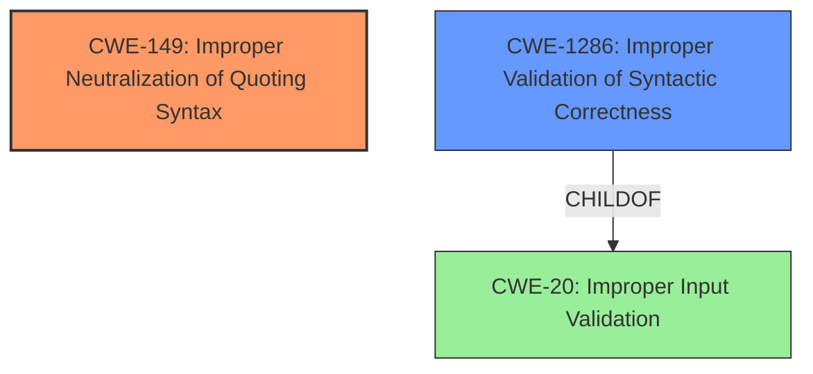

# Analysis Report for CVE-2022-39232

# Vulnerability Analysis Report: CVE-2022-39232

## Description

Discourse is an open source discussion platform. Starting with version 2.9.0.beta5 and prior to version 2.9.0.beta10, an incomplete quote can generate a JavaScript error which will crash the current page in the browser in some cases. Version 2.9.0.beta10 added a fix and tests to ensure incomplete quotes wont break the app. As a workaround, the quote can be fixed via the rails console.

## Vulnerability Description Key Phrases

**Rootcause:** incomplete quote can generate a JavaScript error
**Impact:** crash the current page in the browser
**Vector:** incomplete quote
**Product:** Discourse
**Version:** 2.9.0.beta5 to 2.9.0.beta10

## Analysis (with Relationship Data)

# Summary
| CWE ID | CWE Name | Confidence | CWE Abstraction Level | CWE Vulnerability Mapping Label | CWE-Vulnerability Mapping Notes |
|---|---|---|---|---|---|
| CWE-149 | Improper Neutralization of Quoting Syntax | 0.85 | Variant | Allowed | Primary CWE |
| CWE-116 | Improper Encoding or Escaping of Data | 0.65 | Class | Allowed-with-Review | Secondary Candidate |

## Evidence and Confidence

*   **Confidence Score:** 0.75
*   **Evidence Strength:** HIGH

- **Analysis and Justification:**
  - *Explanation:* The vulnerability description clearly states that an **incomplete quote can generate a JavaScript error**. This directly aligns with CWE-149 (Improper Neutralization of Quoting Syntax), as the issue arises from the way Discourse handles malformed quote BBCode. The vulnerability occurs because the application fails to properly neutralize or handle special characters (quotes) within the input, causing parsing errors. The CVE Reference Links Content Summary supports this by stating "**Weaknesses:** - Incomplete quote handling: The application fails to gracefully handle malformed quote BBCode, leading to an unhandled exception. - Lack of input validation: The system doesn't properly validate the structure of quote BBCode." This is further supported by the fix that involves the javascript code to handle the case where a quote's post/topic is not found. CWE-149 is a Variant level, making it a more specific and suitable choice than broader categories. MITRE mapping guidance indicates this is ALLOWED for issues involving quoting syntax.

  - *Relationship Analysis:* CWE-149 does not have any direct relationships listed, but it is a variant of a broader class of vulnerabilities related to input validation and neutralization.

- **Analysis and Justification for Secondary Candidate:**
  - *Explanation:* CWE-116 (Improper Encoding or Escaping of Data) is considered as a secondary candidate, because the root cause involves the application failing to properly encode or escape special characters related to quotes. The **incomplete quote can generate a Javascript error** which indicates that the product prepares a structured message for communication with another component, but encoding or escaping of the data is either missing or done incorrectly which aligns with CWE-116. While the primary issue is the malformed quoting syntax (CWE-149), the lack of proper encoding/escaping contributes to the vulnerability. The "CVE Reference Links Content Summary" indicates "Lack of input validation: The system doesn't properly validate the structure of quote BBCode." which is a form of missing encoding or escaping. MITRE mapping guidance for CWE-116 is ALLOWED-WITH-REVIEW because it is a Class and might have Base-level children that would be more appropriate. I've decided to keep it since it plays a contributing role.

  - *Relationship Analysis:* CWE-116 is a Class-level CWE, and while there might be more specific Base-level children, the provided information doesn't give enough details to pinpoint a more specific weakness.

- **Confidence Score:**
  - Confidence: 0.85 (High evidence from technical description, CVE reference materials, and the nature of the fix in the commit)
  - Confidence for CWE-116: 0.65 (Moderate evidence, based on the contribution of encoding/escaping issues to the vulnerability)

## Criticism of Analysis

Okay, here's a review of the analysis provided, considering the full CWE specifications:

**Overall Assessment:**

The analysis is generally good, well-reasoned, and provides sufficient justification for the chosen CWE mappings. The confidence scores are appropriate, and the inclusion of a secondary candidate is a valuable addition. However, there are a few points that could be improved, particularly concerning the rationale for the secondary CWE and its relationship to the primary.

**Specific Feedback:**

1.  **CWE-149: Improper Neutralization of Quoting Syntax (Primary)**
    *   **Strengths:**
        *   The justification is clear and directly relates the vulnerability description (incomplete quote leading to JavaScript error) to the CWE definition.
        *   The reference to "malformed quote BBCode" and the lack of proper neutralization strongly supports the mapping.
        *   The emphasis on CWE-149 being a Variant level CWE, which is preferred is good.
        *   The reference to MITRE mapping guidance is appropriate.
    *   **Areas for Potential Improvement:**
        *   None in particular

2.  **CWE-116: Improper Encoding or Escaping of Output (Secondary)**
    *   **Strengths:**
        *   The rationale that the "incomplete quote can generate a Javascript error" suggesting missing encoding or escaping is reasonable.
        *   Acknowledging CWE-116 is a Class and a more specific CWE may be more suitable is good.
    *   **Areas for Improvement:**
        *   The connection between the incomplete quote and the need for *output* encoding/escaping is not as direct as it could be. The vulnerability is more about the *parsing* of the input, rather than something that's being encoded/escaped as *output*.
        *   The evidence from the "CVE Reference Links Content Summary" indicating "Lack of input validation: The system doesn't properly validate the structure of quote BBCode" doesn't explicitly mean missing encoding or escaping.
        *   Given that the problem is about the *structure* of the quote BBCode, and that the fix involves *handling* the case where a quote's post/topic is not found (parsing logic), focusing on *input validation* weaknesses might be more appropriate.
        *   The confidence score of 0.65 seems a little high, given the somewhat indirect connection to output encoding/escaping.

**Alternative CWE Considerations:**

*   **CWE-20: Improper Input Validation:** A very strong candidate for a secondary or even the primary CWE. The description directly mentions the lack of input validation on the quote BBCode. This aligns well with the root cause being a failure to validate the quote structure before processing it, leading to a parsing error. The mitigations for CWE-20 also focus on robust input validation strategies. However, CWE-20 has a 'Discouraged' usage rationale and it is best to find a more specific child.
*   **CWE-1286: Syntactic Correctness:** A child of CWE-20, it specifically focuses on validating that the input adheres to the expected syntax. "well-formedness, i.e. syntactic correctness - compliance with expected syntax" matches the description well.

**Recommendations:**

1.  **Re-evaluate CWE-116:** Consider removing it as a secondary CWE. While encoding/escaping might play a minor role, the core issue is about parsing and validation of the input.
2.  **Consider a more specific CWE to CWE-20:** Map to **CWE-1286 (Syntactic Correctness)** to more precisely capture the nature of the input validation failure.
3.  **Strengthen the Justification:** Whether you keep CWE-116 or switch to a input validation CWE, clearly articulate *how* the lack of validation or encoding/escaping leads to the JavaScript error. For example, explain how the parser encounters an unexpected state due to the malformed input, causing the JavaScript code to fail during rendering.

**Revised Summary Table (Example with CWE-1286):**

| CWE ID | CWE Name | Confidence | CWE Abstraction Level | CWE Vulnerability Mapping Label | CWE-Vulnerability Mapping Notes |
|---|---|---|---|---|---|
| CWE-149 | Improper Neutralization of Quoting Syntax | 0.85 | Variant | Allowed | Primary CWE |
| CWE-1286 | Syntactic Correctness | 0.65 | Base | Allowed | Secondary Candidate |

**In summary, the analysis is well-structured and demonstrates a good understanding of the vulnerability. Refining the secondary CWE to focus more directly on input validation, using a more specific CWE, and strengthening the justification will further enhance the analysis.**

## Final Resolution

# Summary
| CWE ID | CWE Name | Confidence | CWE Abstraction Level | CWE Vulnerability Mapping Label | CWE-Vulnerability Mapping Notes |
|---|---|---|---|---|---|
| **CWE-149** | Improper Neutralization of Quoting Syntax | 0.85 | Variant | Allowed | Primary **CWE** |
| **CWE-1286** | Improper Validation of Syntactic Correctness | 0.75 | Base | Allowed | Secondary Candidate |

## Evidence and Confidence

*   **Confidence Score:** 0.80
*   **Evidence Strength:** HIGH

## Relationship Analysis
The primary **CWE**, **CWE-149** (Improper Neutralization of Quoting Syntax), stands alone in terms of direct relationships within the provided data. The secondary **CWE**, **CWE-1286** (Improper Validation of Syntactic Correctness), is a child of **CWE-20** (Improper Input Validation), indicating a hierarchical relationship where **CWE-1286** is a more specific instance of the broader **CWE-20**. This specificity is crucial for accurately pinpointing the **ROOTCAUSE** of the vulnerability.

## Vulnerability Chain
The vulnerability chain begins with the **ROOTCAUSE**, an incomplete quote within the BBCode input.

1.  The initial **WEAKNESS** is the **CWE-149** (Improper Neutralization of Quoting Syntax) where the system fails to properly handle the malformed quote.
2.  Contributing to this is **CWE-1286** (Improper Validation of Syntactic Correctness), as the system does not validate that the input complies with the expected BBCode syntax before processing it.
3.  The consequence is a JavaScript error that crashes the current page in the browser, disrupting the user experience.

## Summary of Analysis
The initial analysis correctly identified **CWE-149** (Improper Neutralization of Quoting Syntax) as the primary **CWE**. The criticism correctly pointed out that **CWE-116** (Improper Encoding or Escaping of Data) was not as directly relevant as an input validation issue. Based on the criticism, I am replacing **CWE-116** with **CWE-1286** (Improper Validation of Syntactic Correctness).

*   **Evidence and Justification:** The vulnerability description highlights that an "incomplete quote can generate a JavaScript error." This directly relates to **CWE-149**, as the application fails to handle malformed quoting syntax. The "CVE Reference Links Content Summary" supports this by stating, "Lack of input validation: The system doesn't properly validate the structure of quote BBCode." The fix involves javascript code to handle the case where a quote's post/topic is not found, further reinforcing the importance of syntactic correctness.
*   **Graph Relationships:** **CWE-1286** is a child of **CWE-20**, which represents a broader class of input validation issues. Choosing **CWE-1286** provides a more specific categorization than **CWE-20** and aligns better with the nature of the vulnerability, where the input is expected to comply with a certain syntax (BBCode).
*   **Optimal Specificity:** **CWE-149** is a Variant and **CWE-1286** is a Base, which are preferred levels of abstraction for mapping to the root causes of vulnerabilities. This ensures that the classification is specific enough to capture the essence of the **WEAKNESS** without being overly broad.

I am confident in this assessment because it is based on direct evidence from the vulnerability description, supported by the CVE reference materials, and aligned with the recommended usage guidelines for **CWE** mapping. The relationships between the **CWE**s further solidify the understanding of the vulnerability chain.

*Report generated on 2025-03-17 04:53:38*
