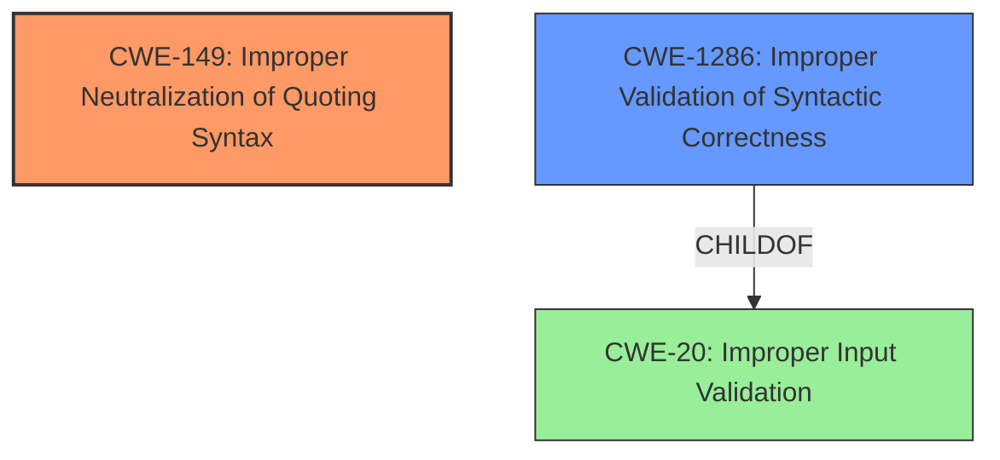

# Final Resolution for CVE-2022-39232

# Summary
| CWE ID | CWE Name | Confidence | CWE Abstraction Level | CWE Vulnerability Mapping Label | CWE-Vulnerability Mapping Notes |
|---|---|---|---|---|---|
| **CWE-149** | Improper Neutralization of Quoting Syntax | 0.85 | Variant | Allowed | Primary **CWE** |
| **CWE-1286** | Improper Validation of Syntactic Correctness | 0.75 | Base | Allowed | Secondary Candidate |

## Evidence and Confidence

*   **Confidence Score:** 0.80
*   **Evidence Strength:** HIGH

## Relationship Analysis
The primary **CWE**, **CWE-149** (Improper Neutralization of Quoting Syntax), stands alone in terms of direct relationships within the provided data. The secondary **CWE**, **CWE-1286** (Improper Validation of Syntactic Correctness), is a child of **CWE-20** (Improper Input Validation), indicating a hierarchical relationship where **CWE-1286** is a more specific instance of the broader **CWE-20**. This specificity is crucial for accurately pinpointing the **ROOTCAUSE** of the vulnerability.

## Vulnerability Chain
The vulnerability chain begins with the **ROOTCAUSE**, an incomplete quote within the BBCode input.

1.  The initial **WEAKNESS** is the **CWE-149** (Improper Neutralization of Quoting Syntax) where the system fails to properly handle the malformed quote.
2.  Contributing to this is **CWE-1286** (Improper Validation of Syntactic Correctness), as the system does not validate that the input complies with the expected BBCode syntax before processing it.
3.  The consequence is a JavaScript error that crashes the current page in the browser, disrupting the user experience.

## Summary of Analysis
The initial analysis correctly identified **CWE-149** (Improper Neutralization of Quoting Syntax) as the primary **CWE**. The criticism correctly pointed out that **CWE-116** (Improper Encoding or Escaping of Data) was not as directly relevant as an input validation issue. Based on the criticism, I am replacing **CWE-116** with **CWE-1286** (Improper Validation of Syntactic Correctness).

*   **Evidence and Justification:** The vulnerability description highlights that an "incomplete quote can generate a JavaScript error." This directly relates to **CWE-149**, as the application fails to handle malformed quoting syntax. The "CVE Reference Links Content Summary" supports this by stating, "Lack of input validation: The system doesn't properly validate the structure of quote BBCode." The fix involves javascript code to handle the case where a quote's post/topic is not found, further reinforcing the importance of syntactic correctness.
*   **Graph Relationships:** **CWE-1286** is a child of **CWE-20**, which represents a broader class of input validation issues. Choosing **CWE-1286** provides a more specific categorization than **CWE-20** and aligns better with the nature of the vulnerability, where the input is expected to comply with a certain syntax (BBCode).
*   **Optimal Specificity:** **CWE-149** is a Variant and **CWE-1286** is a Base, which are preferred levels of abstraction for mapping to the root causes of vulnerabilities. This ensures that the classification is specific enough to capture the essence of the **WEAKNESS** without being overly broad.

I am confident in this assessment because it is based on direct evidence from the vulnerability description, supported by the CVE reference materials, and aligned with the recommended usage guidelines for **CWE** mapping. The relationships between the **CWE**s further solidify the understanding of the vulnerability chain.