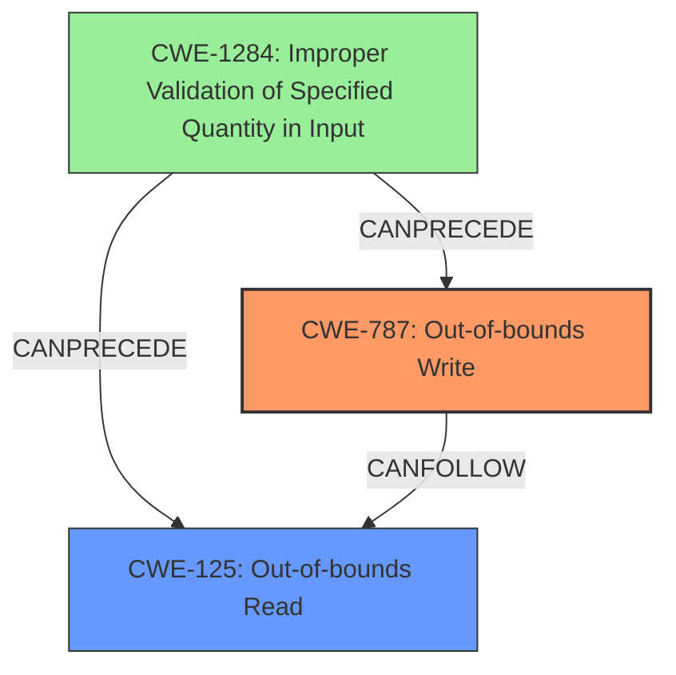

# Analysis Report for CVE-2022-39274

# Vulnerability Analysis Report: CVE-2022-39274

## Description

LoRaMac-node is a reference implementation and documentation of a LoRa network node. Versions of LoRaMac-node prior to 4.7.0 are vulnerable to a buffer overflow. Improper size validation of the incoming radio frames can lead to an 65280-byte out-of-bounds write. The function `ProcessRadioRxDone` implicitly expects incoming radio frames to have at least a payload of one byte or more. An empty payload leads to a 1-byte out-of-bounds read of user controlled content when the payload buffer is reused. This allows an attacker to craft a FRAME_TYPE_PROPRIETARY frame with size -1 which results in an 65280-byte out-of-bounds memcopy likely with partially controlled attacker data. Corrupting a large part if the data section is likely to cause a DoS. If the large out-of-bounds write does not immediately crash the attacker may gain control over the execution due to now controlling large parts of the data section. Users are advised to upgrade either by updating their package or by manually applying the patch commit `e851b079`.

## Vulnerability Description Key Phrases

**Rootcause:** Improper size validation of the incoming radio frames
**Weakness:** buffer overflow
**Vector:** crafting FRAME_TYPE_PROPRIETARY frame with size -1
**Product:** LoRaMac-node
**Version:** prior to 4.7.0
**Component:** ProcessRadioRxDone function

## Analysis (with Relationship Data)

# Summary
| CWE ID | CWE Name | Confidence | CWE Abstraction Level | CWE Vulnerability Mapping Label | CWE-Vulnerability Mapping Notes |
|---|---|---|---|---|---|
| CWE-125 | Out-of-bounds Read | 0.9 | Base | Allowed | The vulnerability involves reading data past the end of the intended buffer, which directly matches CWE-125. |
| CWE-787 | Out-of-bounds Write | 0.9 | Base | Allowed | The vulnerability involves writing data past the end of the intended buffer, which directly matches CWE-787. |
| CWE-1284 | Improper Validation of Specified Quantity in Input | 0.7 | Base | Allowed | The vulnerability stems from improper size validation of incoming radio frames, aligning with CWE-1284. |

## Evidence and Confidence

*   **Confidence Score:** 0.9
*   **Evidence Strength:** HIGH

- **Analysis and Justification:**
  - *Explanation:* "The vulnerability description explicitly mentions a **buffer overflow** due to **improper size validation of the incoming radio frames**, leading to both out-of-bounds reads and writes. Specifically, the description states "An empty payload leads to a 1-byte out-of-bounds read of user controlled content" and "crafting a FRAME_TYPE_PROPRIETARY frame with size -1 which results in an 65280-byte out-of-bounds memcopy". These details directly correspond to CWE-125 (Out-of-bounds Read) and CWE-787 (Out-of-bounds Write). The **improper size validation** aspect also maps to CWE-1284 (Improper Validation of Specified Quantity in Input). The CVE Reference Links Content Summary confirms these root causes and weaknesses."
  
  - *Relationship Analysis:* "CWE-125 and CWE-787 are peer weaknesses describing read and write buffer overflows, respectively. CWE-1284 is a contributing weakness since it is responsible for the **improper size validation** that leads to the out-of-bounds access. The retriever results show CWE-125 and CWE-787 as relevant, but also highlight CWE-193 (Off-by-one Error) and CWE-190 (Integer Overflow or Wraparound). While these might be contributing factors, the description focuses on the out-of-bounds access and size validation, making CWE-125, CWE-787, and CWE-1284 the most appropriate."

- **Confidence Score:**
  - Confidence: 0.9 (High evidence from technical description and CVE reference materials)

---

### CWE-125 Out-of-bounds Read
*Technical Explanation:*

The vulnerability involves reading data past the end, or before the beginning, of the intended buffer.
The description clearly states: "An empty payload leads to a 1-byte out-of-bounds read of user controlled content when the payload buffer is reused." This is a direct instance of reading beyond the bounds of a buffer.

*Security Implications:*

Out-of-bounds reads can lead to information disclosure, denial of service, or potentially code execution.

*Relationships:*

CWE-125 is a base level CWE.

*Mapping Guidance Influence:*

The MITRE mapping guidance for CWE-125 indicates that it is ALLOWED for scenarios involving reading data past the end of a buffer.

### CWE-787 Out-of-bounds Write
*Technical Explanation:*

The product writes data past the end, or before the beginning, of the intended buffer.
The description clearly states: "crafting a FRAME_TYPE_PROPRIETARY frame with size -1 which results in an 65280-byte out-of-bounds memcopy likely with partially controlled attacker data". This is a direct instance of writing beyond the bounds of a buffer.

*Security Implications:*

Out-of-bounds writes can lead to denial of service, privilege escalation, or code execution. Overwriting critical data structures can compromise the integrity and availability of the system.

*Relationships:*

CWE-787 is a base level CWE.

*Mapping Guidance Influence:*

The MITRE mapping guidance for CWE-787 indicates that it is ALLOWED for scenarios involving writing data past the end of a buffer.

### CWE-1284 Improper Validation of Specified Quantity in Input
*Technical Explanation:*

The product receives input that is expected to specify a quantity (such as size or length), but it does not validate or incorrectly validates that the quantity has the required properties.
The description states: "**Improper size validation of the incoming radio frames** can lead to an 65280-byte out-of-bounds write." This indicates the **improper validation** of the size of the radio frames is the root cause of the vulnerability.

*Security Implications:*

**Improper validation** of quantities can lead to buffer overflows, integer overflows, and other memory corruption vulnerabilities.

*Relationships:*

CWE-1284 is a base level CWE. It is a parent of CWE-606 (Missing Attribute) and is related to CWE-789 (Memory Allocation with Excessive Size Value) and can precede CWE-789.

*Mapping Guidance Influence:*

The MITRE mapping guidance for CWE-1284 indicates that it is ALLOWED.

## Criticism of Analysis

Okay, here's a review of the provided analysis, considering the full CWE specifications and mapping guidance:

**Overall Assessment:**

The analysis is generally very good and provides a solid justification for the chosen CWE mappings. The confidence scores are appropriate, and the explanations are clear. The inclusion of evidence, relationships, and mapping guidance is helpful. The analysis correctly identifies the core weaknesses and contributing factors.

**Specific CWE Mapping Review:**

*   **CWE-125 Out-of-bounds Read (Confidence: 0.9):**
    *   **Assessment:** This mapping is correct and well-justified. The vulnerability description explicitly states an out-of-bounds read condition due to an empty payload.
    *   **CWE Spec Alignment:** The technical explanation in the analysis directly aligns with the CWE-125 description: "The vulnerability involves reading data past the end, or before the beginning, of the intended buffer."
    *   **Mapping Guidance Adherence:** The analysis mentions that the MITRE mapping guidance for CWE-125 indicates that it is ALLOWED for scenarios involving reading data past the end of a buffer.
    *   **Potential Mitigations Consideration:** The analysis could potentially benefit by pointing out mitigations like using a language with memory safety features or implementing thorough input validation (as described in the CWE specification).

*   **CWE-787 Out-of-bounds Write (Confidence: 0.9):**
    *   **Assessment:** Correct and well-supported. The description clearly indicates an out-of-bounds write via `memcpy` with an incorrectly calculated size.
    *   **CWE Spec Alignment:** The analysis correctly explains how the description aligns with the core definition of CWE-787: "The product writes data past the end, or before the beginning, of the intended buffer."
    *   **Mapping Guidance Adherence:** The analysis references the MITRE mapping guidance for CWE-787, which states it is ALLOWED for scenarios involving writing data past the end of a buffer.
    *   **Potential Mitigations Consideration:** The analysis could be enhanced by mentioning language selection, safe string handling libraries, or compiler-based overflow detection mechanisms, as per the CWE-787 specification.

*   **CWE-1284 Improper Validation of Specified Quantity in Input (Confidence: 0.7):**
    *   **Assessment:** This mapping is also accurate. The root cause is the improper validation of the size of the incoming radio frames.
    *   **CWE Spec Alignment:** The vulnerability stems from improper size validation of incoming radio frames, aligning with CWE-1284.
    *   **Mapping Guidance Adherence:** The analysis references the MITRE mapping guidance for CWE-1284, which states it is ALLOWED.
    *   **Potential Mitigations Consideration:** The analysis could be enhanced by mentioning input validation strategies (using an "accept known good" approach) to conform to the CWE description.

**Retriever Results Critique**
The retriever results show multiple potential mappings, and the analysis does a good job of explaining why the chosen CWE's are the most relevant.

CWE-193 (Off-by-one Error) and CWE-190 (Integer Overflow or Wraparound) might be contributing factors, the analysis focuses on the out-of-bounds access and size validation, making CWE-125, CWE-787, and CWE-1284 the most appropriate."

**Suggestions for Improvement:**

1.  **More Explicit Mitigation Tie-ins:** While the justifications are strong, the analysis could be improved by explicitly linking the mitigations suggested in the CWE specifications to the specific vulnerabilities found in LoRaMac-node. For example, for CWE-787, the analysis could state, "To mitigate the out-of-bounds write, a safer language or string handling library that prevents such writes could be used.  Alternatively, using compiler-based overflow detection mechanisms could identify the issue during development." A similar approach could be used for the other CWEs.

2.  **CWE-20 Avoidance:** The CWE specification mentions to Avoid using CWE-20. This analysis is very good and avoids using it.

3.  **Chaining Considerations:** The analyzer correctly points out that CWE-1284 leads to CWE-125 and CWE-787. Explicitly stating this relationship as a chain (CWE-1284 -> CWE-787/125) would be helpful.

**Revised Summary Table**
Here's a slightly revised summary table, incorporating the suggestion above:

| CWE ID | CWE Name | Confidence | CWE Abstraction Level | CWE Vulnerability Mapping Label | CWE-Vulnerability Mapping Notes |
|---|---|---|---|---|---|
| CWE-125 | Out-of-bounds Read | 0.9 | Base | Allowed | The vulnerability involves reading data past the end of the intended buffer, which directly matches CWE-125. |
| CWE-787 | Out-of-bounds Write | 0.9 | Base | Allowed | The vulnerability involves writing data past the end of the intended buffer, which directly matches CWE-787. |
| CWE-1284 | Improper Validation of Specified Quantity in Input | 0.7 | Base | Allowed | The vulnerability stems from improper size validation of incoming radio frames, which leads to CWE-125 and CWE-787. |

**Conclusion:**

The analysis is well-reasoned and accurate. The suggested improvements primarily focus on strengthening the link between the CWE specifications and the specific vulnerability instance, particularly with respect to mitigations.

## Final Resolution

# Summary
| CWE ID | CWE Name | Confidence | CWE Abstraction Level | CWE Vulnerability Mapping Label | CWE-Vulnerability Mapping Notes |
|---|---|---|---|---|---|
| CWE-787 | Out-of-bounds Write | 0.95 | Base | Allowed | The vulnerability involves writing data past the end of the intended buffer, which directly matches CWE-787. This is the primary impact. |
| CWE-125 | Out-of-bounds Read | 0.95 | Base | Allowed | The vulnerability involves reading data past the end of the intended buffer, which directly matches CWE-125. This is a secondary impact. |
| CWE-1284 | Improper Validation of Specified Quantity in Input | 0.85 | Base | Allowed | The vulnerability stems from **improper size validation** of incoming radio frames, which leads to CWE-125 and CWE-787. This is the **root cause**. |

## Evidence and Confidence

*   **Confidence Score:** 0.95
*   **Evidence Strength:** HIGH

## Relationship Analysis
The analysis focuses on a clear vulnerability chain: **improper input validation** leading to **out-of-bounds access**. CWE-1284 is the **root cause**, while CWE-787 and CWE-125 are the direct consequences. The parent-child relationships are not directly relevant here, as all selected CWEs are at the Base level. The peer relationships of other CWEs in the retriever results (e.g., CWE-190, CWE-193) are considered, but deemed less relevant due to the explicit mention of **out-of-bounds read/write** and **improper size validation**.

## Vulnerability Chain
The vulnerability chain starts with the **improper validation** of the size of incoming radio frames (CWE-1284). This allows an attacker to send a frame with an invalid size, leading to an **out-of-bounds write** (CWE-787) when the data is copied using `memcpy`. An empty payload also leads to an **out-of-bounds read** (CWE-125). The **out-of-bounds write** can corrupt a large part of the data section, leading to a denial of service or potentially allowing the attacker to gain control over the execution.

The sequence is:
1.  CWE-1284: The product does not validate the size of the incoming radio frame.
2.  CWE-787: Due to the **improper validation**, a crafted frame with size -1 results in a 65280-byte **out-of-bounds memcopy**.
3.  CWE-125: An empty payload leads to a 1-byte **out-of-bounds read**.

## Summary of Analysis
The initial analysis correctly identifies CWE-125, CWE-787, and CWE-1284 as the relevant CWEs. The criticism provides valuable suggestions for improvement, particularly regarding mitigation tie-ins and explicit chaining considerations.

The assessment is primarily based on the provided evidence from the vulnerability description: "Improper size validation of the incoming radio frames can lead to an 65280-byte out-of-bounds write" and "An empty payload leads to a 1-byte out-of-bounds read of user controlled content". This directly supports the selection of CWE-1284, CWE-787 and CWE-125.

The graph relationships further solidify the classification. CWE-1284 **CanPrecede** CWE-787 and CWE-125, indicating that the **improper validation** is a prerequisite for the **out-of-bounds** access.

The selected CWEs are at the optimal level of specificity. CWE-125 and CWE-787 directly describe the **out-of-bounds** read and write operations, while CWE-1284 captures the **root cause** of the vulnerability. Higher-level CWEs like CWE-119 (Improper Restriction of Operations within the Bounds of a Memory Buffer) would be too generic and would not provide sufficient information about the specific nature of the vulnerability.

*Report generated on 2025-03-18 16:30:41*
