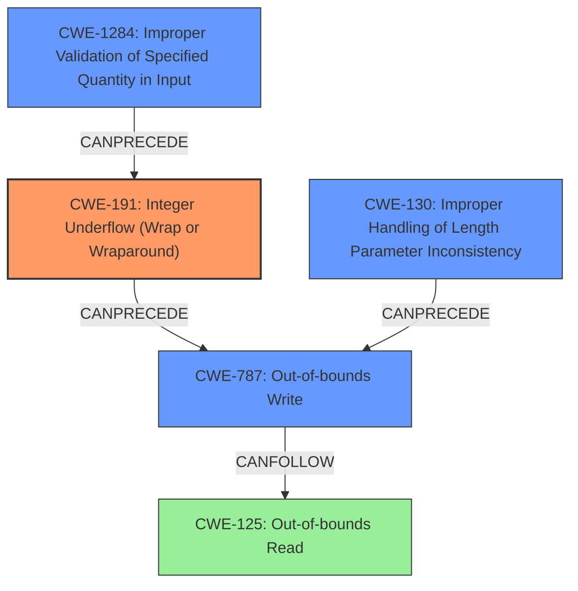

# Analysis Report for CVE-2022-39293

# Vulnerability Analysis Report: CVE-2022-39293

## Description

Azure RTOS USBX is a high-performance USB host, device, and on-the-go (OTG) embedded stack, that is fully integrated with Azure RTOS ThreadX. The case is, in [_ux_host_class_pima_read](https//github.com/azure-rtos/usbx/blob/master/common/usbx_host_classes/src/ux_host_class_pima_read.c), there is data length from device response, returned in the very first packet, and read by [L165 code](https//github.com/azure-rtos/usbx/blob/082fd9db09a3669eca3358f10b8837a5c1635c0b/common/usbx_host_classes/src/ux_host_class_pima_read.c#L165), as header_length. Then in [L178 code](https//github.com/azure-rtos/usbx/blob/082fd9db09a3669eca3358f10b8837a5c1635c0b/common/usbx_host_classes/src/ux_host_class_pima_read.c#L178), there is a if branch, which check the expression of (header_length - UX_HOST_CLASS_PIMA_DATA_HEADER_SIZE) > data_length where if header_length is smaller than UX_HOST_CLASS_PIMA_DATA_HEADER_SIZE, calculation could overflow and then [L182 code](https//github.com/azure-rtos/usbx/blob/082fd9db09a3669eca3358f10b8837a5c1635c0b/common/usbx_host_classes/src/ux_host_class_pima_read.c#L182) the calculation of data_length is also overflow, this way the later [while loop start from L192](https//github.com/azure-rtos/usbx/blob/082fd9db09a3669eca3358f10b8837a5c1635c0b/common/usbx_host_classes/src/ux_host_class_pima_read.c#L192) can move data_pointer to unexpected address and cause write buffer overflow. The fix has been included in USBX release [6.1.12](https//github.com/azure-rtos/usbx/releases/tag/v6.1.12_rel). The following can be used as a workaround Add check of `header_length` 1. It must be greater than `UX_HOST_CLASS_PIMA_DATA_HEADER_SIZE`. 1. It should be greater or equal to the current returned data length (`transfer_request -> ux_transfer_request_actual_length`).

## Vulnerability Description Key Phrases

**Weakness:** integer overflow
**Impact:** write buffer overflow
**Vector:** crafted USB packet
**Product:** Azure RTOS USBX
**Version:** before 6.1.12
**Component:** ux_host_class_pima_read function

## Analysis (with Relationship Data)

# Summary
| CWE ID | CWE Name | Confidence | CWE Abstraction Level | CWE Vulnerability Mapping Label | CWE-Vulnerability Mapping Notes |
|---|---|---|---|---|---|
| CWE-191 | Integer Underflow (Wrap or Wraparound) | 0.95 | Base | Allowed | Primary CWE: The vulnerability involves an integer underflow, which is the core issue.|
| CWE-787 | Out-of-bounds Write | 0.75 | Base | Allowed | Secondary Candidate: The integer underflow leads to an out-of-bounds write.|
| CWE-125 | Out-of-bounds Read | 0.60 | Base | Allowed | Secondary Candidate: An out-of-bounds read could occur while calculating the address to write to.|

## Evidence and Confidence

*   **Confidence Score:** 0.85
*   **Evidence Strength:** HIGH

- **Analysis and Justification:**
  - *Explanation:* The vulnerability description clearly states that an **integer overflow** (should be underflow) occurs in the `_ux_host_class_pima_read` function due to insufficient input validation. Specifically, the `header_length` is not checked to ensure it's greater than or equal to `UX_HOST_CLASS_PIMA_DATA_HEADER_SIZE`. This leads to an integer underflow when `header_length` is smaller, corrupting the `data_length` variable. This aligns directly with CWE-191 (Integer Underflow (Wrap or Wraparound)). The corrupted `data_length` is then used in a loop, resulting in an out-of-bounds write (CWE-787) to memory.

  - *Relationship Analysis:* CWE-191 is the root cause, directly leading to CWE-787. While other CWEs like CWE-190 (Integer Overflow or Wraparound) are related, CWE-191 is more precise because the description explicitly mentions a scenario where a value becomes smaller than the minimum allowable integer value due to subtraction. The description also indicates that data might be read from unexpected addresses (CWE-125) as a result of incorrect data pointer calculation.

- **Confidence Score:**
  - Confidence: 0.95 (High evidence from the vulnerability description and CVE reference materials, which clearly detail the integer underflow and its consequences).

---

## Criticism of Analysis

Okay, let's review the provided analysis against the full CWE specifications and offer a critique, paying close attention to mapping guidance and potential mitigations.

**Overall Assessment:**

The analysis is generally good. It correctly identifies the core issue as an integer underflow leading to a buffer overflow. However, there are a few areas where the mapping could be more precise, and the confidence level could be better justified.

**Detailed Critique:**

1.  **CWE-191: Integer Underflow (Wrap or Wraparound)**

    *   **Assessment:** Correctly identified as the primary CWE.  The description explicitly mentions a subtraction resulting in a value smaller than the minimum allowable integer value, which is the hallmark of CWE-191.
    *   **Confidence:** The 0.95 confidence is justified. The evidence is strong because the vulnerability description explicitly details the underflow scenario.
    *   **Mapping Guidance Check:**  The analysis correctly followed the mapping guidance, recognizing that this is a Base level weakness, and it's the root cause.
    *   **Mitigation Considerations:** The specifications for CWE-191 don't offer specific mitigations beyond general coding best practices. However, the workaround provided in the original analysis (checking `header_length` before the subtraction) directly addresses the vulnerability and aligns with general input validation strategies.

2.  **CWE-787: Out-of-bounds Write**

    *   **Assessment:** Correct. The integer underflow corrupts `data_length`, which is then used in a loop to write data outside the bounds of the buffer.
    *   **Confidence:** A confidence of 0.75 is appropriate. It's a *consequence* of the underflow, making it a secondary issue.
    *   **Mapping Guidance Check:** The analysis aligns with the mapping guidance. CWE-787 is a Base level weakness that describes the specific type of memory corruption occurring.
    *   **Mitigation Considerations:** The specifications for CWE-787 suggest using safer languages or libraries, or employing compiler-based buffer overflow detection. While these are good general practices, they are less directly applicable than the input validation fix.

3.  **CWE-125: Out-of-bounds Read**

    *   **Assessment:** The inclusion of CWE-125 is plausible, but weaker than CWE-787. It's *possible* that when the incorrect `data_length` is used, the read from the USB device could go out of bounds. This depends on the details of the memory layout and the size of the USB transfer.
    *   **Confidence:** The confidence of 0.6 is acceptable, reflecting the uncertainty.
    *   **Mapping Guidance Check:**  The analysis aligns with the mapping guidance, but the connection to the primary weakness is less direct.
    *   **Mitigation Considerations:** The specifications for CWE-125 emphasize input validation and safer languages. Again, the workaround is more directly relevant.

**Recommendations for Improvement:**

*   **Explicitly mention CWE-1284: Improper Validation of Specified Quantity in Input:** The vulnerability hinges on the lack of validation of `header_length`. Adding this CWE would strengthen the analysis.  The full CWE specifications for CWE-1284 are included. This is a base level CWE, and more clearly aligns to what is missing in the code. Also, its potential mitigations focus on input validation which aligns well with the provided workaround.
*   **Correct the typo: Integer Overflow vs Underflow:** In the Analysis and Justification, the analysis states that an "integer overflow" occurs, but it should be "underflow". This mistake is misleading.
*   **Strengthen relationship description:** The analysis describes the *relationships* between the CWE's well but could be stronger.
    *   Example: `CWE-191` directly leads to incorrect buffer length calculation. This then causes `CWE-787` because the write loop uses incorrect length and goes out of bounds.
*   **Consider CWE-130: Improper Handling of Length Parameter Inconsistency**: While CWE-1284 reflects the lack of initial validation, the fact that the length field (`header_length`) is *inconsistent* with what is expected (a value smaller than `UX_HOST_CLASS_PIMA_DATA_HEADER_SIZE` when it should be at least that size) makes CWE-130 relevant. The CWE-130 description emphasizes handling length fields inconsistent with the actual data. The potential mitigations for CWE-130 also align well with suggested validation of length parameters. If including CWE-130, reduce the confidence score of CWE-125, because the root cause is more likely a length parameter inconsistency than a plain out-of-bounds read.

**Revised CWE Mappings (with confidence scores):**

*   **CWE-191:** Integer Underflow (Wrap or Wraparound) - 0.95
*   **CWE-1284:** Improper Validation of Specified Quantity in Input - 0.85
*   **CWE-787:** Out-of-bounds Write - 0.75
*   **CWE-130:** Improper Handling of Length Parameter Inconsistency - 0.65
*   **CWE-125:** Out-of-bounds Read - 0.50

**Summary of Changes:**

*   Added CWE-1284 as it better represents the lack of validation of the input parameter.
*   Added CWE-130 because it represents the inconsistency of the length parameter.
*   Re-ordered the list to place the root cause vulnerability higher.
*   Adjusted the confidence scores to more clearly represent the probability of each vulnerability existing.

By incorporating these suggestions, the analysis would be more precise and better aligned with CWE guidelines. Remember that providing specific details and showing relationships between weaknesses helps improve the overall understanding of the vulnerability and guide remediation efforts.

## Final Resolution

# Summary
| CWE ID | CWE Name | Confidence | CWE Abstraction Level | CWE Vulnerability Mapping Label | CWE-Vulnerability Mapping Notes |
|---|---|---|---|---|---|
| **CWE-191** | **Integer Underflow (Wrap or Wraparound)** | 0.95 | Base | Allowed | Primary CWE: The vulnerability involves an **integer underflow**, which is the core issue. |
| **CWE-1284** | **Improper Validation of Specified Quantity in Input** | 0.85 | Base | Allowed | Secondary Candidate: The `header_length` is not validated. |
| **CWE-787** | **Out-of-bounds Write** | 0.75 | Base | Allowed | Secondary Candidate: The **integer underflow** leads to an out-of-bounds write. |
| **CWE-130** | **Improper Handling of Length Parameter Inconsistency** | 0.65 | Base | Allowed | Secondary Candidate: The `header_length` parameter is inconsistent with what is expected. |
| CWE-125 | Out-of-bounds Read | 0.50 | Base | Allowed | Secondary Candidate: An out-of-bounds read could occur while calculating the address to write to. |

## Evidence and Confidence

*   **Confidence Score:** 0.90
*   **Evidence Strength:** HIGH

## Relationship Analysis
The classification is based on a chain of weaknesses, starting with a missing input validation (**CWE-1284**) which results in an **integer underflow** (**CWE-191**). The **integer underflow** leads to an incorrect calculation of buffer length, resulting in an out-of-bounds write (**CWE-787**). Additionally, the length field inconsistency (**CWE-130**) contributes to the incorrect length calculation. The possibility of an out-of-bounds read (**CWE-125**) exists due to the incorrect buffer length. All selected CWEs are at the Base or Variant abstraction level, providing optimal specificity.

## Vulnerability Chain
The vulnerability chain starts with the lack of input validation on `header_length` (**CWE-1284**), leading to an **integer underflow** when `header_length` is smaller than `UX_HOST_CLASS_PIMA_DATA_HEADER_SIZE` (**CWE-191**). This, along with the inconsistent length parameter (**CWE-130**), corrupts the `data_length` variable. The corrupted `data_length` is then used in a loop, resulting in an out-of-bounds write to memory (**CWE-787**). Due to the incorrect `data_length`, an out-of-bounds read (**CWE-125**) might occur when reading data.

## Summary of Analysis
The initial analysis correctly identified the **integer underflow** (**CWE-191**) and out-of-bounds write (**CWE-787**) as key components of the vulnerability. The criticism highlighted the importance of input validation (**CWE-1284**) and length parameter consistency (**CWE-130**), which are crucial in understanding the root cause.

The vulnerability description states: "if `header_length` is smaller than `UX_HOST_CLASS_PIMA_DATA_HEADER_SIZE`, calculation could **overflow** (should be underflow) and then [L182 code](https//github.com/azure-rtos/usbx/blob/082fd9db09a3669eca3358f10b8837a5c1635c0b/common/usbx_host_classes/src/ux_host_class_pima_read.c#L182) the calculation of `data_length` is also **overflow** (should be underflow), this way the later [while loop start from L192](https//github.com/azure-rtos/usbx/blob/082fd9db09a3669eca3358f10b8837a5c1635c0b/common/usbx_host_classes/src/ux_host_class_pima_read.c#L192) can move `data_pointer` to unexpected address and cause write buffer overflow."

The graph relationships highlight how the lack of input validation (**CWE-1284**) leads to the **integer underflow** (**CWE-191**), which then results in the out-of-bounds write (**CWE-787**). The length parameter inconsistency (**CWE-130**) also plays a role in the incorrect length calculation.

The selected CWEs are at the optimal level of specificity because they accurately describe the specific weaknesses present in the code. **CWE-191** captures the core **integer underflow** issue, **CWE-1284** captures the lack of input validation, **CWE-787** captures the out-of-bounds write, and **CWE-130** captures the length parameter inconsistency. These CWEs provide a comprehensive understanding of the vulnerability and facilitate targeted mitigation efforts.

*Report generated on 2025-03-18 16:32:19*
