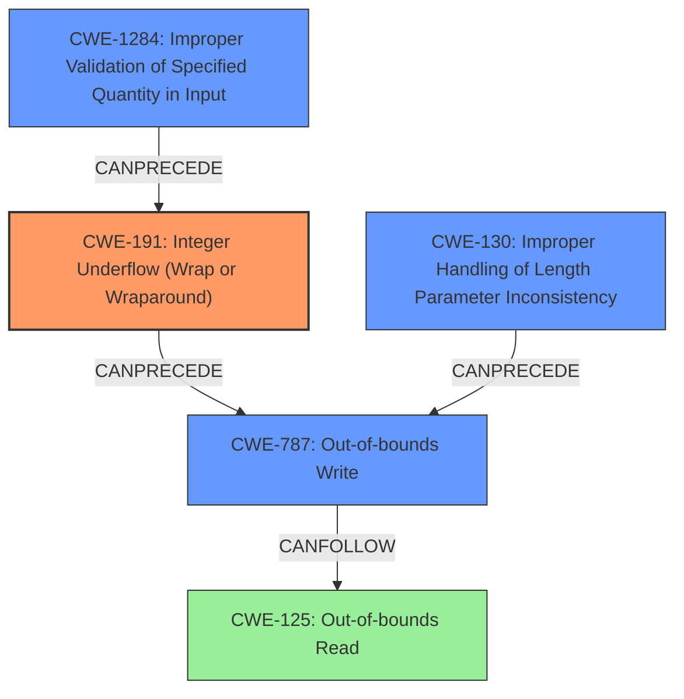

# Final Resolution for CVE-2022-39293

# Summary
| CWE ID | CWE Name | Confidence | CWE Abstraction Level | CWE Vulnerability Mapping Label | CWE-Vulnerability Mapping Notes |
|---|---|---|---|---|---|
| **CWE-191** | **Integer Underflow (Wrap or Wraparound)** | 0.95 | Base | Allowed | Primary CWE: The vulnerability involves an **integer underflow**, which is the core issue. |
| **CWE-1284** | **Improper Validation of Specified Quantity in Input** | 0.85 | Base | Allowed | Secondary Candidate: The `header_length` is not validated. |
| **CWE-787** | **Out-of-bounds Write** | 0.75 | Base | Allowed | Secondary Candidate: The **integer underflow** leads to an out-of-bounds write. |
| **CWE-130** | **Improper Handling of Length Parameter Inconsistency** | 0.65 | Base | Allowed | Secondary Candidate: The `header_length` parameter is inconsistent with what is expected. |
| CWE-125 | Out-of-bounds Read | 0.50 | Base | Allowed | Secondary Candidate: An out-of-bounds read could occur while calculating the address to write to. |

## Evidence and Confidence

*   **Confidence Score:** 0.90
*   **Evidence Strength:** HIGH

## Relationship Analysis
The classification is based on a chain of weaknesses, starting with a missing input validation (**CWE-1284**) which results in an **integer underflow** (**CWE-191**). The **integer underflow** leads to an incorrect calculation of buffer length, resulting in an out-of-bounds write (**CWE-787**). Additionally, the length field inconsistency (**CWE-130**) contributes to the incorrect length calculation. The possibility of an out-of-bounds read (**CWE-125**) exists due to the incorrect buffer length. All selected CWEs are at the Base or Variant abstraction level, providing optimal specificity.

## Vulnerability Chain
The vulnerability chain starts with the lack of input validation on `header_length` (**CWE-1284**), leading to an **integer underflow** when `header_length` is smaller than `UX_HOST_CLASS_PIMA_DATA_HEADER_SIZE` (**CWE-191**). This, along with the inconsistent length parameter (**CWE-130**), corrupts the `data_length` variable. The corrupted `data_length` is then used in a loop, resulting in an out-of-bounds write to memory (**CWE-787**). Due to the incorrect `data_length`, an out-of-bounds read (**CWE-125**) might occur when reading data.

## Summary of Analysis
The initial analysis correctly identified the **integer underflow** (**CWE-191**) and out-of-bounds write (**CWE-787**) as key components of the vulnerability. The criticism highlighted the importance of input validation (**CWE-1284**) and length parameter consistency (**CWE-130**), which are crucial in understanding the root cause.

The vulnerability description states: "if `header_length` is smaller than `UX_HOST_CLASS_PIMA_DATA_HEADER_SIZE`, calculation could **overflow** (should be underflow) and then [L182 code](https//github.com/azure-rtos/usbx/blob/082fd9db09a3669eca3358f10b8837a5c1635c0b/common/usbx_host_classes/src/ux_host_class_pima_read.c#L182) the calculation of `data_length` is also **overflow** (should be underflow), this way the later [while loop start from L192](https//github.com/azure-rtos/usbx/blob/082fd9db09a3669eca3358f10b8837a5c1635c0b/common/usbx_host_classes/src/ux_host_class_pima_read.c#L192) can move `data_pointer` to unexpected address and cause write buffer overflow."

The graph relationships highlight how the lack of input validation (**CWE-1284**) leads to the **integer underflow** (**CWE-191**), which then results in the out-of-bounds write (**CWE-787**). The length parameter inconsistency (**CWE-130**) also plays a role in the incorrect length calculation.

The selected CWEs are at the optimal level of specificity because they accurately describe the specific weaknesses present in the code. **CWE-191** captures the core **integer underflow** issue, **CWE-1284** captures the lack of input validation, **CWE-787** captures the out-of-bounds write, and **CWE-130** captures the length parameter inconsistency. These CWEs provide a comprehensive understanding of the vulnerability and facilitate targeted mitigation efforts.