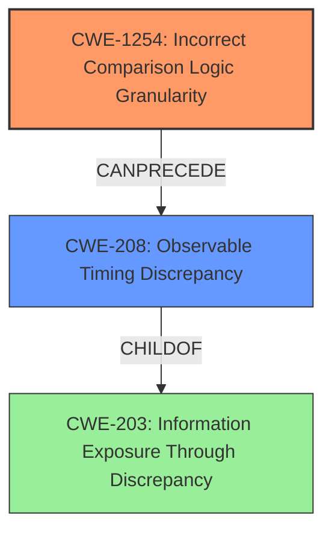

# Final Resolution for CVE-2022-39308

# Summary
| CWE ID | CWE Name | Confidence | CWE Abstraction Level | CWE Vulnerability Mapping Label | CWE-Vulnerability Mapping Notes |
|---|---|---|---|---|---|
| CWE-1254 | Incorrect Comparison Logic Granularity | 0.95 | Base | Allowed | Primary CWE: **Timing attack** due to non-constant-time string comparison. |
| CWE-208 | Observable Timing Discrepancy | 0.8 | Base | Allowed | Secondary CWE: Consequence of the **timing attack**, leading to observable discrepancies. |
| CWE-203 | Information Exposure Through Discrepancy | 0.6 | Base | Allowed | Tertiary CWE: General information leak due to observable timing differences. |

## Evidence and Confidence

*   **Confidence Score:** 0.9
*   **Evidence Strength:** HIGH

## Relationship Analysis
The primary weakness is **CWE-1254 (Incorrect Comparison Logic Granularity)**, which is a base-level CWE describing the use of a non-constant-time comparison. This leads directly to **CWE-208 (Observable Timing Discrepancy)**, as the different execution times reveal information to an attacker. **CWE-203 (Information Exposure Through Discrepancy)** is a broader category that encompasses **CWE-208** but is less specific to the **timing attack** itself. Therefore, **CWE-1254** is the root cause, **CWE-208** is a direct consequence, and **CWE-203** provides a broader context.

## Vulnerability Chain
The vulnerability chain starts with the **ROOTCAUSE** of using regular string comparison for access token validation (**CWE-1254**). This leads to a **timing attack**, where the attacker can observe differences in execution time (**CWE-208**). These timing differences allow the attacker to infer information about the token, eventually leading to unauthorized access. The initial flaw (**CWE-1254**) directly results in the observable **timing discrepancy** (**CWE-208**), which is a form of information exposure (**CWE-203**).

## Summary of Analysis
The initial analysis correctly identified **CWE-1254** and **CWE-208** as the primary and secondary CWEs, respectively. The criticism provided valuable insights, particularly emphasizing that regular string comparison functions often terminate early on a mismatch, creating the **timing difference**.

The vulnerability description explicitly states: "GoCD versions from 19.2.0 to 19.10.0 (inclusive) are subject to a **timing attack** in validation of access tokens due to use of regular string comparison for validation of the token rather than a constant time algorithm." This statement is strong evidence for **CWE-1254**, as it directly links the **timing attack** to the incorrect comparison logic. The consequence of this is also stated: "This could allow a brute force attack on GoCD server API calls to observe **timing differences** in validations in order to guess an access token generated by a user for API access," which supports **CWE-208**.

**CWE-1254** is at the optimal level of specificity because it directly addresses the incorrect comparison logic. **CWE-208** provides context on the consequence of this weakness. **CWE-203** is added to show the broad context of information exposure.

The graph relationships confirm that **CWE-1254** is the **ROOTCAUSE**, leading to **CWE-208**. This is a clear vulnerability chain, where the incorrect comparison logic directly leads to observable **timing discrepancies**. The inclusion of **CWE-203** as a tertiary classification adds a broader perspective but is less directly relevant than the other two.