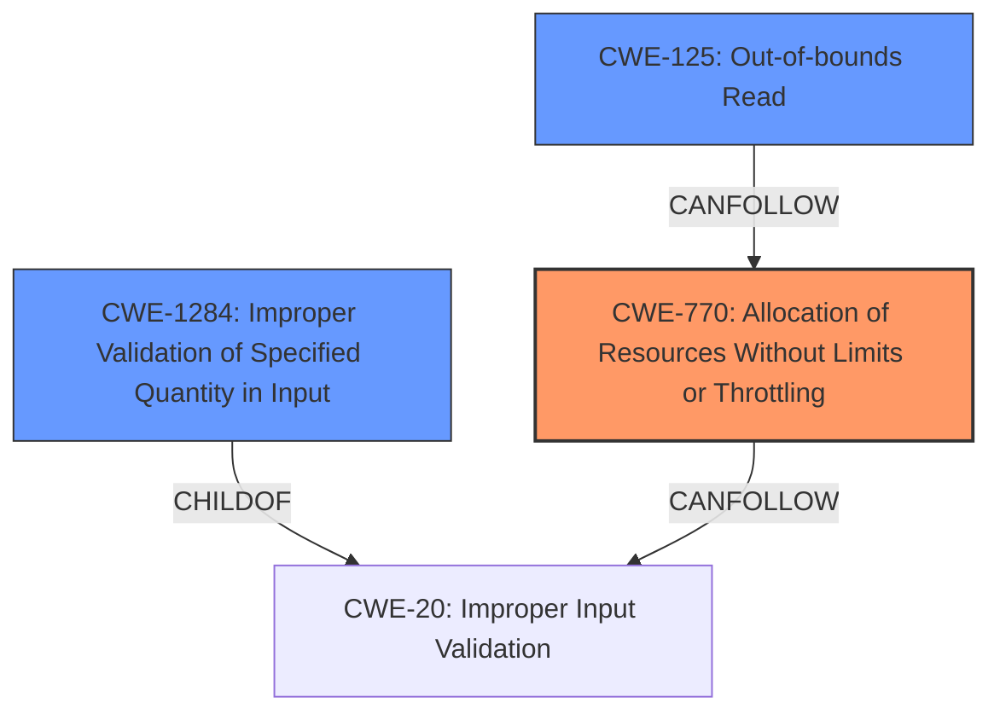

# Final Resolution for CVE-2022-39392

# Summary
| CWE ID | CWE Name | Confidence | CWE Abstraction Level | CWE Vulnerability Mapping Label | CWE-Vulnerability Mapping Notes |
|---|---|---|---|---|---|
| CWE-770 | Allocation of Resources Without Limits or Throttling | 0.9 | Base | Allowed | Primary CWE |
| CWE-1284 | Improper Validation of Specified Quantity in Input | 0.8 | Base | Allowed | Secondary Candidate |
| CWE-125 | Out-of-bounds Read | 0.7 | Base | Allowed | Secondary Candidate |

## Evidence and Confidence

*   **Confidence Score:** 0.8
*   **Evidence Strength:** HIGH

## Relationship Analysis
The selection of CWE-770 as the primary **WEAKNESS** is strengthened by its relationship to CWE-400 (Uncontrolled Resource Consumption), highlighting a broader class of resource management issues. The **CANFOLLOW** relationship between CWE-770 and CWE-20 (Improper Input Validation) underscores the need for validating resource requests, which is further supported by CWE-1284 (Improper Validation of Specified Quantity in Input) being a child of CWE-20. The connection between CWE-770 and CWE-125 (Out-of-bounds Read) through improper memory mapping clarifies the vulnerability chain.

## Vulnerability Chain
The vulnerability chain starts with **CWE-1284** (Improper Validation of Specified Quantity in Input) when the `InstanceLimitsmemory_pages` is set to zero. This leads to **CWE-770** (Allocation of Resources Without Limits or Throttling) because the allocator does not properly impose restrictions on virtual memory mappings. Consequently, this results in **CWE-125** (Out-of-bounds Read), enabling unauthorized memory access outside the WebAssembly sandbox. The initial **ROOTCAUSE** is the missing validation, and the ultimate impact is the out-of-bounds read.

## Summary of Analysis
The initial analysis correctly identified CWE-770, CWE-1284, CWE-125, and CWE-789 as potential classifications for the reported vulnerability. The criticism provided a detailed and well-reasoned critique of the initial analysis, including a suggestion to increase confidence levels for the selected CWEs by providing a more direct linkage between the vulnerability description and the CWE definitions. The criticism also suggests explicitly stating how one CWE leads to another to clarify the chain of causation.

Based on the vulnerability description, "In this configuration, the virtual memory mapping for WebAssembly memories did not meet the compiler-required configuration requirements for safely executing WebAssembly modules. Wasmtimes default settings require virtual memory page faults to indicate that wasm reads/writes are out-of-bounds, but the pooling allocators configuration would not create an appropriate virtual memory mapping for this meaning out of bounds reads/writes can successfully read/write memory unrelated to the wasm sandbox within range of the base address of the memory mapping created by the pooling allocator," the primary **WEAKNESS** is **CWE-770** (Allocation of Resources Without Limits or Throttling) because the allocator *does not impose any restrictions on the virtual memory mappings* when `InstanceLimitsmemory_pages` is zero. The secondary candidates are **CWE-1284** (Improper Validation of Specified Quantity in Input) because setting `InstanceLimitsmemory_pages` to zero is an *input* and the system does not properly *validate* that the *quantity* of memory pages is within allowed bounds, and **CWE-125** (Out-of-bounds Read) as a result of the improper memory mapping. The **ROOTCAUSE** is directly related to the lack of validation on the input that defines memory allocation limits.

The graph relationships influenced the final selection by clarifying the vulnerability chain. The hierarchical and chain relationships illustrate how the lack of input validation leads to uncontrolled resource allocation, resulting in out-of-bounds reads.

The selected CWEs are at the optimal level of specificity because they directly represent the **ROOTCAUSE** and consequences of the vulnerability based on the available evidence.