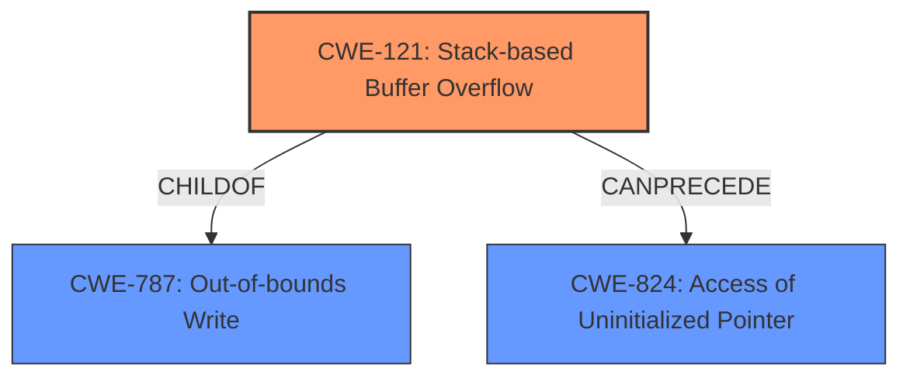

# Analysis Report for CVE-2022-39803

# Vulnerability Analysis Report: CVE-2022-39803

## Description

Due to lack of proper memory management, when a victim opens a manipulated ACIS Part and Assembly (.sat, CoreCadTranslator.exe) file received from untrusted sources in SAP 3D Visual Enterprise Author - version 9, it is possible that a Remote Code Execution can be triggered when payload forces a stack-based overflow or a re-use of dangling pointer which refers to overwritten space in memory.

## Vulnerability Description Key Phrases

**Rootcause:** lack of proper memory management
**Weakness:** stack-based overflow or a re-use of dangling pointer
**Impact:** Remote Code Execution
**Vector:** manipulated ACIS Part and Assembly file
**Product:** SAP 3D Visual Enterprise Author
**Version:** 9
**Component:** CoreCadTranslator.exe

## Analysis (with Relationship Data)

# Summary
| CWE ID | CWE Name | Confidence | CWE Abstraction Level | CWE Vulnerability Mapping Label | CWE-Vulnerability Mapping Notes |
|---|---|---|---|---|---|
| CWE-121 | Stack-based Buffer Overflow | 0.95 | Variant | Allowed | Primary CWE |
| CWE-824 | Access of Uninitialized Pointer | 0.70 | Base | Allowed | Secondary Candidate CWE |
| CWE-787 | Out-of-bounds Write | 0.60 | Base | Allowed | Secondary Candidate CWE |

## Evidence and Confidence

*   **Confidence Score:** 0.90
*   **Evidence Strength:** HIGH

- **Analysis and Justification:**  
  - *Explanation:* The vulnerability description explicitly mentions a "**stack-based overflow**" and "**lack of proper memory management**" when processing a manipulated file. This directly aligns with CWE-121 (Stack-based Buffer Overflow), a variant of CWE-119, where data is written beyond the boundaries of a buffer allocated on the stack, leading to potential remote code execution. The description also mentions "**re-use of dangling pointer**", which suggests the possibility of CWE-824 (Access of Uninitialized Pointer) where a pointer is accessed without proper initialization, potentially leading to unexpected behavior or vulnerabilities. While CWE-119 (Buffer Overflow) is suggested by the "CWE for similar CVE Descriptions", CWE-121 provides a more specific classification due to the explicit mention of the stack. Since the vulnerability explicitly mentions a stack-based overflow, and CWE-121 is a Variant (more specific than Base/Class), it's chosen as the primary CWE. Additionally, the potential for reusing a dangling pointer (referring to overwritten memory) could be indicative of CWE-824 (Access of Uninitialized Pointer), indicating a secondary weakness related to memory management. CWE-787 (Out-of-bounds Write) is a more general case of buffer overflows which is less specific than CWE-121.

  - *Relationship Analysis:* CWE-121 is a variant of CWE-119 (Buffer Overflow). The "Retriever Results" also list CWE-119, but given the specific mention of a "stack-based overflow", CWE-121 is more accurate. CWE-121 can lead to CWE-787 (Out-of-bounds Write). CWE-824 has no direct relationship but is often a consequence of memory corruption issues arising from buffer overflows.

- **Confidence Score:**
  - Confidence: 0.95 (High confidence due to direct mention of "stack-based overflow" and "re-use of dangling pointer" in the vulnerability description)
---

## Criticism of Analysis

Okay, here's a review of the analysis, considering the full CWE specifications provided:

**Overall Assessment:**

The analysis is well-structured and attempts to provide a comprehensive explanation of the identified CWEs. The confidence scores are justified, and the inclusion of CWE specifications is valuable. The primary CWE choice of CWE-121 is reasonable given the information. The addition of CWE-824 and CWE-787 as secondary candidates is also justified, but the reasoning could be slightly improved.

**Detailed Critique:**

1.  **Primary CWE: CWE-121 (Stack-based Buffer Overflow)**
    *   **Justification:** The analysis correctly identifies the explicit mention of "stack-based overflow" in the description as strong evidence for CWE-121. This is a good application of the principle of choosing the most specific CWE available.
    *   **Confidence:** The high confidence score (0.95) is appropriate, given the clear textual match in the vulnerability description.
    *   **Mapping Guidance Consideration:** The analysis correctly acknowledges that CWE-119 is discouraged for direct mapping when more specific children exist.
    *   **Potential Mitigations:** The provided mitigations for CWE-121 (compiler-based detection, abstraction libraries, bounds checking) are relevant and should be considered.
    *   **Improvement Suggestion:** None.

2.  **Secondary CWE: CWE-824 (Access of Uninitialized Pointer)**
    *   **Justification:** The justification for CWE-824 is weaker but still reasonable. The phrase "re-use of dangling pointer which refers to overwritten space in memory" *could* imply that a pointer is being used without proper initialization *after* it's been freed (or its memory has been overwritten, which has a similar effect). However, the relationship isn't as direct as the one for CWE-121.
    *   **Confidence:** The lack of a direct cause to CWE-824 in the original description should result in a lower Confidence Score than the original assessment of 0.7. A confidence score of 0.6 would be more appropriate.
    *   **Mapping Guidance Consideration:** The analysis notes that "CWE-824 has no direct relationship but is often a consequence of memory corruption issues arising from buffer overflows." This highlights that CWE-824 is a *potential consequence*, not necessarily the *cause* or a *parallel issue*.
    *   **Potential Mitigations:** The suggested mitigations are less directly applicable based on current information provided. While setting pointers to NULL after freeing memory (or preventing uninitialized pointer usage) are general good practices, their relevance depends on whether this is, in fact, a dangling pointer scenario.
    *   **Improvement Suggestion:** The analysis should clarify *how* a stack-based overflow might *lead* to the use of an uninitialized or dangling pointer. A stronger chain of reasoning would increase confidence. For example: "By overwriting parts of the stack, an attacker might corrupt a pointer value, leading to the use of an uninitialized or previously-freed memory location."

3.  **Secondary CWE: CWE-787 (Out-of-bounds Write)**
    *   **Justification:** CWE-787 is a valid candidate because a stack-based buffer overflow *is* an out-of-bounds write. However, the description explicitly calls out that CWE-121 is a Variant of the more general CWE-787 which makes 121 a better choice.
    *   **Confidence:** While valid, its generality means it's less informative than CWE-121. Should result in a Confidence Score of 0.55
    *   **Mapping Guidance Consideration:** This is less specific than CWE-121 as a stack buffer is allocated on the stack, which makes it very specific.
    *   **Potential Mitigations:** While the mitigations for CWE-787 are applicable to buffer overflows in general, they are already captured more specifically within the mitigations for CWE-121.
    *   **Improvement Suggestion:** The relationship between CWE-121 and CWE-787 (Variant and Base CWE) should be better articulated.

**Recommendations:**

*   **Refine CWE-824 Justification:** Provide a clearer explanation of how the described overflow *could* lead to dangling pointer use or access of uninitialized pointers. Be explicit about the potential corruption of pointer values on the stack.
*   **Clarify CWE-121/CWE-787 relationship**: The relationship between the two CWEs (variant/base) should be better established and could be simplified to just CWE-121.
*   **Lower CWE-824 and CWE-787 Confidence:** Reassess the confidence scores for secondary CWEs to reflect the less direct evidence in the description.

By addressing these points, the analysis can provide a more precise and actionable understanding of the vulnerability.

## Final Resolution

# Summary 
| CWE ID | CWE Name | Confidence | CWE Abstraction Level | CWE Vulnerability Mapping Label | CWE-Vulnerability Mapping Notes |
|---|---|---|---|---|---|
| CWE-121 | Stack-based Buffer Overflow | 0.95 | Variant | Allowed | Primary CWE |
| CWE-824 | Access of Uninitialized Pointer | 0.60 | Base | Allowed | Secondary Candidate CWE |
| CWE-787 | Out-of-bounds Write | 0.55 | Base | Allowed | Secondary Candidate CWE |

## Evidence and Confidence

*   **Confidence Score:** 0.90
*   **Evidence Strength:** HIGH

## Relationship Analysis
The primary relationship is that CWE-121 (Stack-based Buffer Overflow) is a variant of CWE-787 (Out-of-bounds Write), making CWE-121 more specific and appropriate given the vulnerability description. CWE-824 (Access of Uninitialized Pointer) is added as a secondary candidate since memory corruption due to stack-based buffer overflows could lead to the use of uninitialized pointers.

## Vulnerability Chain
The vulnerability chain starts with the processing of a manipulated file. This leads to a **CWE-121 (Stack-based Buffer Overflow)**, where data is written beyond the boundaries of a buffer allocated on the stack. This can then lead to **CWE-824 (Access of Uninitialized Pointer)** if the overflow corrupts pointer values on the stack, causing the program to use uninitialized memory. The final impact is potential remote code execution.

## Summary of Analysis
The initial analysis and criticism are both well-reasoned. The primary CWE, CWE-121, is strongly supported by the vulnerability description's explicit mention of a "stack-based overflow." The analysis correctly identifies that CWE-121 is a variant of CWE-787, making it a more specific and preferred choice. The inclusion of CWE-824 as a secondary candidate is plausible, as a stack-based overflow can potentially corrupt pointer values, leading to the use of uninitialized memory. The adjustments to the confidence scores for CWE-824 and CWE-787 are appropriate, reflecting the less direct evidence for these weaknesses.

The graph relationships influenced the final selection by highlighting the parent-child relationship between CWE-121 and CWE-787, emphasizing the importance of choosing the most specific CWE. The potential chain relationship between CWE-121 and CWE-824 further supports the inclusion of CWE-824 as a secondary candidate.

The selected CWEs are at the optimal level of specificity. CWE-121 is a Variant CWE that directly matches the vulnerability description, while CWE-824 and CWE-787 represent potential consequences or more general forms of the weakness.

Evidence:
"Due to lack of proper memory management, when a victim opens a manipulated ACIS Part and Assembly (.sat, CoreCadTranslator.exe) file received from untrusted sources in SAP 3D Visual Enterprise Author - version 9, it is possible that a Remote Code Execution can be triggered when payload forces a stack-based overflow or a re-use of dangling pointer which refers to overwritten space in memory."

*Report generated on 2025-03-18 16:34:51*
