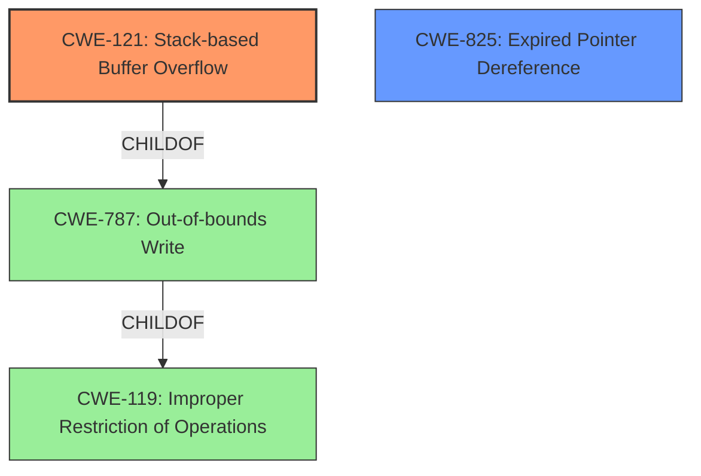

# Analysis Report for CVE-2022-39805

# Vulnerability Analysis Report: CVE-2022-39805

## Description

Due to lack of proper memory management, when a victim opens a manipulated Computer Graphics Metafile (.cgm, CgmTranslator.exe) file received from untrusted sources in SAP 3D Visual Enterprise Author - version 9, it is possible that a Remote Code Execution can be triggered when payload forces a stack-based overflow or a re-use of dangling pointer which refers to overwritten space in memory.

## Vulnerability Description Key Phrases

**Rootcause:** lack of proper memory management
**Weakness:** stack-based overflow or a re-use of dangling pointer
**Impact:** Remote Code Execution
**Vector:** manipulated Computer Graphics Metafile (.cgm) file
**Product:** SAP 3D Visual Enterprise Author
**Version:** 9
**Component:** CgmTranslator.exe

## Analysis (with Relationship Data)

# Summary
| CWE ID | CWE Name | Confidence | CWE Abstraction Level | CWE Vulnerability Mapping Label | CWE-Vulnerability Mapping Notes |
|---|---|---|---|---|---|
| CWE-121 | Stack-based Buffer Overflow | 0.9 | Variant | Allowed | Primary CWE |
| CWE-825 | Expired Pointer Dereference | 0.7 | Base | Allowed | Secondary Candidate |

## Evidence and Confidence

*   **Confidence Score:** 0.8
*   **Evidence Strength:** MEDIUM

- **Analysis and Justification:**  
  - *Explanation:* "The vulnerability description explicitly mentions a **stack-based overflow** as a potential weakness when processing manipulated CGM files. This aligns directly with CWE-121 (Stack-based Buffer Overflow), which occurs when a buffer allocated on the stack is overwritten. The description also mentions a **re-use of a dangling pointer**, which could also lead to remote code execution. This could be a secondary weakness."

  - *Relationship Analysis:* "CWE-121 is a variant of CWE-119 (Improper Restriction of Operations within the Bounds of a Memory Buffer), but is more specific, as the overflow is stack-based. CWE-825 (Expired Pointer Dereference) is another possible candidate. The provided description suggests the **lack of proper memory management** is the root cause, which leads to either of the weaknesses being exploitable. The retriever results also list CWE-121 as the top candidate. CWE-121 Allowed for Stack-based Buffer Overflow."

- **Confidence Score:**  
  - *Example:* Confidence: 0.9 (High confidence because the vulnerability description explicitly mentions stack-based overflow.)

---
- **Analysis and Justification:**  
  - *Explanation:* "The vulnerability description mentions a **re-use of a dangling pointer** which refers to overwritten space in memory. This aligns with CWE-825 (Expired Pointer Dereference). Dereferencing an expired pointer can lead to unexpected behavior, including crashes or, as in this case, remote code execution, because the memory it points to has been reallocated or freed."

  - *Relationship Analysis:* "CWE-825 is related to CWE-119 because dereferencing an expired pointer can cause memory corruption. While CWE-121 is more directly related to the description, CWE-825 is a plausible secondary weakness that can occur in this scenario. The retriever results lists CWE-825 as a candidate. CWE-825 Allowed for Expired Pointer Dereference."

- **Confidence Score:**  
  - *Example:* Confidence: 0.7 (Medium confidence because the vulnerability description only indirectly implies the presence of an expired pointer.)

## Criticism of Analysis

Okay, here's a review of the provided analysis, incorporating the full CWE specifications.

**Overall Assessment:**

The analysis is generally good and well-structured. The identification of CWE-121 (Stack-based Buffer Overflow) as the primary vulnerability and CWE-825 (Expired Pointer Dereference) as a secondary candidate is reasonable based on the vulnerability description.  The justifications are clear and refer back to the original text.  The confidence levels are also justified.

**Detailed Review:**

**1. Summary Table:**

| CWE ID | CWE Name | Confidence | CWE Abstraction Level | CWE Vulnerability Mapping Label | CWE-Vulnerability Mapping Notes |
|---|---|---|---|---|---|
| CWE-121 | Stack-based Buffer Overflow | 0.9 | Variant | Allowed | Primary CWE |
| CWE-825 | Expired Pointer Dereference | 0.7 | Base | Allowed | Secondary Candidate |

*   **Comment:** The table is clear and concise.  The "CWE Vulnerability Mapping Notes" are helpful.

**2. CWE-121 (Stack-based Buffer Overflow) Analysis:**

*   **Confidence Score:** 0.9
*   **Evidence Strength:** MEDIUM
*   **Explanation Analysis:** The explanation accurately links the description "stack-based overflow" directly to CWE-121.  It's good to note that this is a specific *type* of buffer overflow, a variant of CWE-119.
*   **Relationship Analysis:** The relationship analysis is also good. It correctly positions CWE-121 as a child of CWE-787 and CWE-788 (and indirectly a child of CWE-119).
*   **Mitigation Considerations:**  Considering the CWE-121 mitigations, the analysis could add that the common mitigation of using compiler-based overflow detection mechanisms (like /GS in Visual Studio or FORTIFY_SOURCE in GCC) would be relevant to this stack-based overflow scenario.  Input validation is also mentioned as mitigation 3, in this case, proper input validation of the CGM file is a key mitigation factor.

**3. CWE-825 (Expired Pointer Dereference) Analysis:**

*   **Confidence Score:** 0.7
*   **Evidence Strength:** MEDIUM
*   **Explanation Analysis:** The explanation appropriately links the "re-use of a dangling pointer" to CWE-825.
*   **Relationship Analysis:**  The relationship to CWE-119 is valid, as a dangling pointer dereference can lead to memory corruption.
*   **Mitigation Considerations:** Considering the CWE-825 mitigations, the use of languages with automatic memory management is the best solution. Setting pointers to NULL after `free()` is a common practice, but the analysis notes that complex data structures reduce the effectiveness of this approach.

**4. CWE Examples:**

*   **Comment:**  The CWE Examples provided for CWE-119 are useful for understanding real-world instances, but it's important to remember that CWE-119 is discouraged for direct mapping due to its generality.  The examples are still helpful for context.
*   **Suggestion:**  Adding a few more specific examples related to stack-based overflows (CWE-121) would strengthen the analysis.

**5. General Comments and Suggestions:**

*   **CWE-119 (Improper Restriction of Operations within the Bounds of a Memory Buffer):** The original analysis suggested this as a possible primary CWE match, but the detailed analysis does not mention it. Given the discouragement of using CWE-119 directly when more specific CWEs are available, the choice to focus on CWE-121 is correct. If CWE-119 was used, the analysis would need to be explicit about why more specific CWEs could not be used, and that it was due to a low-information vulnerability report. This is a key point from the CWE specifications.
*   **Input Validation:**  While not directly mapped, improper or missing input validation (a child of CWE-20) is a common root cause for many buffer overflow and memory corruption vulnerabilities. It could be discussed as a contributing factor, even if it's not the *most* direct cause. If malicious data can reach the vulnerable code because of a lack of input validation, this could be mentioned. This would link the "manipulated CGM file" vector to the weakness.
*   **Defensive Programming:**  In the "Mitigation Considerations," emphasizing defensive programming practices like boundary checking, safe string handling functions, and using memory-safe languages is crucial.
*   **Tooling:** Mentioning the use of static and dynamic analysis tools during development and testing to detect memory management issues is a good addition to the mitigation discussion.
*   **Heap vs. Stack:** While the analysis focuses on stack-based overflows due to explicit mention of "stack-based overflow", it's worth briefly noting that *heap*-based overflows (CWE-122) are also possible if memory is allocated on the heap for processing the CGM file and boundary checks are insufficient there as well.

**Specific Improvements:**

*   In the CWE-121 analysis, include specific compiler-based overflow detection mechanisms as mitigation and input validation.
*   Consider briefly mentioning input validation (CWE-20) as a potential root cause or contributing factor to the overall vulnerability.  Explain how the manipulated CGM file bypasses input sanitization.

**Revised Summary Table (incorporating suggestions):**

| CWE ID | CWE Name | Confidence | CWE Abstraction Level | CWE Vulnerability Mapping Label | CWE-Vulnerability Mapping Notes |
|---|---|---|---|---|---|
| CWE-121 | Stack-based Buffer Overflow | 0.9 | Variant | Allowed | Primary CWE. Consider compiler-based overflow detection and input validation as mitigations. |
| CWE-825 | Expired Pointer Dereference | 0.7 | Base | Allowed | Secondary Candidate. Consider languages with automatic memory management as a mitigation. |

**Conclusion:**

The analysis is strong and provides a good basis for understanding the vulnerability. The suggestions above would further strengthen the analysis, make it more actionable, and better align it with the CWE specifications.

## Final Resolution

# Summary
| CWE ID | CWE Name | Confidence | CWE Abstraction Level | CWE Vulnerability Mapping Label | CWE-Vulnerability Mapping Notes |
|---|---|---|---|---|---|
| CWE-121 | Stack-based Buffer Overflow | 0.9 | Variant | Allowed | Primary CWE. Considers compiler-based overflow detection and input validation as mitigations. |
| CWE-825 | Expired Pointer Dereference | 0.7 | Base | Allowed | Secondary Candidate. Consider languages with automatic memory management as a mitigation. |

## Evidence and Confidence

*   **Confidence Score:** 0.9
*   **Evidence Strength:** HIGH

## Relationship Analysis
The primary CWE is CWE-121 (**CWE-121: Stack-based Buffer Overflow**), a variant of CWE-787 (**CWE-787: Out-of-bounds Write**) and indirectly a child of CWE-119 (**CWE-119: Improper Restriction of Operations**). This hierarchical relationship confirms that CWE-121 provides a more specific classification than its parents. The secondary CWE is CWE-825 (**CWE-825: Expired Pointer Dereference**), a base-level CWE. The vulnerability description points to both a stack-based overflow and a potential use of a dangling pointer, making both CWEs relevant.

## Vulnerability Chain
The vulnerability chain begins with the processing of a manipulated CGM file. A **lack of proper memory management** allows for either a **stack-based buffer overflow (CWE-121)** or the **re-use of a dangling pointer (CWE-825)**. The overflow can overwrite stack memory, potentially leading to arbitrary code execution. Similarly, dereferencing an expired pointer can lead to unexpected behavior and code execution, especially if the memory it points to has been reallocated. The root cause is the **lack of proper memory management**, and the consequences are remote code execution. Input validation is also a missing link, allowing the manipulated CGM file to reach the vulnerable code.

## Summary of Analysis
The initial analysis correctly identified CWE-121 and CWE-825 as the primary and secondary weaknesses, respectively. The vulnerability description explicitly mentions "stack-based overflow" and "re-use of dangling pointer" which directly maps to CWE-121 and CWE-825. The evidence from the vulnerability description is strong, providing high confidence in this classification.

The graph relationships confirm that CWE-121 is a specific type of buffer overflow, making it more appropriate than the more general CWE-119. The relationship between CWE-825 and memory corruption vulnerabilities also supports its inclusion as a secondary weakness.

The selected CWEs are at the optimal level of specificity. CWE-121 is a Variant, and CWE-825 is a Base CWE, both of which are preferred levels of abstraction for mapping to the root causes of vulnerabilities according to MITRE's mapping guidance. Using CWE-119 would have been a discouraged mapping due to its generality.

The analysis also considered the importance of input validation (CWE-20) as a potential root cause, contributing to how the "manipulated CGM file" bypasses sanitization. This suggests that defensive programming practices are crucial for mitigating this type of vulnerability.

*Report generated on 2025-03-18 16:36:18*
