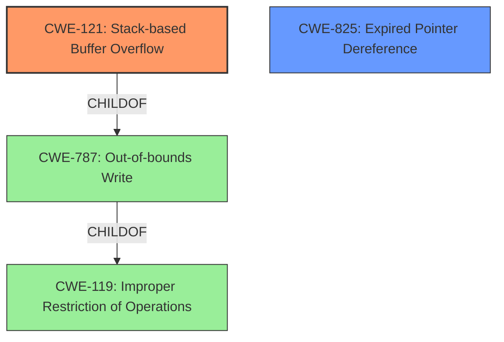

# Final Resolution for CVE-2022-39805

# Summary
| CWE ID | CWE Name | Confidence | CWE Abstraction Level | CWE Vulnerability Mapping Label | CWE-Vulnerability Mapping Notes |
|---|---|---|---|---|---|
| CWE-121 | Stack-based Buffer Overflow | 0.9 | Variant | Allowed | Primary CWE. Considers compiler-based overflow detection and input validation as mitigations. |
| CWE-825 | Expired Pointer Dereference | 0.7 | Base | Allowed | Secondary Candidate. Consider languages with automatic memory management as a mitigation. |

## Evidence and Confidence

*   **Confidence Score:** 0.9
*   **Evidence Strength:** HIGH

## Relationship Analysis
The primary CWE is CWE-121 (**CWE-121: Stack-based Buffer Overflow**), a variant of CWE-787 (**CWE-787: Out-of-bounds Write**) and indirectly a child of CWE-119 (**CWE-119: Improper Restriction of Operations**). This hierarchical relationship confirms that CWE-121 provides a more specific classification than its parents. The secondary CWE is CWE-825 (**CWE-825: Expired Pointer Dereference**), a base-level CWE. The vulnerability description points to both a stack-based overflow and a potential use of a dangling pointer, making both CWEs relevant.

## Vulnerability Chain
The vulnerability chain begins with the processing of a manipulated CGM file. A **lack of proper memory management** allows for either a **stack-based buffer overflow (CWE-121)** or the **re-use of a dangling pointer (CWE-825)**. The overflow can overwrite stack memory, potentially leading to arbitrary code execution. Similarly, dereferencing an expired pointer can lead to unexpected behavior and code execution, especially if the memory it points to has been reallocated. The root cause is the **lack of proper memory management**, and the consequences are remote code execution. Input validation is also a missing link, allowing the manipulated CGM file to reach the vulnerable code.

## Summary of Analysis
The initial analysis correctly identified CWE-121 and CWE-825 as the primary and secondary weaknesses, respectively. The vulnerability description explicitly mentions "stack-based overflow" and "re-use of dangling pointer" which directly maps to CWE-121 and CWE-825. The evidence from the vulnerability description is strong, providing high confidence in this classification.

The graph relationships confirm that CWE-121 is a specific type of buffer overflow, making it more appropriate than the more general CWE-119. The relationship between CWE-825 and memory corruption vulnerabilities also supports its inclusion as a secondary weakness.

The selected CWEs are at the optimal level of specificity. CWE-121 is a Variant, and CWE-825 is a Base CWE, both of which are preferred levels of abstraction for mapping to the root causes of vulnerabilities according to MITRE's mapping guidance. Using CWE-119 would have been a discouraged mapping due to its generality.

The analysis also considered the importance of input validation (CWE-20) as a potential root cause, contributing to how the "manipulated CGM file" bypasses sanitization. This suggests that defensive programming practices are crucial for mitigating this type of vulnerability.