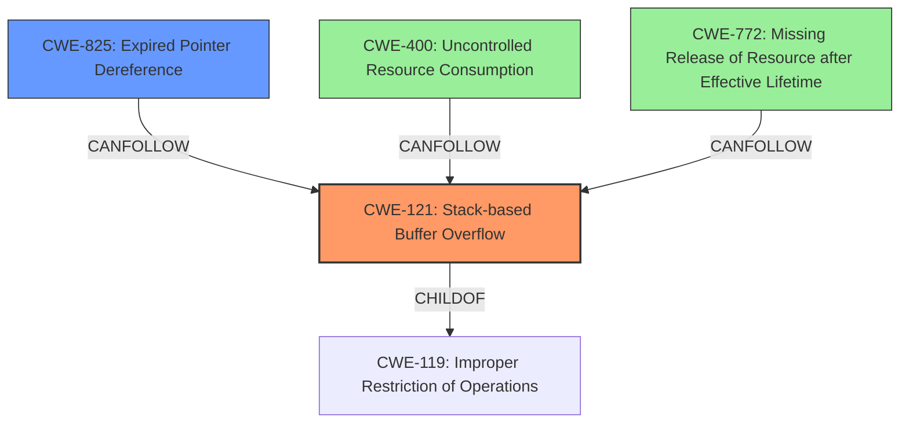

# Final Resolution for CVE-2022-39806

# Summary
| CWE ID | CWE Name | Confidence | CWE Abstraction Level | CWE Vulnerability Mapping Label | CWE-Vulnerability Mapping Notes |
|---|---|---|---|---|---|
| **CWE-121** | **Stack-based Buffer Overflow** | 0.8 | Variant | Primary | Allowed |
| **CWE-825** | **Expired Pointer Dereference** | 0.8 | Base | Secondary | Allowed - Potentially due to improper deallocation of memory within the file format. |
| **CWE-400** | **Uncontrolled Resource Consumption** | 0.5 | Base | Informative | Allowed - If the parsing process allocates memory without limit, this could lead to denial of service. |
| **CWE-772** | **Missing Release of Resource after Effective Lifetime** | 0.5 | Base | Informative | Allowed - Highlights the failure to release allocated memory. |

## Evidence and Confidence

*   **Confidence Score:** 0.8
*   **Evidence Strength:** HIGH

## Relationship Analysis
The primary weakness is a **stack-based buffer overflow (CWE-121)**, a specific type of buffer overflow that occurs on the stack. This is a child of the more general **CWE-119 (Improper Restriction of Operations within the Bounds of a Memory Buffer)**. The vulnerability description explicitly mentions a "stack-based overflow," justifying the selection of the more specific CWE-121. The secondary weakness is **CWE-825 (Expired Pointer Dereference)**, which can result from memory corruption caused by the buffer overflow. Additional weaknesses considered are related to resource management: **CWE-400 (Uncontrolled Resource Consumption)** and **CWE-772 (Missing Release of Resource after Effective Lifetime)**, which could arise from improper memory management during file parsing.

## Vulnerability Chain
The vulnerability chain starts with a manipulated SolidWorks Drawing file. The lack of proper memory management during file processing leads to a **CWE-121 (Stack-based Buffer Overflow)**. This overflow corrupts the stack, potentially overwriting a pointer with a controlled address. When this pointer is later dereferenced, it becomes a **CWE-825 (Expired Pointer Dereference)**, leading to code execution. In addition, the improper memory management could lead to **CWE-400 (Uncontrolled Resource Consumption)** if the parsing process allocates memory without limits and **CWE-772 (Missing Release of Resource after Effective Lifetime)** if allocated memory isn't properly released.

## Summary of Analysis
The initial analysis correctly identified **CWE-121 (Stack-based Buffer Overflow)** and **CWE-825 (Expired Pointer Dereference)** as the primary and secondary weaknesses, respectively. The vulnerability description explicitly states "stack-based overflow" and "re-use of a dangling pointer," which directly maps to these CWEs. The criticism suggested refining the justification for CWE-825 and considering additional weaknesses related to resource management, which I have incorporated. The refined justification explains how the "lack of proper memory management" can lead to dangling pointers through improper deallocation during file processing. I've also included **CWE-400 (Uncontrolled Resource Consumption)** and **CWE-772 (Missing Release of Resource after Effective Lifetime)** as tertiary weaknesses, as they are potential consequences of the improper memory management. The confidence levels have been adjusted slightly, with CWE-121 at 0.8 and CWE-825 at 0.8, to reflect the level of certainty given the available information. The selected CWEs are at the optimal level of specificity, with CWE-121 being a Variant and CWE-825 being a Base CWE, while the additional CWEs are at the Base level as well.