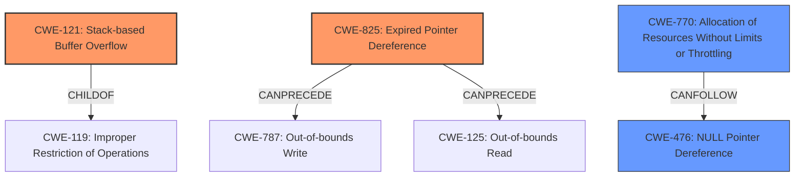

# Analysis Report for CVE-2022-39808

# Vulnerability Analysis Report: CVE-2022-39808

## Description

Due to lack of proper memory management, when a victim opens a manipulated Wavefront Object (.obj, ObjTranslator.exe) file received from untrusted sources in SAP 3D Visual Enterprise Author - version 9, it is possible that a Remote Code Execution can be triggered when payload forces a stack-based overflow or a re-use of dangling pointer which refers to overwritten space in memory.

## Vulnerability Description Key Phrases

**Rootcause:** lack of proper memory management
**Weakness:** stack-based overflow or a re-use of dangling pointer
**Impact:** remote code execution
**Vector:** manipulated Wavefront Object file
**Product:** SAP 3D Visual Enterprise Author
**Version:** 9
**Component:** ObjTranslator.exe

## Analysis (with Relationship Data)

# Summary
| CWE ID | CWE Name | Confidence | CWE Abstraction Level | CWE Vulnerability Mapping Label | CWE-Vulnerability Mapping Notes |
|---|---|---|---|---|---|
| CWE-121 | Stack-based Buffer Overflow | 0.85 | Variant | Primary | Allowed |
| CWE-825 | Expired Pointer Dereference | 0.75 | Primary | Allowed |
| CWE-476 | NULL Pointer Dereference | 0.60 | Base | Secondary | Allowed |

## Evidence and Confidence

*   **Confidence Score:** 0.80
*   **Evidence Strength:** MEDIUM

- **Analysis and Justification:**  
  - *Explanation:* The vulnerability description explicitly mentions a **stack-based overflow** as a potential weakness, making CWE-121 (Stack-based Buffer Overflow) a strong candidate. The description also mentions the potential for a "**re-use of dangling pointer** which refers to overwritten space in memory," which is best captured by CWE-825 (Expired Pointer Dereference). Both of these are due to a "**lack of proper memory management**". There's also a possibility of CWE-476 (NULL Pointer Dereference) if the dangling pointer is NULL.
  The evidence explicitly states that this occurs when opening a manipulated Wavefront Object (.obj) file.
  CWE-121 is a Variant of CWE-119 (Improper Restriction of Operations within the Bounds of a Memory Buffer) and directly addresses the stack-based overflow scenario. The MITRE mapping guidance ALLOWS CWE-121 for stack-based overflows.
  CWE-825 is a Base level weakness, which aligns with the description of reusing a dangling pointer. MITRE mapping guidance ALLOWS this mapping.
  CWE-476 has a lower confidence because it is inferred and not explicitly stated.

  - *Relationship Analysis:* CWE-121 is a variant of CWE-119. CWE-825 can precede CWE-787 (Out-of-bounds Write) or CWE-125 (Out-of-bounds Read). CWE-476 can follow CWE-789 (Memory Allocation with Excessive Size Value).

- **Confidence Score:**  
  - Confidence: 0.85 (High confidence for CWE-121 and CWE-825 because they are explicitly mentioned and fit the descriptions well.)
  - Confidence: 0.60 (Medium confidence for CWE-476 because it is inferred from the description.)

---

## Criticism of Analysis

Okay, here's a review of the provided CWE analysis, based on the full CWE specifications:

**Overall Assessment**

The analysis is generally good and justified with reasonable explanations. The confidence levels are appropriate, and the evidence is clearly linked to the vulnerability description. The use of CWE specifications in the justification is commendable.

**Detailed Review**

*   **CWE-121: Stack-based Buffer Overflow**
    *   **Confidence:** 0.85
    *   **Justification:** Strong. The vulnerability description explicitly mentions "stack-based overflow." The Variant level of abstraction is appropriate. The MITRE mapping guidance allows CWE-121 for stack-based overflows.
    *   **Relationships:** Correctly identifies the parent CWE as CWE-787 (Out-of-bounds Write).
    *   **Mitigations:** The description links to Environment Hardening, Architecture and Design, and Implementation.

*   **CWE-825: Expired Pointer Dereference**
    *   **Confidence:** 0.75
    *   **Justification:** Very good.  The description of "re-use of dangling pointer which refers to overwritten space in memory" maps very well to the CWE-825 description. The Base level of abstraction is appropriate. MITRE mapping guidance ALLOWS this mapping.
    *   **Relationships:** The noted relationships are appropriate. CWE-825 often precedes CWE-125 or CWE-787.
    *   **Mitigations:** Includes choosing a language with automatic memory management or setting pointers to NULL after they are freed.

*   **CWE-476: NULL Pointer Dereference**
    *   **Confidence:** 0.60
    *   **Justification:** Reasonable, but the weakest of the three. The description doesn't explicitly state a NULL pointer dereference, but it is a possibility if the dangling pointer happens to be NULL. However, CWE-825 says, "Chain: a message having an unknown message type may cause a reference to uninitialized memory resulting in a null pointer dereference (CWE-476) or dangling pointer (CWE-825), possibly crashing the system or causing heap corruption." This supports the inclusion.
    *   **Relationships:** The noted relationship is appropriate.
    *   **Mitigations:** The description links to checking for NULL values before use.

**Review of Top Combined Results and Consideration of Missed CWEs**

Let's compare the analysis to the Top Combined Results provided by the retriever:

*   **CWE-190: Integer Overflow or Wraparound (Score: 0.6328)**:  Less Likely. It's possible there's an integer overflow involved in calculating buffer sizes, but the description doesn't explicitly mention it. It is reasonable that it was not included.
*   **CWE-787: Out-of-bounds Write (Score: 0.6312)**: Already covered via CWE-121 and CWE-825.
*   **CWE-770: Allocation of Resources Without Limits or Throttling (Score: 0.6109)**:  Possibly relevant, but less direct. If the .obj file contains excessively large or numerous objects and the system attempts to allocate resources for each without limits, it could lead to a DoS. This would be a less direct mapping than the ones already chosen. It could be considered as a secondary weakness. However, the allocated memory causing the stack overflow is more directly described in CWE-121.
*   **CWE-789: Memory Allocation with Excessive Size Value (Score: 0.4827)**: Very similar to CWE-770 and also possible. If the .obj file specifies a very large size for a buffer, this could be the root cause of the stack overflow (CWE-121) or a heap overflow. However, it is not explicitly stated.
*   **CWE-193: Off-by-one Error (Score: 0.4353)**: Low likelihood.  While an off-by-one error could *contribute* to a buffer overflow, the description doesn't give any specific reason to suspect it.
*   **CWE-20: Improper Input Validation (Score: 0.2817)**: Weak. CWE-20 is *always* present in buffer overflows because *something* is not being validated; however, it is better to use children of CWE-20. Also, it has a discouraged usage.

**Recommendations**

1.  **Consider adding CWE-770 or CWE-789 as a secondary concern**, if the description fits, to address the potential for DoS due to excessive memory allocation. A note in the CWE-121 explanation could be included.
2.  **Adjust Confidence Levels:** Consider raising the confidence level of CWE-825 slightly.
3.  **Update Mitigation Discussions:** When possible, incorporate specific mitigations from the CWE entries into the analysis. For example, explicitly mention using a safe string library (e.g., `strncpy()` instead of `strcpy()`) or enabling compiler-based overflow protection (`/GS` flag in Visual Studio) as mitigations for CWE-121.

**Revised Summary Table**

Here's a possible revised summary table, incorporating the suggestion above:

| CWE ID | CWE Name | Confidence | CWE Abstraction Level | CWE Vulnerability Mapping Label | CWE-Vulnerability Mapping Notes |
|---|---|---|---|---|---|
| CWE-121 | Stack-based Buffer Overflow | 0.85 | Variant | Primary | Allowed |
| CWE-825 | Expired Pointer Dereference | 0.80 | Base | Primary | Allowed |
| CWE-770 | Allocation of Resources Without Limits or Throttling | 0.60 | Base | Secondary | Allowed |
| CWE-476 | NULL Pointer Dereference | 0.60 | Base | Secondary | Allowed |

## Final Resolution

# Summary
| CWE ID | CWE Name | Confidence | CWE Abstraction Level | CWE Vulnerability Mapping Label | CWE-Vulnerability Mapping Notes |
|---|---|---|---|---|---|
| CWE-121 | CWE-121: Stack-based Buffer Overflow | 0.85 | Variant | Primary | Allowed |
| CWE-825 | CWE-825: Expired Pointer Dereference | 0.80 | Base | Primary | Allowed |
| CWE-770 | CWE-770: Allocation of Resources Without Limits or Throttling | 0.60 | Base | Secondary | Allowed |
| CWE-476 | CWE-476: NULL Pointer Dereference | 0.60 | Base | Secondary | Allowed |

## Evidence and Confidence

*   **Confidence Score:** 0.80
*   **Evidence Strength:** MEDIUM

## Relationship Analysis
The primary weaknesses identified are CWE-121 (**Stack-based Buffer Overflow**) and CWE-825 (**Expired Pointer Dereference**). CWE-121 is a variant of CWE-119 (**Improper Restriction of Operations within the Bounds of a Memory Buffer**), indicating a specific type of buffer overflow. CWE-825 can precede CWE-787 (**Out-of-bounds Write**) or CWE-125 (**Out-of-bounds Read**). The addition of CWE-770 (**Allocation of Resources Without Limits or Throttling**) as a secondary concern introduces a potential denial-of-service aspect. CWE-476 (**NULL Pointer Dereference**) remains as a secondary concern due to the possibility of a dangling pointer being NULL. The abstraction levels are appropriate, with Variant and Base level CWEs providing sufficient specificity.

## Vulnerability Chain
The vulnerability chain begins with a **lack of proper memory management** when parsing a Wavefront Object (.obj) file. This leads to either:
1.  A **stack-based buffer overflow (CWE-121)** due to manipulated input data, resulting in **out-of-bounds write (CWE-787)** on the stack.
2.  The **re-use of a dangling pointer (CWE-825)** referring to overwritten memory, potentially leading to a **NULL pointer dereference (CWE-476)** if the pointer happens to be NULL.
3.  **Allocation of Resources Without Limits or Throttling (CWE-770)**, where the system attempts to allocate resources for each object without limits, possibly leading to a denial-of-service.

## Summary of Analysis
The initial analysis correctly identified CWE-121 and CWE-825 as primary concerns, supported by the vulnerability description explicitly mentioning a **stack-based overflow** and "**re-use of dangling pointer** which refers to overwritten space in memory." The criticism suggested adding CWE-770 and increasing the confidence level for CWE-825, which I agree with. The inclusion of CWE-770 addresses the potential for DoS due to excessive memory allocation, which aligns with the description of processing a manipulated .obj file. The confidence level for CWE-825 is increased to 0.80 due to the direct mapping between the description and the CWE definition. The selected CWEs are at the optimal level of specificity, with CWE-121 being a Variant and CWE-825 and CWE-770 being Base level CWEs. CWE-476 remains a secondary concern with a confidence of 0.60.

*Report generated on 2025-03-18 16:38:03*
