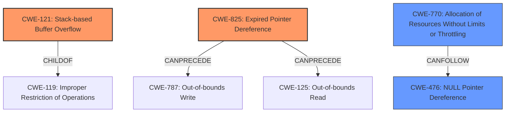

# Final Resolution for CVE-2022-39808

# Summary
| CWE ID | CWE Name | Confidence | CWE Abstraction Level | CWE Vulnerability Mapping Label | CWE-Vulnerability Mapping Notes |
|---|---|---|---|---|---|
| CWE-121 | CWE-121: Stack-based Buffer Overflow | 0.85 | Variant | Primary | Allowed |
| CWE-825 | CWE-825: Expired Pointer Dereference | 0.80 | Base | Primary | Allowed |
| CWE-770 | CWE-770: Allocation of Resources Without Limits or Throttling | 0.60 | Base | Secondary | Allowed |
| CWE-476 | CWE-476: NULL Pointer Dereference | 0.60 | Base | Secondary | Allowed |

## Evidence and Confidence

*   **Confidence Score:** 0.80
*   **Evidence Strength:** MEDIUM

## Relationship Analysis
The primary weaknesses identified are CWE-121 (**Stack-based Buffer Overflow**) and CWE-825 (**Expired Pointer Dereference**). CWE-121 is a variant of CWE-119 (**Improper Restriction of Operations within the Bounds of a Memory Buffer**), indicating a specific type of buffer overflow. CWE-825 can precede CWE-787 (**Out-of-bounds Write**) or CWE-125 (**Out-of-bounds Read**). The addition of CWE-770 (**Allocation of Resources Without Limits or Throttling**) as a secondary concern introduces a potential denial-of-service aspect. CWE-476 (**NULL Pointer Dereference**) remains as a secondary concern due to the possibility of a dangling pointer being NULL. The abstraction levels are appropriate, with Variant and Base level CWEs providing sufficient specificity.

## Vulnerability Chain
The vulnerability chain begins with a **lack of proper memory management** when parsing a Wavefront Object (.obj) file. This leads to either:
1.  A **stack-based buffer overflow (CWE-121)** due to manipulated input data, resulting in **out-of-bounds write (CWE-787)** on the stack.
2.  The **re-use of a dangling pointer (CWE-825)** referring to overwritten memory, potentially leading to a **NULL pointer dereference (CWE-476)** if the pointer happens to be NULL.
3.  **Allocation of Resources Without Limits or Throttling (CWE-770)**, where the system attempts to allocate resources for each object without limits, possibly leading to a denial-of-service.

## Summary of Analysis
The initial analysis correctly identified CWE-121 and CWE-825 as primary concerns, supported by the vulnerability description explicitly mentioning a **stack-based overflow** and "**re-use of dangling pointer** which refers to overwritten space in memory." The criticism suggested adding CWE-770 and increasing the confidence level for CWE-825, which I agree with. The inclusion of CWE-770 addresses the potential for DoS due to excessive memory allocation, which aligns with the description of processing a manipulated .obj file. The confidence level for CWE-825 is increased to 0.80 due to the direct mapping between the description and the CWE definition. The selected CWEs are at the optimal level of specificity, with CWE-121 being a Variant and CWE-825 and CWE-770 being Base level CWEs. CWE-476 remains a secondary concern with a confidence of 0.60.