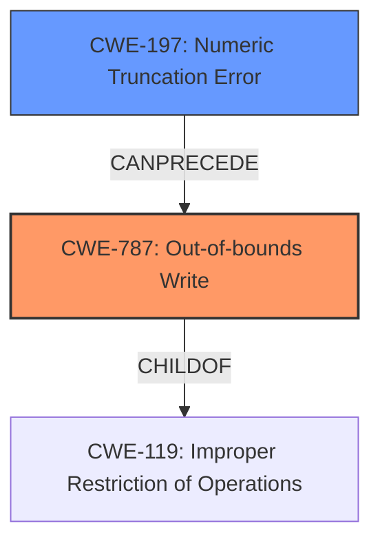

# Final Resolution for CVE-2022-40531

# Summary
| CWE ID | CWE Name | Confidence | CWE Abstraction Level | CWE Vulnerability Mapping Label | CWE-Vulnerability Mapping Notes |
|---|---|---|---|---|---|
| **CWE-787** | **Out-of-bounds Write** | 0.80 | Base | Allowed | Primary CWE: Root cause leading to memory corruption |
| **CWE-197** | **Numeric Truncation Error** | 0.70 | Base | Allowed | Secondary Candidate: Incorrect type cast that leads to out-of-bounds write |

## Evidence and Confidence

*   **Confidence Score:** 0.75
*   **Evidence Strength:** MEDIUM

## Relationship Analysis
The primary relationship that influenced the decision was the chain relationship between **CWE-197 (Numeric Truncation Error)** and **CWE-787 (Out-of-bounds Write)**. The **incorrect type cast** (CWE-197) can precede and directly lead to an out-of-bounds write (CWE-787) if the truncated value is used in a calculation related to memory access, such as an offset or buffer size.

## Vulnerability Chain
The vulnerability chain starts with an **incorrect type cast** (**CWE-197**), which results in a truncated numeric value. This truncated value is then used in a memory operation, leading to an **out-of-bounds write** (**CWE-787**). The **out-of-bounds write** corrupts memory, leading to a crash or potentially arbitrary code execution.

## Summary of Analysis
The initial analysis identified **CWE-197 (Numeric Truncation Error)** as the primary **WEAKNESS**, which is a reasonable starting point given the "**incorrect type cast**" in the vulnerability description. However, the criticism correctly pointed out that the analysis needed to explain how this type cast specifically leads to memory corruption.

The key phrase from the vulnerability description is: "Memory corruption in WLAN due to **incorrect type cast** while sending WMI_SCAN_SCH_PRIO_TBL_CMDID message."

Based on the vulnerability description and relationship analysis, the updated assessment is that **CWE-787 (Out-of-bounds Write)** is the most appropriate primary CWE because it directly describes the *effect* of the vulnerability: memory corruption due to writing data outside the intended buffer. **CWE-197 (Numeric Truncation Error)** remains a secondary CWE as the **ROOTCAUSE** contributing to the **out-of-bounds write**.

This selection provides a more specific and accurate representation of the vulnerability, aligning with the Base level of abstraction preferred by MITRE. The combination of **CWE-787** and **CWE-197** provides a more complete picture of the vulnerability's root cause and its resulting impact.