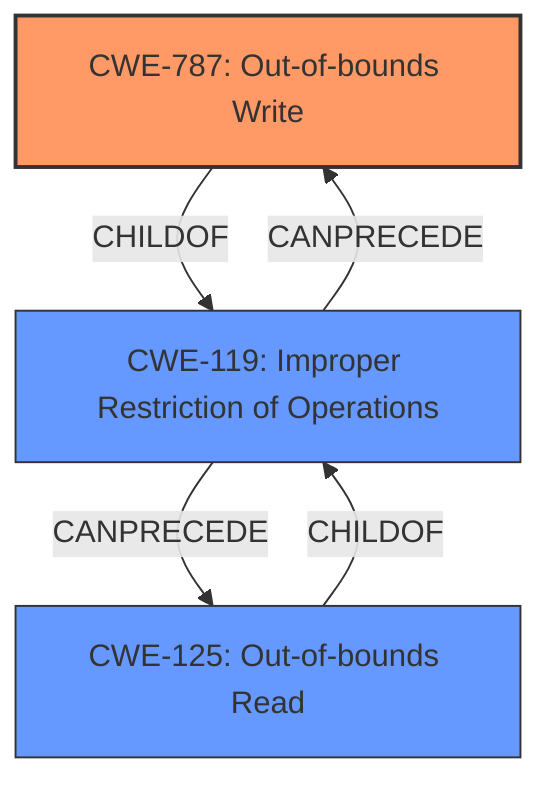

# Analysis Report for CVE-2022-40962

# Vulnerability Analysis Report: CVE-2022-40962

## Description

Mozilla developers Nika Layzell, Timothy Nikkel, Sebastian Hengst, Andreas Pehrson, and the Mozilla Fuzzing Team reported memory safety bugs present in Firefox 104 and Firefox ESR 102.2. Some of these bugs showed evidence of memory corruption and we presume that with enough effort some of these could have been exploited to run arbitrary code. This vulnerability affects Firefox ESR < 102.3, Thunderbird < 102.3, and Firefox < 105.

## Vulnerability Description Key Phrases

**Weakness:** memory safety bugs
**Impact:** arbitrary code execution
**Product:** ['Firefox ESR', 'Thunderbird', 'Firefox']
**Version:** < 102.3

## Analysis (with Relationship Data)

# Summary
| CWE ID | CWE Name | Confidence | CWE Abstraction Level | CWE Vulnerability Mapping Label | CWE-Vulnerability Mapping Notes |
|---|---|---|---|---|---|
| CWE-119 | Improper Restriction of Operations within the Bounds of a Memory Buffer | 0.75 | Class | Allowed | The vulnerability description indicates memory safety bugs and memory corruption, which can lead to out-of-bounds read or write operations. |

## Evidence and Confidence

*   **Confidence Score:** 0.75
*   **Evidence Strength:** MEDIUM

- **Analysis and Justification:**  
  - *Explanation:* The vulnerability description mentions "**memory safety bugs**" that showed evidence of "**memory corruption**". The CVE Reference Links Content Summary indicates the **root cause** involves these memory safety issues. While the exact type of memory corruption (e.g., buffer overflow, use-after-free) is not specified, the general category of **improper memory boundary handling** is covered by CWE-119 [Improper Restriction of Operations within the Bounds of a Memory Buffer]. Although many lower-level CWEs are possible, insufficient information is provided to select a base or variant level CWE. The MITRE mapping guidance for CWE-119 is "Discouraged" because it is often misused, but here it is being used as a general case as the more specific weakness is unknown.
  
  - *Relationship Analysis:* CWE-119 is a class-level CWE. It is the parent of many base-level CWEs like CWE-120 (Classic Buffer Overflow), CWE-125 (Out-of-bounds Read), and CWE-787 (Out-of-bounds Write). Since we only know that there are memory safety bugs that lead to memory corruption, but not the specific type, mapping to the class-level CWE-119 is appropriate.

- **Confidence Score:**  
  - *Example:* Confidence: 0.75 (Medium evidence due to the high-level description of the vulnerability)

## Criticism of Analysis

Okay, I've reviewed the provided analysis and the full CWE specifications for the listed weaknesses. Here's my critique:

**Overall Assessment:**

The analysis correctly identifies the general area of vulnerability. The choice of CWE-119 as a high-level classification is reasonable given the limited information. However, the analysis stops short of identifying more specific CWEs that are likely at play, and the confidence score could be improved with a more thorough exploration of potential underlying causes. The use of CWE-119 is discouraged by MITRE, but as a high-level mapping for a general case where the root cause is unknown, it is appropriate.

**Specific Feedback:**

*   **CWE-119 Justification:** The justification for selecting CWE-119 is sound, given the description of "memory safety bugs" and "memory corruption." It accurately reflects that the root cause is within improper memory boundary handling.

*   **Confidence Score:** The confidence score of 0.75 is appropriate. A higher confidence score would require more detailed information on the specific memory corruption issue.

*   **CWE Selection and Abstraction Level:** The initial analysis picks CWE-119 because it is a general case. However, the retriever results suggest more specific CWEs. The key is to use the provided information and reasoning to narrow down the possibilities.

*   **Alternative CWEs:** The retriever results highlight several potential CWEs that are more specific than CWE-119.
    *   **CWE-787: Out-of-bounds Write**: High score from the retriever. Given the mention of memory corruption, this is a likely possibility. If the memory corruption leads to writing data beyond the allocated buffer, then CWE-787 is a good fit. The impact (arbitrary code execution) supports the likelihood of a memory write issue.
    *   **CWE-125: Out-of-bounds Read:** High score from the retriever. If the memory corruption leads to reading data from beyond the allocated buffer, then CWE-125 is a good fit. The impact (arbitrary code execution) supports the likelihood of a memory read issue.
    *   **CWE-416: Use After Free:** Medium score from the retriever. If the memory corruption involves the use of memory after it has been freed, then CWE-416 is a good fit.
    *   **CWE-120: Buffer Copy without Checking Size of Input ('Classic Buffer Overflow')**  This is possible but less likely given the "memory safety" framing. It implies a failure to check bounds before copying data into a buffer, causing an overflow.

*   **CWE-124 Buffer Underwrite ('Buffer Underflow')**: This is less likely as it is not often used.

*   **CWE-476 NULL Pointer Dereference**: This could be a result of memory corruption. However, it is less likely to be the direct cause.

*   **CWE-681 Incorrect Conversion between Numeric Types**: This can lead to memory corruption issues, but there is no evidence for this in the description.

*   **CWE-843 Access of Resource Using Incompatible Type ('Type Confusion')**: This could lead to memory corruption issues, but there is no evidence for this in the description.

*   **CWE-362 Concurrent Execution using Shared Resource with Improper Synchronization ('Race Condition')**: This is less likely as there is no mention of concurrent execution in the description.

*   **CWE-427 Uncontrolled Search Path Element**: This is irrelevant to memory corruption issues.

**Recommendations for Improvement:**

1.  **Explore Sub-CWEs of CWE-119:** Given the 'memory corruption' aspect, the analysis should investigate children of CWE-119 like CWE-787 (Out-of-bounds Write), CWE-125 (Out-of-bounds Read), and CWE-416 (Use After Free). Even if the specific type of memory corruption is unknown, stating the *possibility* of these more specific CWEs would improve the analysis.

2.  **Justify Rejection of Alternatives:** Explicitly state why other potential CWEs (like those from the retriever) are *less likely* based on the available information. For example: "While CWE-416 (Use After Free) is a possibility, there is no explicit mention of memory being freed and then reused, making it a less likely candidate than CWE-787 or CWE-125."

3.  **Increase Confidence (if possible):** If further information could be gathered (e.g., by examining the bug reports linked), the confidence score could be increased by identifying more specific CWEs.

4.  **Consider Chaining:** Memory corruption often involves multiple steps. While the primary CWE might be CWE-787 (Out-of-bounds Write), it could be *caused* by something like CWE-190 (Integer Overflow) or CWE-131 (Incorrect Calculation of Buffer Size). This is a more advanced analysis, but it's something to consider.

5.  **Add Potential Mitigations for Child CWEs:** If you mention potential sub-CWEs, include brief mitigation advice tailored to those CWEs. For example, if you suggest CWE-787 is a possibility, you could add "Mitigation for CWE-787 includes using safe string handling functions and performing thorough bounds checking." This demonstrates a deeper understanding of the implications of the selected CWE.

**Revised Summary Table (Example):**

| CWE ID | CWE Name | Confidence | CWE Abstraction Level | CWE Vulnerability Mapping Label | CWE-Vulnerability Mapping Notes |
|---|---|---|---|---|---|
| CWE-119 | Improper Restriction of Operations within the Bounds of a Memory Buffer | 0.60 | Class | Allowed | The vulnerability description indicates memory safety bugs and memory corruption, which can lead to out-of-bounds read or write operations. Insufficient information is provided to select a base or variant level CWE with high confidence. |
| CWE-787 | Out-of-bounds Write | 0.40 | Base | Allowed | Given the impact of arbitrary code execution, it is possible that this vulnerability leads to writing data past the end of a buffer, a common cause of arbitrary code execution. |
| CWE-125 | Out-of-bounds Read | 0.30 | Base | Allowed | Given the impact of arbitrary code execution, it is possible that this vulnerability leads to reading data past the end of a buffer, which may leak sensitive information. |
| CWE-416 | Use After Free | 0.20 | Variant | Allowed | Given the impact of arbitrary code execution, it is possible that this vulnerability involves using memory after it has been freed. |

In this revised table, I've lowered the confidence of CWE-119 and introduced new CWEs that are plausible given the description.

**In Conclusion:**

The initial analysis is a good starting point. By exploring sub-CWEs, justifying choices, and considering chaining, the analysis can be significantly improved to provide a more accurate and useful representation of the vulnerability. Also consider including mitigation strategies from the child CWEs.

## Final Resolution

# Summary
| CWE ID | CWE Name | Confidence | CWE Abstraction Level | CWE Vulnerability Mapping Label | CWE-Vulnerability Mapping Notes |
|---|---|---|---|---|---|
| CWE-787 | Out-of-bounds Write | 0.65 | Base | Allowed | Primary CWE. The vulnerability description indicates memory corruption, which can lead to out-of-bounds write operations, potentially enabling arbitrary code execution. |
| CWE-119 | Improper Restriction of Operations within the Bounds of a Memory Buffer | 0.50 | Class | Allowed | Secondary candidate. The vulnerability description indicates memory safety bugs and memory corruption, which can lead to out-of-bounds read or write operations. |
| CWE-125 | Out-of-bounds Read | 0.40 | Base | Allowed | Secondary candidate. The vulnerability description indicates memory corruption, which can lead to out-of-bounds read operations, potentially leaking sensitive information. |

## Evidence and Confidence

*   **Confidence Score:** 0.60
*   **Evidence Strength:** MEDIUM

## Relationship Analysis
The selection of CWE-787 as the primary weakness is based on the high likelihood of out-of-bounds write operations leading to arbitrary code execution, as indicated in the vulnerability description. CWE-119 serves as a broader classification encompassing memory safety bugs and memory corruption. CWE-125 is also considered as a possibility due to the potential for out-of-bounds read operations, which could leak sensitive information.

The hierarchical relationship between CWE-119 (Class) and CWE-787/CWE-125 (Base) is important. CWE-787 and CWE-125 are children of CWE-119, representing more specific instances of memory boundary errors. The chain relationship isn't explicitly defined in this case, but it can be inferred that an improper operation within memory bounds (CWE-119) *can precede* an out-of-bounds write (CWE-787) or read (CWE-125).

## Vulnerability Chain
The vulnerability chain involves **memory safety bugs** leading to **memory corruption**. This **memory corruption** likely leads to an **out-of-bounds write (CWE-787)**. The consequence of this **out-of-bounds write** is the potential for **arbitrary code execution**, as explicitly stated in the vulnerability description. A potential secondary path is **memory corruption** leading to an **out-of-bounds read (CWE-125)**, which could leak sensitive information.

## Summary of Analysis
The initial analysis correctly identified CWE-119 as a general classification but failed to explore more specific possibilities. The criticism correctly points out that more specific CWEs, particularly CWE-787 and CWE-125, are plausible given the description of "memory corruption" and the impact of "arbitrary code execution."

The vulnerability description states: "Mozilla developers Nika Layzell, Timothy Nikkel, Sebastian Hengst, Andreas Pehrson, and the Mozilla Fuzzing Team reported **memory safety bugs** present in Firefox 104 and Firefox ESR 102.2. Some of these bugs showed evidence of **memory corruption** and we presume that with enough effort some of these could have been exploited to **run arbitrary code**."

The relationship analysis helped refine the selection, prioritizing CWE-787 due to the direct link between out-of-bounds writes and the stated impact of arbitrary code execution. While CWE-119 is still relevant as a general category, CWE-787 provides a more specific and accurate representation of the **root cause**. CWE-125 is retained as a possible secondary weakness that could contribute to information leakage.

The selection of CWE-787 is at the optimal level of specificity because it directly addresses the mechanism leading to the stated impact. While the precise source of the memory corruption isn't provided, the evidence strongly suggests an out-of-bounds write as the primary enabler of arbitrary code execution.

*Report generated on 2025-03-18 16:41:08*
