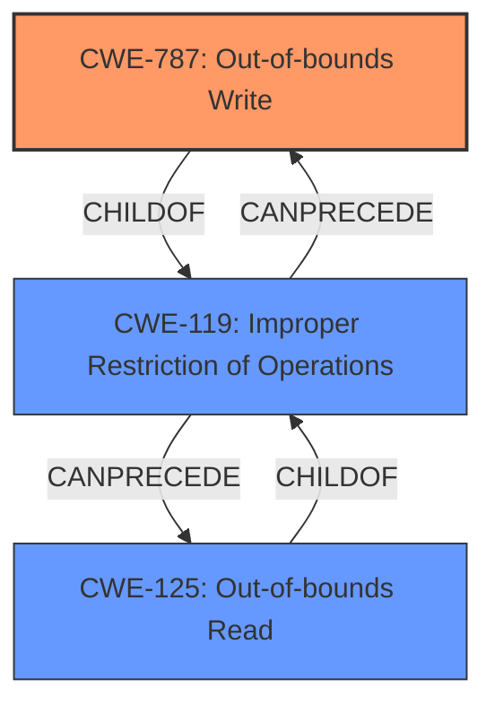

# Final Resolution for CVE-2022-40962

# Summary
| CWE ID | CWE Name | Confidence | CWE Abstraction Level | CWE Vulnerability Mapping Label | CWE-Vulnerability Mapping Notes |
|---|---|---|---|---|---|
| CWE-787 | Out-of-bounds Write | 0.65 | Base | Allowed | Primary CWE. The vulnerability description indicates memory corruption, which can lead to out-of-bounds write operations, potentially enabling arbitrary code execution. |
| CWE-119 | Improper Restriction of Operations within the Bounds of a Memory Buffer | 0.50 | Class | Allowed | Secondary candidate. The vulnerability description indicates memory safety bugs and memory corruption, which can lead to out-of-bounds read or write operations. |
| CWE-125 | Out-of-bounds Read | 0.40 | Base | Allowed | Secondary candidate. The vulnerability description indicates memory corruption, which can lead to out-of-bounds read operations, potentially leaking sensitive information. |

## Evidence and Confidence

*   **Confidence Score:** 0.60
*   **Evidence Strength:** MEDIUM

## Relationship Analysis
The selection of CWE-787 as the primary weakness is based on the high likelihood of out-of-bounds write operations leading to arbitrary code execution, as indicated in the vulnerability description. CWE-119 serves as a broader classification encompassing memory safety bugs and memory corruption. CWE-125 is also considered as a possibility due to the potential for out-of-bounds read operations, which could leak sensitive information.

The hierarchical relationship between CWE-119 (Class) and CWE-787/CWE-125 (Base) is important. CWE-787 and CWE-125 are children of CWE-119, representing more specific instances of memory boundary errors. The chain relationship isn't explicitly defined in this case, but it can be inferred that an improper operation within memory bounds (CWE-119) *can precede* an out-of-bounds write (CWE-787) or read (CWE-125).

## Vulnerability Chain
The vulnerability chain involves **memory safety bugs** leading to **memory corruption**. This **memory corruption** likely leads to an **out-of-bounds write (CWE-787)**. The consequence of this **out-of-bounds write** is the potential for **arbitrary code execution**, as explicitly stated in the vulnerability description. A potential secondary path is **memory corruption** leading to an **out-of-bounds read (CWE-125)**, which could leak sensitive information.

## Summary of Analysis
The initial analysis correctly identified CWE-119 as a general classification but failed to explore more specific possibilities. The criticism correctly points out that more specific CWEs, particularly CWE-787 and CWE-125, are plausible given the description of "memory corruption" and the impact of "arbitrary code execution."

The vulnerability description states: "Mozilla developers Nika Layzell, Timothy Nikkel, Sebastian Hengst, Andreas Pehrson, and the Mozilla Fuzzing Team reported **memory safety bugs** present in Firefox 104 and Firefox ESR 102.2. Some of these bugs showed evidence of **memory corruption** and we presume that with enough effort some of these could have been exploited to **run arbitrary code**."

The relationship analysis helped refine the selection, prioritizing CWE-787 due to the direct link between out-of-bounds writes and the stated impact of arbitrary code execution. While CWE-119 is still relevant as a general category, CWE-787 provides a more specific and accurate representation of the **root cause**. CWE-125 is retained as a possible secondary weakness that could contribute to information leakage.

The selection of CWE-787 is at the optimal level of specificity because it directly addresses the mechanism leading to the stated impact. While the precise source of the memory corruption isn't provided, the evidence strongly suggests an out-of-bounds write as the primary enabler of arbitrary code execution.