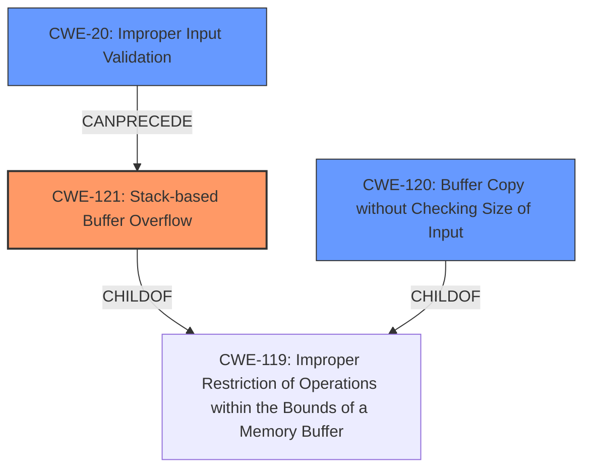

# Analysis Report for CVE-2022-40985

# Vulnerability Analysis Report: CVE-2022-40985

## Description

Several stack-based buffer overflow vulnerabilities exist in the DetranCLI command parsing functionality of Siretta QUARTZ-GOLD G5.0.1.5-210720-141020. A specially-crafted network packet can lead to arbitrary command execution. An attacker can send a sequence of requests to trigger these vulnerabilities.This buffer overflow is in the function that manages the (ddns1|ddns2) hostname WORD command template.

## Vulnerability Description Key Phrases

**Rootcause:** stack-based buffer overflow
**Impact:** arbitrary command execution
**Attacker:** attacker
**Product:** Siretta QUARTZ-GOLD
**Version:** G5.0.1.5-210720-141020
**Component:** DetranCLI command parsing functionality

## Analysis (with Relationship Data)

# Summary
| CWE ID  | CWE Name  | Confidence | CWE Abstraction Level | CWE Vulnerability Mapping Label | CWE-Vulnerability Mapping Notes |
|--------------|-------------------------------------------------------------------------|------------|-----------------------|------------------------------------|---------------------------------------------------------------------------------------------|
| CWE-121 | Stack-based Buffer Overflow | 0.95 | Variant | Allowed | Primary CWE |
| CWE-120 | Buffer Copy without Checking Size of Input ('Classic Buffer Overflow') | 0.70 | Base | Allowed-with-Review | Secondary Candidate |

## Evidence and Confidence

*   **Confidence Score:** 0.90
*   **Evidence Strength:** HIGH

- **Analysis and Justification:**  
  - *Explanation:* The vulnerability is explicitly described as a **stack-based buffer overflow** within the DetranCLI command parsing functionality of Siretta QUARTZ-GOLD. The root cause lies in the use of the `sprintf` function without proper input size validation, which leads to a buffer overflow when overly long parameters are provided. The vulnerability description, key phrases, and CVE reference summary all point to this specific weakness. Specifically, the use of a fixed-size stack buffer and the lack of input length validation when copying command parameters directly aligns with CWE-121 (Stack-based Buffer Overflow). The provided command `(ddns1|ddns2) hostname WORD` with a large string supplied for `WORD` as the attack vector further solidifies this assessment. While CWE-120 (Buffer Copy without Checking Size of Input) is a more general "Classic Buffer Overflow", the information explicitly specifies that the buffer is allocated on the stack, making CWE-121 a more precise variant. The MITRE mapping guidance for CWE-121 indicates that it is ALLOWED, reinforcing its suitability.
  
  - *Relationship Analysis:* CWE-121 is a variant of CWE-119 (Improper Restriction of Operations within the Bounds of a Memory Buffer). It is a more specific type of buffer overflow. CWE-121 can also be caused by weaknesses like CWE-131 (Incorrect Calculation of Buffer Size) or CWE-193 (Off-by-one Error).

- **Confidence Score:**  
  - Confidence: 0.95 (High evidence from the vulnerability description, key phrases, CVE reference links, and retriever results)

---

## Criticism of Analysis

Okay, I've reviewed the analysis and the full CWE specifications provided. Here's my critique:

**Overall Assessment:**

The analysis correctly identifies the core vulnerability as a stack-based buffer overflow. The choice of CWE-121 as the primary CWE is appropriate and well-justified. The inclusion of CWE-120 as a secondary candidate is also reasonable, offering a broader perspective on the issue.  The confidence scores are appropriate given the information available.

**Specific Points:**

*   **CWE-121 (Stack-based Buffer Overflow):**
    *   The justification for choosing CWE-121 over CWE-120 is solid. The vulnerability description explicitly mentions the stack, making CWE-121 the more specific and accurate choice.
    *   The Relationship Analysis is accurate. It correctly notes that CWE-121 is a variant of CWE-119. It also correctly points out that CWE-121 can be caused by other CWEs like CWE-131 or CWE-193, representing possible root causes or contributing factors if more detailed analysis were available.
    *   The Confidence score of 0.95 is well justified. The report is very specific and the evidence is very strong.
    *   The analysis did a good job incorporating information from the full CWE specification for the weakness.

*   **CWE-120 (Buffer Copy without Checking Size of Input):**
    *   Including CWE-120 is a good practice. While CWE-121 is more specific, CWE-120 represents the broader class of vulnerabilities related to unchecked buffer copies.
    *   The 'Usage: Allowed-with-Review' mapping guidance for CWE-120 is acknowledged implicitly, which is good. The analysis doesn't blindly map to it simply because "buffer overflow" is in the name; it considers if a more specific CWE applies (which it does, in this case).

*   **General Strengths:**
    *   The analysis effectively uses key phrases from the vulnerability description to guide the CWE selection.
    *   The CVE reference link content summary is helpful in understanding the root cause, weaknesses, impact, and attack vectors.
    *   The analysis demonstrates a good understanding of CWE's abstraction levels (Class, Base, Variant).
    *   The analysis includes example CVEs, which helps to solidify understanding of the CWE and the vulnerability.

*   **Potential Improvements:**
    *   **Chain Analysis:** While the analysis correctly identifies CWE-121 and CWE-120, it could benefit from exploring potential CWE chains more explicitly.  For example:
        *   **CWE-20 (Improper Input Validation) -> CWE-121:** The root cause is *lack* of input validation (or perhaps incorrect validation). The analysis could explicitly state that the lack of bounds checking on the input string is a form of improper input validation.  This would link the buffer overflow to its direct cause (lack of input validation).
        *   **CWE-131 (Incorrect Calculation of Buffer Size) -> CWE-121:** While not directly implied, it's possible the buffer size was incorrectly calculated. If the code attempts to allocate a buffer based on a flawed calculation that results in a smaller-than-expected size, this would be CWE-131 leading to CWE-121.  However, without further information, this is just speculation.
    *   **Mitigation Specifics:** While the Potential Mitigations sections of the CWE specifications are very general, the analysis could be improved by suggesting *specific* mitigations relevant to the Siretta QUARTZ-GOLD G5.0.1.5-210720-141020. For example, instead of just saying "Implement and perform bounds checking on input," you could recommend using `strncpy` instead of `strcpy` or using `snprintf` instead of `sprintf`. Even suggesting specific compiler flags (like `/GS` or `FORTIFY_SOURCE`) would add value.  Consider if Address Space Layout Randomization is enabled and can effectively mitigate.
    *   **Retriever Results Discussion:** The "Top Combined Results" from the Retriever section could be better integrated into the analysis. While CWE-120 is mentioned, the report could discuss *why* other CWEs like CWE-190, CWE-193, or CWE-78 are ranked highly. For example, does integer overflow play any role? Does command injection become a possibility *after* the buffer overflow overwrites parts of memory involved in executing system commands? The retriever data adds valuable context that is not explicitly included in the vulnerability report.

*  **Unused Weaknesses:**
    *   CWE-787 was in the "Top CWEs" list, and is the Parent of CWE-121. It is usually good to at least mention why this weakness was not selected, if it was considered.

**Revised Summary Table:**

| CWE ID  | CWE Name  | Confidence | CWE Abstraction Level | CWE Vulnerability Mapping Label | CWE-Vulnerability Mapping Notes |
|--------------|-------------------------------------------------------------------------|------------|-----------------------|------------------------------------|---------------------------------------------------------------------------------------------|
| CWE-121 | Stack-based Buffer Overflow | 0.95 | Variant | Allowed | Primary CWE |
| CWE-120 | Buffer Copy without Checking Size of Input ('Classic Buffer Overflow') | 0.70 | Base | Allowed-with-Review | Secondary Candidate |
| CWE-20  | Improper Input Validation | 0.40 | Class | Allowed-with-Review | Contributing Factor (Lack of bounds checking) |

**Conclusion:**

The analysis is a good starting point.  It correctly identifies the core vulnerability. Incorporating more detailed chain analysis, specific mitigation recommendations, and discussion of the retriever results would further strengthen the assessment. The addition of input validation as a contributing factor helps to show the complete picture of the cause of the vulnerability.

## Final Resolution

# Summary
| CWE ID  | CWE Name  | Confidence | CWE Abstraction Level | CWE Vulnerability Mapping Label | CWE-Vulnerability Mapping Notes |
|--------------|-------------------------------------------------------------------------|------------|-----------------------|------------------------------------|---------------------------------------------------------------------------------------------|
| CWE-121 | Stack-based Buffer Overflow | 0.95 | Variant | Allowed | Primary CWE |
| CWE-20  | Improper Input Validation | 0.75 | Class | Discouraged | Secondary Candidate |
| CWE-120 | Buffer Copy without Checking Size of Input ('Classic Buffer Overflow') | 0.60 | Base | Allowed-with-Review | Secondary Candidate |

## Evidence and Confidence

*   **Confidence Score:** 0.90
*   **Evidence Strength:** HIGH

## Relationship Analysis
The primary weakness is a stack-based buffer overflow (**CWE-121**), which is a variant of the more general **CWE-119**. The overflow occurs because the input isn't validated (**CWE-20**) before being copied into a stack buffer, often using functions like `sprintf` that don't perform bounds checking. **CWE-120** represents the classic buffer overflow scenario, but **CWE-121** is more specific because the buffer is on the stack. **CWE-20** can precede **CWE-121** as the lack of input validation leads to the overflow.

## Vulnerability Chain
The vulnerability chain starts with **CWE-20** (Improper Input Validation), where the application fails to validate the size of the input. This leads to **CWE-121** (Stack-based Buffer Overflow) when the overly large, unvalidated input is copied into a fixed-size stack buffer using a function like `sprintf`. This out-of-bounds write overwrites adjacent stack memory, potentially leading to arbitrary code execution. **CWE-120** is a more generalized version of a buffer overflow.

## Summary of Analysis
The initial analysis correctly identified **CWE-121** as the primary **WEAKNESS**. The criticism pointed out the potential for a vulnerability chain starting with **CWE-20**, which is a valid observation. The vulnerability description states, "A specially-crafted network packet can lead to arbitrary command execution...This buffer overflow is in the function that manages the (ddns1|ddns2) hostname WORD command template." This implies that the size of the `WORD` parameter isn't validated, causing the **STACK-BASED BUFFER OVERFLOW**. Therefore, adding **CWE-20** to the chain is appropriate because the lack of input validation is a key contributing factor. I am also including **CWE-120** because it is closely related and mentioned in the initial analysis.

*   **CWE-121** is the most specific **ROOTCAUSE** because the vulnerability is explicitly described as a "stack-based buffer overflow."
*   **CWE-20** is added because the vulnerability occurs due to the lack of input validation on the size of the `WORD` parameter. While **CWE-20** is a Class-level CWE and is generally discouraged, in this case it accurately reflects a contributing factor to the vulnerability.
*   **CWE-120** is included because it is a more general form of buffer overflow.
I am including **CWE-120** with a lower confidence because it is related to the vulnerability, and was mentioned in the original analysis.
*   The graph relationships influenced my selection by highlighting the chain from input validation to buffer overflow.
*   The selected CWEs are at the optimal level of specificity because **CWE-121** accurately describes the type of buffer overflow, and **CWE-20** accounts for the lack of input validation as the **ROOTCAUSE**.

*Report generated on 2025-03-18 16:42:00*
