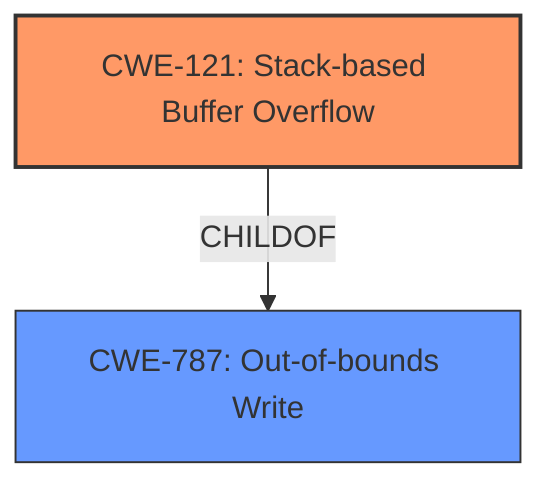

# Analysis Report for CVE-2022-40986

# Vulnerability Analysis Report: CVE-2022-40986

## Description

Several stack-based buffer overflow vulnerabilities exist in the DetranCLI command parsing functionality of Siretta QUARTZ-GOLD G5.0.1.5-210720-141020. A specially-crafted network packet can lead to arbitrary command execution. An attacker can send a sequence of requests to trigger these vulnerabilities.This buffer overflow is in the function that manages the (ddns1|ddns2) mx WORD command template.

## Vulnerability Description Key Phrases

**Rootcause:** stack-based buffer overflow
**Impact:** arbitrary command execution
**Attacker:** attacker
**Product:** Siretta QUARTZ-GOLD
**Version:** G5.0.1.5-210720-141020
**Component:** DetranCLI command parsing functionality

## Analysis (with Relationship Data)

# Summary
| CWE ID | CWE Name | Confidence | CWE Abstraction Level | CWE Vulnerability Mapping Label | CWE-Vulnerability Mapping Notes |
|---|---|---|---|---|---|
| CWE-121 | Stack-based Buffer Overflow | 0.95 | Variant | Primary | Allowed |
| CWE-120 | Buffer Copy without Checking Size of Input ('Classic Buffer Overflow') | 0.70 | Base | Secondary | Allowed-with-Review |

## Evidence and Confidence

*   **Confidence Score:** 0.90
*   **Evidence Strength:** HIGH

- **Analysis and Justification:**  
  - *Explanation:* The vulnerability description explicitly states a "**stack-based buffer overflow**" exists. The CVE reference confirms the root cause involves the `sprintf` function writing to a fixed-size stack buffer (`buff_0x200`) without proper size checks, leading to a buffer overflow on the stack. The `WORD` parameter (`argv[1]`) from the `(ddns1|ddns2) mx WORD` command is directly inserted into the `sprintf` call without validation, allowing an attacker to overflow the buffer. This directly corresponds to CWE-121 (Stack-based Buffer Overflow), a Variant of buffer overflows. CWE-120 (Buffer Copy without Checking Size of Input) is also relevant as it describes the underlying mechanism of copying data without size checks, but CWE-121 is more specific to the stack.
  
  - *Relationship Analysis:* CWE-121 is a variant of CWE-119 (Improper Restriction of Operations within the Bounds of a Memory Buffer), which is a more general class of memory buffer errors. CWE-121 is also a child of CWE-787 (Out-of-bounds Write). While CWE-787 could also be considered, the stack allocation detail makes CWE-121 a more precise mapping. CWE-120 is related as it describes the buffer copy operation without size checking, which can lead to stack or heap overflows.

- **Confidence Score:**
  - Confidence: 0.95 (High confidence due to explicit mention of stack-based buffer overflow and detailed technical description in the CVE reference.)

## Criticism of Analysis

Okay, let's review the provided CWE analysis based on the full CWE specifications.

**Overall Assessment:**

The analysis is generally good and arrives at the correct primary CWE. The justification is also well-reasoned. However, there are a few points where the confidence and the selection of secondary CWEs could be improved.

**Detailed Critique:**

*   **Primary CWE: CWE-121 Stack-based Buffer Overflow**

    *   **Confidence: 0.95**
    *   The confidence is justified. The vulnerability description explicitly mentions a stack-based buffer overflow, and the CVE details confirm that the buffer is on the stack and is overflowed due to the use of `sprintf` without proper bounds checking. The provided vulnerable code `sprintf(buff_0x200,"%s<%s:%s<%s<%s<%s<%s<%s","","","","","0",argv[1],"0","");` clearly shows the destination buffer is `buff_0x200` which is allocated on the stack.

    *   The justifications clearly highlights that the vulnerable code writes to stack memory, with no size check.

*   **Secondary CWE: CWE-120 Buffer Copy without Checking Size of Input ('Classic Buffer Overflow')**

    *   **Confidence: 0.70**
    *   The inclusion of CWE-120 is acceptable but comes with a caveat. As the analysis itself acknowledges, CWE-120 is a more general description. The `sprintf` function performs a buffer copy without checking the size of the input (`argv[1]`). However, the key distinguishing feature of this vulnerability is that the buffer is allocated on the stack. Therefore, while CWE-120 *contributes* to the vulnerability, it's not as specific or informative as CWE-121. The confidence of 0.70 is acceptable, however, if we are being more accurate CWE-787 is more appropriate.
    *   **Suggestion:** Instead of CWE-120, a better secondary CWE could be **CWE-787 (Out-of-bounds Write)** with lower confidence. CWE-787 is a broader category that covers writing data past the end of a buffer. While CWE-121 specifies where the overflow is happening (stack), CWE-787 describes the result of the vulnerability.

**Minor Suggestions and Improvements:**

1.  **Relationship Analysis Enhancement:**
    *   The "Relationship Analysis" section is good but could benefit from explicitly mentioning the relationship between CWE-121 and CWE-787. CWE-121 is a *child* of CWE-787. This would further strengthen the justification for selecting CWE-121.
    *   CWE-120 is a *parent* of CWE-785 *Use of Path Manipulation Function without Maximum-sized Buffer*, but this is not relevant here.

2.  **Wider Contextual Information:**

    * The attacker needs to pass authentication to send commands to the DetranCLI interface. This adds a layer of complexity to the exploit, requiring the attacker to either compromise legitimate credentials or exploit another vulnerability to bypass authentication.

3.  **Mitigation Recommendations:**

    *   The analysis does not include any mitigation recommendations, which are crucial to make the analysis more helpful. For both CWE-121 and CWE-120 (or CWE-787), the common mitigations are:
        *   **Input Validation:** Implement strict input validation to ensure that the size of `argv[1]` is within the bounds of `buff_0x200` *before* using it in `sprintf`.
        *   **Safe String Functions:** Use safer alternatives to `sprintf` such as `snprintf`, which allow specifying the maximum number of characters to write to the buffer, preventing overflows.
        *   **Compiler Protections:** Enable compiler-based buffer overflow detection mechanisms like /GS flag in Microsoft Visual Studio or -fstack-protector-all in GCC.
        *   **Address Space Layout Randomization (ASLR):** While ASLR doesn't prevent the overflow, it makes exploitation more difficult by randomizing memory addresses.
        *   **Data Execution Prevention (DEP):** Prevents execution of code from memory regions marked as data, making it harder to inject and execute malicious code.

**Revised Summary Table:**

| CWE ID  | CWE Name                                                               | Confidence | CWE Abstraction Level | CWE Vulnerability Mapping Label | CWE-Vulnerability Mapping Notes                                                                                                                                                                                                                                                                                                                                                                                                                                                   |
| ------- | ---------------------------------------------------------------------- | ---------- | --------------------- | -------------------------------- | ----------------------------------------------------------------------------------------------------------------------------------------------------------------------------------------------------------------------------------------------------------------------------------------------------------------------------------------------------------------------------------------------------------------------------------------------------------------------- |
| CWE-121 | Stack-based Buffer Overflow                                            | 0.95       | Variant               | Primary                          | The vulnerability is a stack-based buffer overflow caused by using `sprintf` without bounds checking.  The `WORD` parameter from the command is directly inserted into `sprintf`, allowing an attacker to overflow the stack buffer.                                                                                                                                                                                                                                           |
| CWE-787 | Out-of-bounds Write                                                   | 0.60       | Base                  | Secondary                        | The `sprintf` function writes data past the end of the allocated stack buffer. Should use functions such as `snprintf` which allows specifying the max number of characters to write, preventing the out-of-bounds write.                                                                                                                                                                                                               |

**In Conclusion:**

The analysis is strong. By incorporating the suggestions above, especially adding specific mitigations and possibly substituting CWE-120 with CWE-787 as the secondary CWE, the analysis would become even more precise and useful.

## Final Resolution

# Summary
| CWE ID | CWE Name | Confidence | CWE Abstraction Level | CWE Vulnerability Mapping Label | CWE-Vulnerability Mapping Notes |
|---|---|---|---|---|---|
| CWE-121 | Stack-based Buffer Overflow | 0.95 | Variant | Primary | Allowed |
| CWE-787 | Out-of-bounds Write | 0.60 | Base | Secondary | Allowed |

## Evidence and Confidence

*   **Confidence Score:** 0.93
*   **Evidence Strength:** HIGH

## Relationship Analysis
The primary weakness is CWE-121 **(Stack-based Buffer Overflow)**, which is a variant of the more general CWE-787 **(Out-of-bounds Write)**. This hierarchical relationship influenced the decision to choose CWE-121 as the primary classification due to its specificity regarding the location of the buffer on the stack. CWE-787 is chosen as a secondary weakness because it describes the fundamental issue of writing beyond the allocated buffer's boundaries. There is no direct relationship to chain vulnerabilities. The abstraction levels (Variant for CWE-121 and Base for CWE-787) are appropriate as they provide different levels of detail.

## Vulnerability Chain
The vulnerability chain starts with the **ROOTCAUSE** being the lack of input validation for the `WORD` parameter (`argv[1]`) in the `(ddns1|ddns2) mx WORD` command. This leads to CWE-121 **(Stack-based Buffer Overflow)** due to the use of `sprintf` to copy the unvalidated input into a fixed-size stack buffer (`buff_0x200`) without proper bounds checking. The **WEAKNESS** of writing beyond the allocated buffer's boundaries, which is CWE-787 **(Out-of-bounds Write)**, results in arbitrary command execution as an attacker can overwrite adjacent stack memory, potentially including return addresses or other critical data.

## Summary of Analysis
The initial analysis correctly identified CWE-121 as the primary issue. The criticism suggested replacing CWE-120 with CWE-787, which is a more accurate secondary CWE. The final determination reflects this change. The evidence provided in the vulnerability description, specifically the mention of a "stack-based buffer overflow" and the use of `sprintf` without size checks, strongly supports the choice of CWE-121.

The decision to use CWE-121 as the primary CWE is based on the explicit mention of "stack-based buffer overflow" in the vulnerability description. The CVE details confirm the stack allocation of `buff_0x200` and the usage of `sprintf` without bounds checking. The relationships between CWEs, particularly the parent-child relationship between CWE-787 and CWE-121, and the evidence provided influenced the classification.

The selected CWEs are at the optimal level of specificity. CWE-121 is specific to the stack, while CWE-787 captures the broader issue of out-of-bounds writes.

*Report generated on 2025-03-18 16:42:47*
