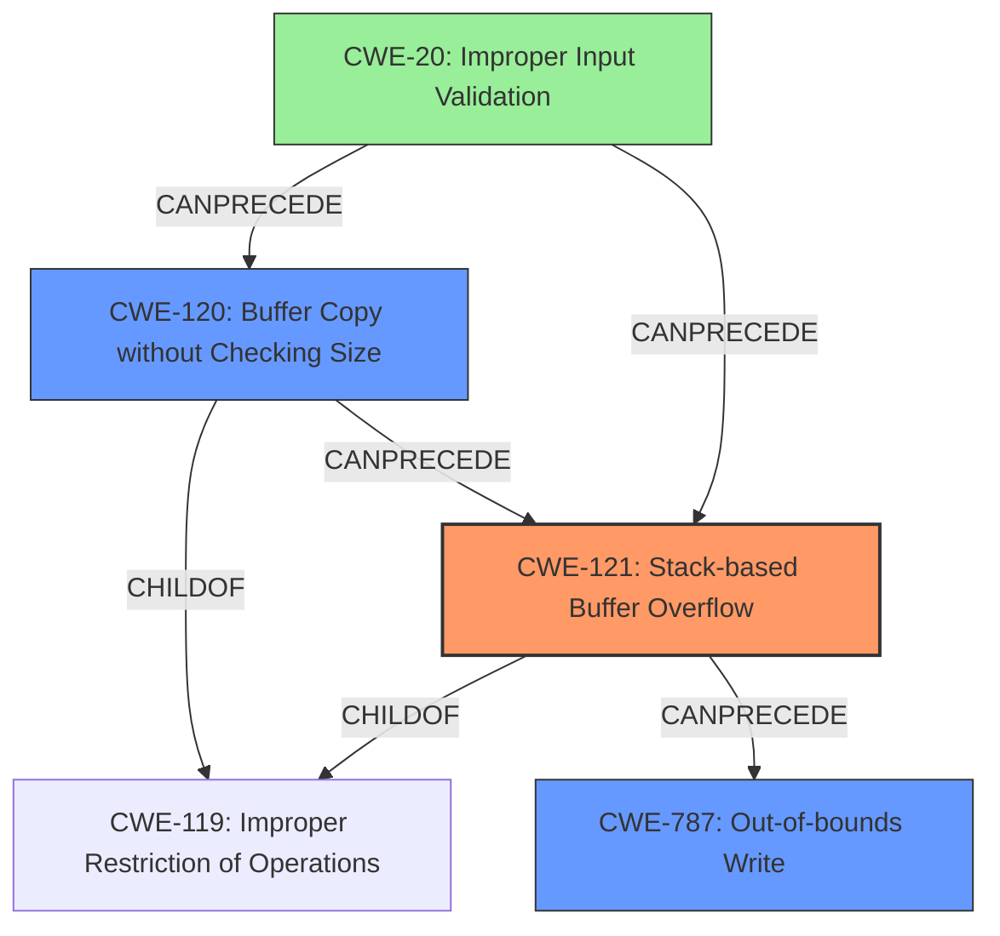

# Final Resolution for CVE-2022-40988

# Summary
| CWE ID | CWE Name | Confidence | CWE Abstraction Level | CWE Vulnerability Mapping Label | CWE-Vulnerability Mapping Notes |
|---|---|---|---|---|---|
| CWE-121 | Stack-based Buffer Overflow | 0.95 | Variant | Allowed | Primary CWE |
| CWE-120 | Buffer Copy without Checking Size of Input ('Classic Buffer Overflow') | 0.85 | Base | Allowed-with-Review | Secondary Candidate |
| CWE-787 | Out-of-bounds Write | 0.75 | Base | Allowed | Secondary Candidate |

## Evidence and Confidence

*   **Confidence Score:** 0.92
*   **Evidence Strength:** HIGH

## Relationship Analysis
The selection of CWE-121 as the primary weakness is well-supported due to the explicit mention of a "stack-based buffer overflow." CWE-120 is included as a secondary weakness because the `sprintf` function is used without proper bounds checking. CWE-787 represents the outcome of the buffer overflow.

## Vulnerability Chain
The vulnerability chain starts with the lack of input validation (**CWE-20**), leading to the use of `sprintf` without bounds checking (**CWE-120**), which causes a stack-based buffer overflow (**CWE-121**), ultimately resulting in an out-of-bounds write (**CWE-787**).

## Summary of Analysis
The initial analysis correctly identifies **CWE-121 (Stack-based Buffer Overflow)** as the primary issue, supported by the vulnerability description and CVE reference summary which states that the `DetranCLI` binary uses `sprintf` without proper bounds checking when parameters are inserted into a stack buffer. This assessment is based on the provided evidence and is further reinforced by the criticism, which highlights that the root cause is the lack of bounds checking when copying data into the stack buffer.

The selection of **CWE-120 (Buffer Copy without Checking Size of Input ('Classic Buffer Overflow'))** as a secondary candidate is justified because the `sprintf` function is used without proper bounds checking. The criticism suggests that the analysis should explicitly state that the use of `sprintf` without bounds checking is the *mechanism* through which the stack-based overflow occurs, making it a contributing factor but not the most precise root cause for *this particular case*.

**CWE-787 (Out-of-bounds Write)** is a consequence of the buffer overflow, and the initial analysis correctly identifies this. The criticism emphasizes that **CWE-787** is what *happens* because of the stack-based buffer overflow and focusing on **CWE-121** and potentially **CWE-120** addresses the underlying cause.

The optimal level of specificity is achieved by prioritizing **CWE-121** because it directly describes the stack-based nature of the buffer overflow. **CWE-120** contributes to the vulnerability by describing the mechanism, and **CWE-787** is the result. The addition of **CWE-20 (Improper Input Validation)** provides a more complete view of the vulnerability chain.

The final determination is based on a combination of the provided evidence, the relationship analysis, and the criticism. The selected CWEs reflect the optimal level of specificity, with **CWE-121** as the primary cause, **CWE-120** as a contributing factor, and **CWE-787** as the result.