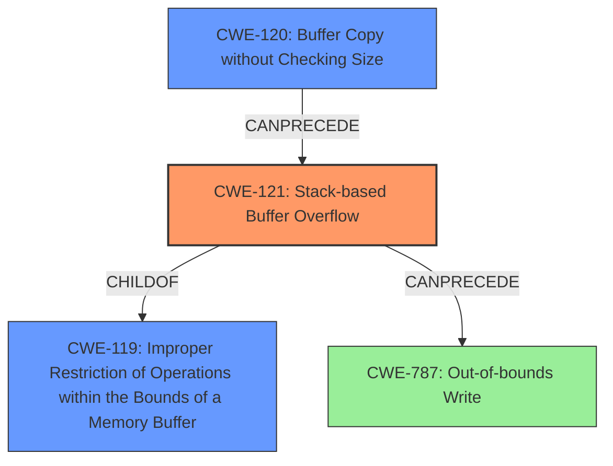

# Final Resolution for CVE-2022-40989

# Summary
| CWE ID | CWE Name | Confidence | CWE Abstraction Level | CWE Vulnerability Mapping Label | CWE-Vulnerability Mapping Notes |
|---|---|---|---|---|---|
| CWE-121 | Stack-based Buffer Overflow | 0.95 | Variant | Allowed | Primary CWE. The vulnerability is a stack-based buffer overflow. |
| CWE-120 | Buffer Copy without Checking Size of Input ('Classic Buffer Overflow') | 0.85 | Base | Allowed-with-Review | Secondary CWE. The underlying cause is copying data without checking the size using `sprintf`. |

## Evidence and Confidence

*   **Confidence Score:** 0.93
*   **Evidence Strength:** HIGH

## Relationship Analysis
The primary relationship influencing the decision is the parent-child relationship between CWE-119 (**CWE-119: Improper Restriction of Operations within the Bounds of a Memory Buffer**) and CWE-121. CWE-121 is a variant of CWE-119, making it a more specific classification for a stack-based buffer overflow. CWE-120 highlights the method by which the buffer overflow occurs, through a buffer copy without checking size. There are also "CanPrecede" relationships involving buffer overflows that lead to out-of-bounds writes (CWE-787), but the details of the description lend themselves more towards the buffer copy without checking size.

## Vulnerability Chain
The vulnerability chain starts with the use of `sprintf` without bounds checking (CWE-120). This leads to a **stack-based buffer overflow** (CWE-121), where data is written beyond the allocated buffer on the stack. The consequence is arbitrary command execution, as stated in the vulnerability description.

## Summary of Analysis
The initial analysis correctly identified CWE-121 as the primary weakness, given the explicit description of a **stack-based buffer overflow**. The use of `sprintf` without bounds checking confirms that the vulnerability is caused by a buffer copy without checking the size, justifying the inclusion of CWE-120 as a secondary CWE.

The vulnerability description clearly states: "Several **stack-based buffer overflow** vulnerabilities exist... This buffer overflow is in the function that manages the bandwidth... command template." This statement provides strong evidence for selecting CWE-121.

The relationship analysis further supports this decision, as CWE-121 is a variant of CWE-119, providing a more specific classification. CWE-120 is related as it highlights the lack of input size validation during the buffer copy operation with `sprintf`.

The selected CWEs are at the optimal level of specificity, as CWE-121 accurately describes the type of buffer overflow and CWE-120 identifies the root cause—copying data without proper size validation.