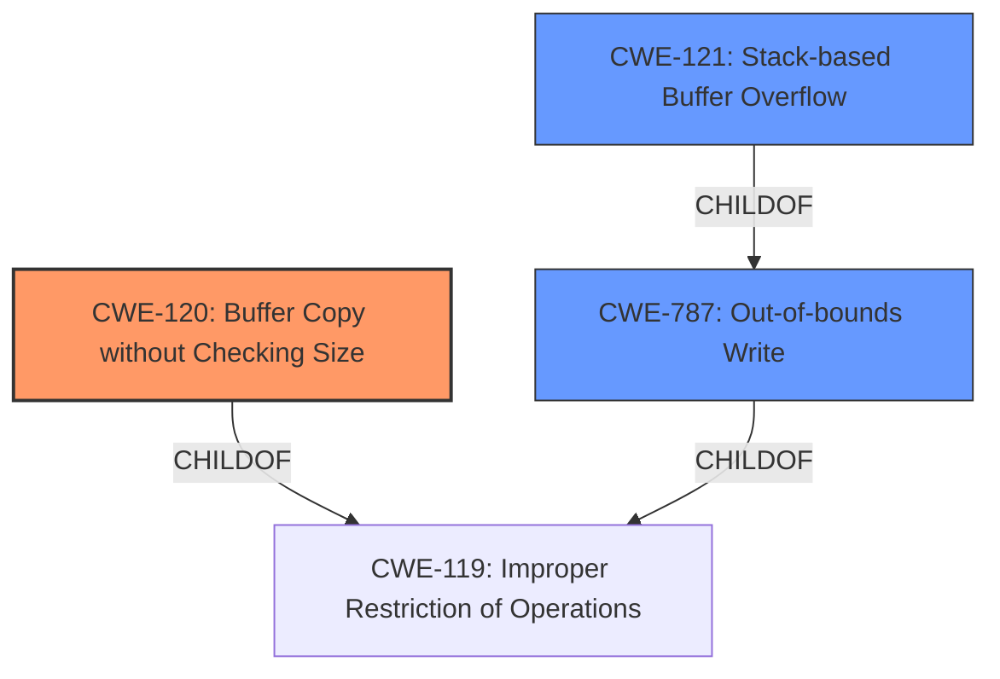

# Final Resolution for CVE-2022-40992

# Summary
| CWE ID | CWE Name | Confidence | CWE Abstraction Level | CWE Vulnerability Mapping Label | CWE-Vulnerability Mapping Notes |
|---|---|---|---|---|---|
| **CWE-120** | Buffer Copy without Checking Size of Input ('Classic Buffer Overflow') | 0.95 | Base | Primary | Allowed-with-Review |
| **CWE-121** | Stack-based Buffer Overflow | 0.90 | Variant | Secondary Candidate | Allowed |
| **CWE-787** | Out-of-bounds Write | 0.75 | Base | Secondary Candidate | Allowed |

## Evidence and Confidence

*   **Confidence Score:** 0.93
*   **Evidence Strength:** HIGH

## Relationship Analysis
The primary weakness is **CWE-120 (Buffer Copy without Checking Size)**, a base CWE that is a child of **CWE-119 (Improper Restriction of Operations within the Bounds of a Memory Buffer)**. **CWE-121 (Stack-based Buffer Overflow)** is a variant of **CWE-119** and a child of **CWE-787 (Out-of-bounds Write)**, specifying that the overflow occurs on the stack. **CWE-120** describes the specific flaw (buffer copy without size check), while **CWE-121** details the location of the buffer (stack). **CWE-787 (Out-of-bounds Write)** describes the result of the overflow.

## Vulnerability Chain
The vulnerability chain starts with the use of `sprintf` without checking input sizes (**CWE-120**). This leads to an out-of-bounds write on the stack (**CWE-121**, **CWE-787**), potentially allowing arbitrary command execution. The root cause is the unchecked buffer copy, and the impact is arbitrary command execution due to the ability to overwrite data on the stack.

## Summary of Analysis
The initial analysis, along with the provided criticism, accurately identifies the vulnerability as a **stack-based buffer overflow** resulting from the use of `sprintf` without input size validation. The primary **WEAKNESS** is **CWE-120 (Buffer Copy without Checking Size)**, which describes the specific mechanism causing the overflow. **CWE-121 (Stack-based Buffer Overflow)** is a valuable secondary classification because it identifies the location of the buffer on the stack and is a child of **CWE-787**. The addition of **CWE-787 (Out-of-bounds Write)** as a secondary candidate is appropriate because it describes the direct result of **CWE-120**.

The evidence for **CWE-120** is strong: "The vulnerability is a **stack-based buffer overflow** in the DetranCLI command parsing functionality of Siretta QUARTZ-GOLD. The root cause is the use of `sprintf` without checking the size of input parameters against the stack buffer size...`sprintf` is used with unchecked input parameters, causing a **stack-based buffer overflow**." This quote demonstrates direct evidence that the vulnerability involves copying data without proper size validation using `sprintf`.

The confidence score for **CWE-121** was increased to 0.90 to reflect the explicit mention of "stack-based" in the vulnerability description, justifying its selection as a more precise variant of a general buffer overflow.

The inclusion of **CWE-787** is justified because it represents the outcome of **CWE-120**, which is an out-of-bounds write.
The selected CWEs are at the optimal level of specificity, with **CWE-120** identifying the root cause, **CWE-121** specifying the memory location, and **CWE-787** detailing the direct result.