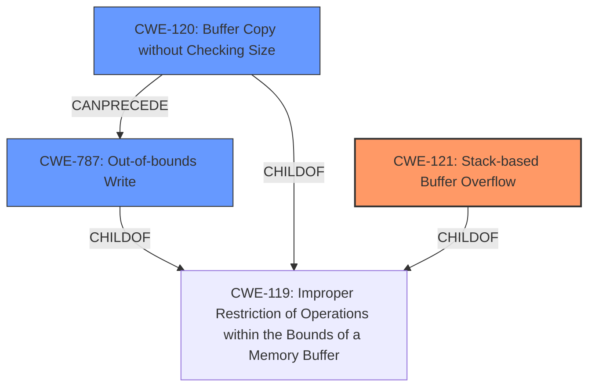

# Analysis Report for CVE-2022-40994

# Vulnerability Analysis Report: CVE-2022-40994

## Description

Several stack-based buffer overflow vulnerabilities exist in the DetranCLI command parsing functionality of Siretta QUARTZ-GOLD G5.0.1.5-210720-141020. A specially-crafted network packet can lead to arbitrary command execution. An attacker can send a sequence of requests to trigger these vulnerabilities.This buffer overflow is in the function that manages the no firmwall keyword WORD description (WORD|null) command template.

## Vulnerability Description Key Phrases

**Rootcause:** stack-based buffer overflow
**Impact:** arbitrary command execution
**Attacker:** attacker
**Product:** Siretta QUARTZ-GOLD
**Version:** G5.0.1.5-210720-141020
**Component:** DetranCLI command parsing functionality

## Analysis (with Relationship Data)

# Summary
| CWE ID | CWE Name | Confidence | CWE Abstraction Level | CWE Vulnerability Mapping Label | CWE-Vulnerability Mapping Notes |
|---|---|---|---|---|---|
| CWE-120 | Buffer Copy without Checking Size of Input ('Classic Buffer Overflow') | 0.95 | Base | Allowed-with-Review | The vulnerability involves a **stack-based buffer overflow** due to copying data without checking input size. |
| CWE-787 | Out-of-bounds Write | 0.75 | Base | Allowed | The **buffer overflow** leads to writing data beyond the intended buffer boundary. |

## Evidence and Confidence

*   **Confidence Score:** 0.85
*   **Evidence Strength:** HIGH

- **Analysis and Justification:**  
  - *Explanation:* The vulnerability description clearly states a **stack-based buffer overflow** exists in the DetranCLI command parsing functionality. The CVE reference links content summary reinforces this, mentioning that the `DetranCLI` binary uses `sprintf` without proper size validation, leading to **stack-based buffer overflows**. CWE-120 (Buffer Copy without Checking Size of Input) directly addresses this type of vulnerability, where data is copied to a buffer without validating the input size. The "Usage: Allowed-with-Review" mapping guidance suggests caution, but the description aligns well as the `sprintf` operation is a buffer copy operation where the size of the input is not checked. CWE-787 (Out-of-bounds Write) is also relevant as it represents the consequence of the buffer overflow, which is writing data beyond the intended buffer's boundaries.

  - *Relationship Analysis:* CWE-120 is a parent of more specific buffer overflow types, such as stack-based and heap-based overflows. CWE-787 (Out-of-bounds Write) is a related weakness that represents the direct consequence of the buffer overflow. While CWE-121 (Stack-based Buffer Overflow) is a more specific variant, CWE-120 is chosen as the primary weakness since the root cause is the unchecked buffer copy, and the stack-based aspect is secondary.

- **Confidence Score:**  
  - *Example:* Confidence: 0.95 (High evidence due to explicit mention of **stack-based buffer overflow** and confirmation in CVE reference links). Confidence in CWE-787 as a secondary issue is lower (0.75) as it is a consequence rather than the root cause.

## Criticism of Analysis

Okay, let's review the provided analysis of the Siretta QUARTZ-GOLD G5.0.1.5-210720-141020 stack-based buffer overflow vulnerability, considering the full CWE specifications.

**Overall Assessment:**

The analysis is generally good, correctly identifying the core issue as a buffer overflow and relating it to both CWE-120 and CWE-787. The confidence scores are reasonable. However, I believe a stronger case can be made for CWE-121 (Stack-based Buffer Overflow) as the *primary* CWE, and I'll explain why below.

**Detailed Critique:**

1.  **CWE-120: Buffer Copy without Checking Size of Input ('Classic Buffer Overflow')**

    *   **Confidence:** 0.95
    *   **Justification:**  The analysis correctly identifies that `sprintf` is used without proper size validation, thus leading to data being copied to a buffer without ensuring the input fits. This aligns with CWE-120's description.
    *   **Mapping Guidance Consideration:** The "Allowed-with-Review" mapping guidance for CWE-120 is appropriate. It highlights the potential for misuse, emphasizing it *should* be used specifically for "Buffer Copy" operations where there is no input size checking and writing past the buffer's end occurs.  The analysis adequately justifies its use here because `sprintf` is a buffer copy operation and the problem is the absence of size checks.
    *   **Potential Mitigations:** Mitigations for CWE-120 such as language selection, using safer libraries, and compiler-based overflow detection are all highly relevant to this vulnerability.
    *   **Critique:** While the justification for CWE-120 is sound, I believe the *primary* CWE should be CWE-121. The vulnerability is explicitly described as a "stack-based buffer overflow." While the root cause is the unchecked buffer copy operation, the *location* of the buffer (on the stack) is a critical detail and influences exploitability and mitigation strategies. CWE-120 is more generic; CWE-121 is more specific and accurate given the description.

2.  **CWE-787: Out-of-bounds Write**

    *   **Confidence:** 0.75
    *   **Justification:** This is a valid *secondary* CWE. The analysis correctly states that writing beyond the intended buffer's boundary is a *consequence* of the buffer overflow.
    *   **Mapping Guidance Consideration:** The "Allowed" usage for CWE-787 is appropriate, as it is a direct result of the overflow.
    *   **Potential Mitigations:** The mitigations for CWE-787 (language selection, safer libraries, compiler-based detection) overlap significantly with those for CWE-120 and CWE-121, making it a useful but perhaps less distinctive CWE for this specific case.
    *   **Critique:** The confidence level of 0.75 is reasonable, as CWE-787 represents the *effect* rather than the direct *cause* of the vulnerability. It's a good supporting CWE, but not the best primary.

3.  **CWE-121: Stack-based Buffer Overflow** (Missing from original analysis as a Primary CWE)

    *   **Confidence:** 0.90+ (If used as Primary)
    *   **Justification:** The vulnerability is explicitly described as a *stack-based buffer overflow*. CWE-121 directly addresses this.
    *   **Mapping Guidance Consideration:** "Usage: Allowed"  The description fits perfectly, so there's no issue using this Variant-level CWE.
    *   **Potential Mitigations:** Mitigations are similar to CWE-120 but with a greater emphasis on stack protection mechanisms (canaries, address space layout randomization - ASLR, DEP/NX).
    *   **Critique:** Given the detailed information in the description, CWE-121 fits better as the primary CWE. While CWE-120 captures the lack of bounds checking, CWE-121 *specifically* identifies the type of buffer overflow. Knowing it's on the stack allows for more tailored mitigation and exploit analysis.

**Revised Recommendations:**

| CWE ID  | CWE Name                                                                 | Confidence | CWE Abstraction Level | CWE Vulnerability Mapping Label | CWE-Vulnerability Mapping Notes                                                                                                                                                                        |
| :------- | :----------------------------------------------------------------------- | :--------- | :-------------------- | :-------------------------------- | :----------------------------------------------------------------------------------------------------------------------------------------------------------------------------------------------------- |
| CWE-121 | Stack-based Buffer Overflow                                                | 0.95       | Variant               | Allowed                            | The vulnerability is explicitly identified as a stack-based buffer overflow.                                                                                                                  |
| CWE-120 | Buffer Copy without Checking Size of Input ('Classic Buffer Overflow') | 0.85       | Base                  | Allowed-with-Review               | The root cause is copying data using `sprintf` without proper input size validation.                                                                                                   |
| CWE-787 | Out-of-bounds Write                                                       | 0.75       | Base                  | Allowed                            | This is the direct consequence of the buffer overflow - writing data beyond the buffer's boundaries.                                                                                             |

**Summary of Changes:**

*   Made CWE-121 the primary CWE with a higher confidence score.
*   Slightly reduced the confidence score of CWE-120 as a secondary CWE, as the stack location is more descriptive.
*   Kept CWE-787 as a valuable supporting CWE.

**In conclusion:**  The original analysis was good, but focusing on CWE-121 as the primary CWE better captures the specific nature of the vulnerability and allows for more targeted mitigation strategies. Reviewing the full CWE specifications and considering the mapping guidance helps refine the analysis for better accuracy and clarity.

## Final Resolution

# Summary

| CWE ID  | CWE Name                                                                 | Confidence | CWE Abstraction Level | CWE Vulnerability Mapping Label | CWE-Vulnerability Mapping Notes                                                                                                                                                                        |
| :------- | :----------------------------------------------------------------------- | :--------- | :-------------------- | :-------------------------------- | :----------------------------------------------------------------------------------------------------------------------------------------------------------------------------------------------------- |
| CWE-121 | Stack-based Buffer Overflow                                                | 0.95       | Variant               | Allowed                            | The vulnerability is explicitly identified as a **stack-based buffer overflow**.                                                                                                                  |
| CWE-120 | Buffer Copy without Checking Size of Input ('Classic Buffer Overflow') | 0.85       | Base                  | Allowed-with-Review               | The root cause is copying data using `sprintf` without proper input size validation.                                                                                                   |
| CWE-787 | Out-of-bounds Write                                                       | 0.75       | Base                  | Allowed                            | This is the direct consequence of the **buffer overflow** - writing data beyond the buffer's boundaries.                                                                                             |

  - The Primary CWE should be first and noted as the Primary CWEs
  - The secondary candidate CWEs should be next and noted as secondary candidates.
  - The confidence is a confidence score 0 to 1 to rate your confidence in your assessment for that CWE.
  - The CWE Abstraction Level as one of these values: Base, Variant, Pillar, Class, Compound
  - The Mapping Notes Usage as one of these values: Allowed, Allowed-with-Review, Prohibited, Discouraged

## Evidence and Confidence

*   **Confidence Score:** 0.90
*   **Evidence Strength:** HIGH

## Relationship Analysis
The decision to prioritize CWE-121 was heavily influenced by its specific match to the vulnerability description as a "stack-based buffer overflow." While CWE-120 captures the underlying cause of unchecked buffer copy, CWE-121 provides a more precise classification. CWE-787 is included to show the consequence of the overflow, and it is a child of CWE-119. CWE-121 is a variant of CWE-119, **Improper Restriction of Operations within the Bounds of a Memory Buffer**. CWE-120 can precede CWE-787, as the unchecked copy leads to the out-of-bounds write.

## Vulnerability Chain
The vulnerability chain starts with the use of `sprintf` without proper size validation (CWE-120). This leads to a **stack-based buffer overflow** (CWE-121) because the destination buffer resides on the stack. The overflow results in an out-of-bounds write (CWE-787), potentially allowing an attacker to overwrite critical data or execute arbitrary code.

## Summary of Analysis
The initial analysis correctly identified CWE-120 and CWE-787. However, the criticism highlighted the importance of including CWE-121 as the primary CWE due to the explicit mention of a **stack-based buffer overflow** in the vulnerability description: "Several **stack-based buffer overflow** vulnerabilities exist...". This direct reference provides strong evidence for prioritizing CWE-121.

The graph relationships further support this decision. CWE-121 is a variant of CWE-119, making it a more specific and accurate classification than the broader CWE-120. The vulnerability chain illustrates how the unchecked buffer copy (CWE-120) leads to the **stack-based overflow** (CWE-121) and ultimately results in an out-of-bounds write (CWE-787).

The selected CWEs are at the optimal level of specificity. CWE-121 captures the specific type of buffer overflow, while CWE-120 identifies the root cause of unchecked copying, and CWE-787 represents the consequence of the overflow. Using these three CWEs provides a comprehensive understanding of the vulnerability.

*Report generated on 2025-03-18 16:59:54*
