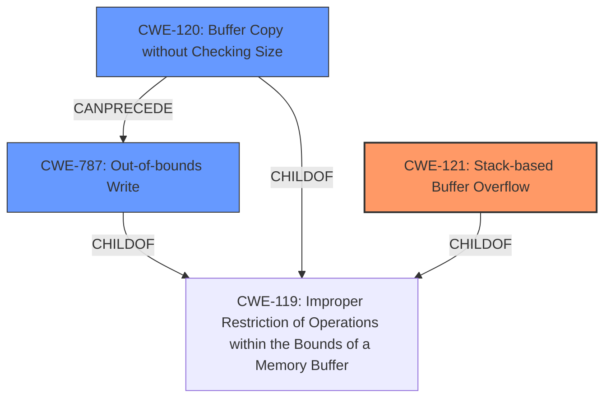

# Final Resolution for CVE-2022-40994

# Summary

| CWE ID  | CWE Name                                                                 | Confidence | CWE Abstraction Level | CWE Vulnerability Mapping Label | CWE-Vulnerability Mapping Notes                                                                                                                                                                        |
| :------- | :----------------------------------------------------------------------- | :--------- | :-------------------- | :-------------------------------- | :----------------------------------------------------------------------------------------------------------------------------------------------------------------------------------------------------- |
| CWE-121 | Stack-based Buffer Overflow                                                | 0.95       | Variant               | Allowed                            | The vulnerability is explicitly identified as a **stack-based buffer overflow**.                                                                                                                  |
| CWE-120 | Buffer Copy without Checking Size of Input ('Classic Buffer Overflow') | 0.85       | Base                  | Allowed-with-Review               | The root cause is copying data using `sprintf` without proper input size validation.                                                                                                   |
| CWE-787 | Out-of-bounds Write                                                       | 0.75       | Base                  | Allowed                            | This is the direct consequence of the **buffer overflow** - writing data beyond the buffer's boundaries.                                                                                             |

  - The Primary CWE should be first and noted as the Primary CWEs
  - The secondary candidate CWEs should be next and noted as secondary candidates.
  - The confidence is a confidence score 0 to 1 to rate your confidence in your assessment for that CWE.
  - The CWE Abstraction Level as one of these values: Base, Variant, Pillar, Class, Compound
  - The Mapping Notes Usage as one of these values: Allowed, Allowed-with-Review, Prohibited, Discouraged

## Evidence and Confidence

*   **Confidence Score:** 0.90
*   **Evidence Strength:** HIGH

## Relationship Analysis
The decision to prioritize CWE-121 was heavily influenced by its specific match to the vulnerability description as a "stack-based buffer overflow." While CWE-120 captures the underlying cause of unchecked buffer copy, CWE-121 provides a more precise classification. CWE-787 is included to show the consequence of the overflow, and it is a child of CWE-119. CWE-121 is a variant of CWE-119, **Improper Restriction of Operations within the Bounds of a Memory Buffer**. CWE-120 can precede CWE-787, as the unchecked copy leads to the out-of-bounds write.

## Vulnerability Chain
The vulnerability chain starts with the use of `sprintf` without proper size validation (CWE-120). This leads to a **stack-based buffer overflow** (CWE-121) because the destination buffer resides on the stack. The overflow results in an out-of-bounds write (CWE-787), potentially allowing an attacker to overwrite critical data or execute arbitrary code.

## Summary of Analysis
The initial analysis correctly identified CWE-120 and CWE-787. However, the criticism highlighted the importance of including CWE-121 as the primary CWE due to the explicit mention of a **stack-based buffer overflow** in the vulnerability description: "Several **stack-based buffer overflow** vulnerabilities exist...". This direct reference provides strong evidence for prioritizing CWE-121.

The graph relationships further support this decision. CWE-121 is a variant of CWE-119, making it a more specific and accurate classification than the broader CWE-120. The vulnerability chain illustrates how the unchecked buffer copy (CWE-120) leads to the **stack-based overflow** (CWE-121) and ultimately results in an out-of-bounds write (CWE-787).

The selected CWEs are at the optimal level of specificity. CWE-121 captures the specific type of buffer overflow, while CWE-120 identifies the root cause of unchecked copying, and CWE-787 represents the consequence of the overflow. Using these three CWEs provides a comprehensive understanding of the vulnerability.