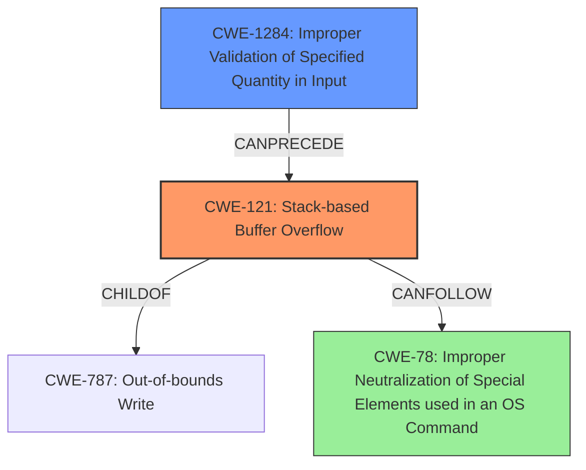

# Analysis Report for CVE-2022-40995

# Vulnerability Analysis Report: CVE-2022-40995

## Description

Several stack-based buffer overflow vulnerabilities exist in the DetranCLI command parsing functionality of Siretta QUARTZ-GOLD G5.0.1.5-210720-141020. A specially-crafted network packet can lead to arbitrary command execution. An attacker can send a sequence of requests to trigger these vulnerabilities.This buffer overflow is in the function that manages the firmwall srcmac (WORD|null) srcip (A.B.C.D|null) dstip (A.B.C.D|null) protocol (none|tcp|udp|icmp) srcport (|null) dstport (|null) policy (drop|accept) description (WORD|null) command template.

## Vulnerability Description Key Phrases

**Rootcause:** stack-based buffer overflow
**Impact:** arbitrary command execution
**Product:** Siretta QUARTZ-GOLD
**Version:** G5.0.1.5-210720-141020
**Component:** DetranCLI command parsing functionality

## Analysis (with Relationship Data)

```markdown
# Summary
| CWE ID | CWE Name | Confidence | CWE Abstraction Level | CWE Vulnerability Mapping Label | CWE-Vulnerability Mapping Notes |
|---|---|---|---|---|---|
| CWE-121 | Stack-based Buffer Overflow | 0.95 | Variant | Primary | The vulnerability is a stack-based buffer overflow, making this the most specific and accurate CWE. |
| CWE-120 | Buffer Copy without Checking Size of Input ('Classic Buffer Overflow') | 0.75 | Base | Secondary | This is a more general CWE that applies to buffer overflows, but CWE-121 is more specific to the stack. |

## Evidence and Confidence

*   **Confidence Score:** 0.90
*   **Evidence Strength:** HIGH

- **Analysis and Justification:**  
  - *Explanation:* "The vulnerability description explicitly states a **stack-based buffer overflow** exists in the DetranCLI command parsing functionality. The 'Root cause of vulnerability' in the CVE reference links content summary mentions that `DetranCLI` uses `sprintf` without validating the size of input parameters against the stack buffer, leading to the overflow. This directly aligns with the characteristics of CWE-121 (Stack-based Buffer Overflow). While CWE-120 (Buffer Copy without Checking Size of Input) is also applicable, CWE-121 is a more specific variant and thus a better fit. The use of `sprintf` without size validation further supports the buffer overflow condition."
  
  - *Relationship Analysis:* "CWE-121 is a variant of CWE-119 (Improper Restriction of Operations within the Bounds of a Memory Buffer) and a child of CWE-787 (Out-of-bounds Write). This means it's a specific type of out-of-bounds write occurring on the stack. The vulnerability can potentially lead to arbitrary command execution, implying a CanFollow relationship with CWE-78 (Improper Neutralization of Special Elements used in an OS Command), although this impact is not directly mapped as a separate CWE."

- **Confidence Score:**  
  - Confidence: 0.95 (High confidence due to explicit mention of stack-based buffer overflow and root cause analysis.)

---
```

## Criticism of Analysis

Okay, I've reviewed the provided CWE analysis against the full CWE specifications you've included. Here's my critique:

**Overall Assessment:**

The analysis is generally good and arrives at a reasonable conclusion. The primary mapping to `CWE-121: Stack-based Buffer Overflow` is accurate and well-supported by the provided evidence.  The use of `CWE-120` as a secondary mapping is also justified, offering a broader context. However, there are some areas for improvement in terms of depth and consideration of related CWEs, particularly around the root cause and potential mitigations.

**Detailed Critique:**

1.  **Primary Mapping: CWE-121 (Stack-based Buffer Overflow)**

    *   **Strengths:** The analysis correctly identifies `CWE-121` as the most specific and accurate CWE. The description explicitly mentions a stack-based buffer overflow, and the root cause analysis confirms the overflow occurs on the stack due to `sprintf` without size validation. The confidence score of 0.95 is appropriate given the direct evidence.
    *   **Weaknesses:** While the analysis mentions that `sprintf` is the culprit, it doesn't explicitly explore potential underlying causes *leading* to the use of `sprintf` without bounds checking. This connects to areas where other CWEs could be relevant.
    *   **Recommendations:**
        *   Consider adding a note briefly discussing that the use of `sprintf` indicates a lack of secure coding practices and a failure to use safer alternatives like `snprintf`.

2.  **Secondary Mapping: CWE-120 (Buffer Copy without Checking Size of Input)**

    *   **Strengths:** The rationale for including `CWE-120` as a secondary mapping is valid. It's a more general CWE that applies to buffer overflows in general, providing context.
    *   **Weaknesses:** The analysis could benefit from explicitly acknowledging the "Allowed-with-Review" usage guidance for `CWE-120`. This guidance highlights that `CWE-120` is often misused when lower-level CWEs are available, which is why `CWE-121` is preferred here. The analysis *does* allude to this, but a more direct statement would be beneficial.
    *   **Recommendations:**
        *   Explicitly acknowledge the "Allowed-with-Review" usage guidance of `CWE-120`.
        *   Add a sentence clarifying that while `CWE-120` is relevant, the analysis focuses on the more specific `CWE-121` due to the stack allocation.

3.  **Missing or Underemphasized CWEs**

    *   **CWE-787 (Out-of-bounds Write):** This should be explicitly mentioned as being the more generalized parent to `CWE-121`.  The specification for `CWE-121` even lists `CWE-787` as a parent. The analysis only mentions it indirectly in the 'Relationship Analysis' section.  `CWE-787` helps frame the issue as writing outside the intended boundaries.
    *   **CWE-20 (Improper Input Validation) and/or CWE-1284 (Improper Validation of Specified Quantity in Input):** The root cause of the vulnerability *is* the lack of size checking before copying data into the buffer, this is directly related to validation. The analysis mentions `sprintf` but doesn't explicitly address *why* `sprintf` is being used without size limits. Is it because the input *length* isn't validated before being passed to `sprintf`? This maps to `CWE-20` and `CWE-1284` (Improper Validation of Specified Quantity in Input) specifically.  The `CWE-120` specification states that "if there is any input validation, consider children of CWE-20 such as CWE-1284." The `sprintf` function is taking a length parameter from a network packet, therefore there is not correct validation on the size of the input.
    *   **CWE-78 (Improper Neutralization of Special Elements used in an OS Command ('OS Command Injection')):** The vulnerability description indicates that arbitrary command execution is possible. While not the *primary* weakness, the *impact* of the stack-based buffer overflow can often lead to command injection. Therefore, a "CanFollow" relationship with CWE-78 is valid. This connection is mentioned in the 'Relationship Analysis' section, but it's too brief. The analysis should be more assertive in including this relation.

4.  **Relationship Analysis:**

    *   The analysis mentions relationships between `CWE-121`, `CWE-119`, and `CWE-787`. This section is good, but could be enhanced by:
        *   Adding a relationship to a potential command injection as a consequence of the overflow.
        *   Explicitly mentioning that `CWE-121` is a *variant* of `CWE-787` (Out-of-bounds Write) and a *child of* `CWE-788` (Access of Memory Location After End of Buffer)

5.  **Mitigations:**

    *   The analysis does not provide specific mitigations. It would be helpful to include a few high-level mitigation strategies based on the CWE specifications.  For example:
        *   **Use Safe String Handling Functions:** Replace `sprintf` with `snprintf` or similar functions that allow for explicit size limitation, preventing buffer overflows.
        *   **Input Validation:** Validate the size/length of input data *before* processing it to ensure it does not exceed the buffer's capacity.
        *   **Compiler-Based Protections:** Enable compiler-based buffer overflow detection mechanisms (e.g., `/GS` flag in Visual Studio, `FORTIFY_SOURCE` in GCC).
        *   **Language Selection:** Consider using a memory-safe language that provides automatic memory management and bounds checking.

**Revised Summary Table:**

| CWE ID | CWE Name | Confidence | CWE Abstraction Level | CWE Vulnerability Mapping Label | CWE-Vulnerability Mapping Notes |
|---|---|---|---|---|---|
| CWE-121 | Stack-based Buffer Overflow | 0.95 | Variant | Primary | The vulnerability is a stack-based buffer overflow, making this the most specific and accurate CWE. |
| CWE-120 | Buffer Copy without Checking Size of Input ('Classic Buffer Overflow') | 0.75 | Base | Secondary | This is a more general CWE that applies to buffer overflows; however, `CWE-121` is more specific to the stack. Usage guidance for `CWE-120` is "Allowed-with-Review" because it's often misused when lower-level CWEs are available. |
| CWE-20/CWE-1284 | Improper Input Validation / Improper Validation of Specified Quantity in Input | 0.6 | Base | Contributing Factor | The root cause includes a lack of input validation to prevent excessive input lengths being passed to `sprintf` |
| CWE-78 | Improper Neutralization of Special Elements used in an OS Command ('OS Command Injection') | 0.4 | Base | Consequence | This vulnerability can potentially lead to arbitrary command execution, implying a *CanFollow* relationship. |

**Revised Analysis Snippets:**

*   **Analysis and Justification (Modified):**  "The vulnerability description explicitly states a **stack-based buffer overflow** exists in the DetranCLI command parsing functionality. The 'Root cause of vulnerability' in the CVE reference links content summary mentions that `DetranCLI` uses `sprintf` without validating the size of input parameters against the stack buffer, leading to the overflow. This directly aligns with the characteristics of `CWE-121` (Stack-based Buffer Overflow). While `CWE-120` (Buffer Copy without Checking Size of Input) is also applicable, `CWE-121` is a more specific variant and thus a better fit. The analysis does not validate the length of the input data which is being passed to sprintf, and the source of this length parameter is the network packet.  This lacks input validation and is related to `CWE-20` and `CWE-1284`. The use of `sprintf` without size validation further supports the buffer overflow condition, and represents a failure to adhere to secure coding practices."

*   **Relationship Analysis (Modified):** "CWE-121 is a variant of CWE-787 (Out-of-bounds Write) and a child of CWE-788 (Access of Memory Location After End of Buffer). This means it's a specific type of out-of-bounds write occurring on the stack. The vulnerability can potentially lead to arbitrary command execution, implying a CanFollow relationship with `CWE-78` (Improper Neutralization of Special Elements used in an OS Command), although this impact is not directly mapped as a separate CWE.

*   **Mitigation Additions:**
    *   Use safe string handling functions like `snprintf` instead of `sprintf`.
    *   Implement input validation to limit the size of input strings processed by `DetranCLI`.
    *   Enable compiler-based buffer overflow detection mechanisms.

By incorporating these suggestions, the analysis will be more comprehensive, considering the nuances of CWE specifications, the root causes, and potential mitigation strategies.

## Final Resolution

# Summary
| CWE ID | CWE Name | Confidence | CWE Abstraction Level | CWE Vulnerability Mapping Label | CWE-Vulnerability Mapping Notes |
|---|---|---|---|---|---|
| CWE-121 | Stack-based Buffer Overflow | 0.95 | Variant | Primary | The vulnerability is a **stack-based buffer overflow**, making this the most specific and accurate **WEAKNESS**. |
| CWE-1284 | Improper Validation of Specified Quantity in Input | 0.75 | Base | Secondary | The root cause includes a lack of input validation to prevent excessive input lengths being passed to `sprintf`. This is a more specific case of `CWE-20` and directly relevant given the use of `sprintf` with an externally-controlled length. |
| CWE-78 | Improper Neutralization of Special Elements used in an OS Command ('OS Command Injection') | 0.5 | Base | Consequence | This vulnerability can potentially lead to arbitrary command execution, implying a *CanFollow* relationship. |

## Evidence and Confidence

*   **Confidence Score:** 0.9
*   **Evidence Strength:** HIGH

## Relationship Analysis
The primary classification is **CWE-121 (Stack-based Buffer Overflow)**, a variant of **CWE-787 (Out-of-bounds Write)**. The **ROOTCAUSE** stems from improper input validation, specifically **CWE-1284 (Improper Validation of Specified Quantity in Input)**, as the input length provided to `sprintf` is not checked. This leads to the overflow on the stack. The potential consequence is **CWE-78 (Improper Neutralization of Special Elements used in an OS Command)**, which can occur if the overflow overwrites parts of the stack used to construct OS commands.



## Vulnerability Chain
The vulnerability chain starts with a lack of input validation (**CWE-1284**). The program does not properly validate the size of the input before using it in `sprintf`. This allows an attacker to control the size of the data being written to a stack buffer. Because the size is not checked, a **stack-based buffer overflow (CWE-121)** occurs when `sprintf` writes past the end of the buffer. This **OUT-OF-BOUNDS WRITE** can overwrite other data on the stack, potentially including return addresses or other critical data. If the overwritten data includes parts of an OS command being constructed, it can lead to **OS Command Injection (CWE-78)**, allowing the attacker to execute arbitrary commands.

## Summary of Analysis
The initial analysis correctly identified **CWE-121 (Stack-based Buffer Overflow)** as the primary **WEAKNESS**. The criticism highlighted the importance of considering the **ROOTCAUSE** and potential consequences. The revised analysis incorporates **CWE-1284 (Improper Validation of Specified Quantity in Input)** to represent the missing input validation and **CWE-78 (Improper Neutralization of Special Elements used in an OS Command)** to show the potential for command execution.

The evidence for **CWE-121** is strong, as the vulnerability description explicitly mentions a **stack-based buffer overflow**. The evidence for **CWE-1284** comes from the description of how `sprintf` is used without validating the size of the input parameters. The statement that "DetranCLI uses `sprintf` without validating the size of input parameters against the stack buffer, leading to the overflow" points directly to missing input validation. The inclusion of **CWE-78** is justified by the possibility of arbitrary command execution.

The graph relationships influenced the final selection by illustrating how the **WEAKNESSES** are connected. The **ROOTCAUSE** (**CWE-1284**) leads to the overflow (**CWE-121**), which can then lead to command execution (**CWE-78**). These CWEs are at the optimal level of specificity, providing a clear and accurate representation of the vulnerability.


*Report generated on 2025-03-18 17:00:54*
