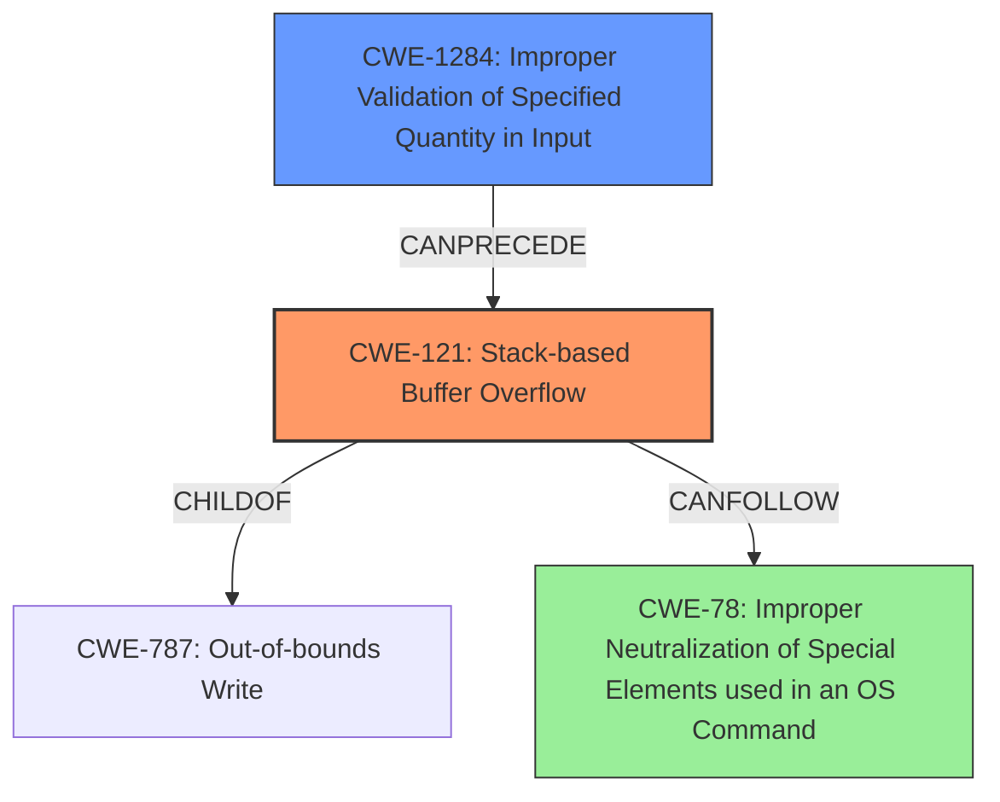

# Final Resolution for CVE-2022-40995

# Summary
| CWE ID | CWE Name | Confidence | CWE Abstraction Level | CWE Vulnerability Mapping Label | CWE-Vulnerability Mapping Notes |
|---|---|---|---|---|---|
| CWE-121 | Stack-based Buffer Overflow | 0.95 | Variant | Primary | The vulnerability is a **stack-based buffer overflow**, making this the most specific and accurate **WEAKNESS**. |
| CWE-1284 | Improper Validation of Specified Quantity in Input | 0.75 | Base | Secondary | The root cause includes a lack of input validation to prevent excessive input lengths being passed to `sprintf`. This is a more specific case of `CWE-20` and directly relevant given the use of `sprintf` with an externally-controlled length. |
| CWE-78 | Improper Neutralization of Special Elements used in an OS Command ('OS Command Injection') | 0.5 | Base | Consequence | This vulnerability can potentially lead to arbitrary command execution, implying a *CanFollow* relationship. |

## Evidence and Confidence

*   **Confidence Score:** 0.9
*   **Evidence Strength:** HIGH

## Relationship Analysis
The primary classification is **CWE-121 (Stack-based Buffer Overflow)**, a variant of **CWE-787 (Out-of-bounds Write)**. The **ROOTCAUSE** stems from improper input validation, specifically **CWE-1284 (Improper Validation of Specified Quantity in Input)**, as the input length provided to `sprintf` is not checked. This leads to the overflow on the stack. The potential consequence is **CWE-78 (Improper Neutralization of Special Elements used in an OS Command)**, which can occur if the overflow overwrites parts of the stack used to construct OS commands.

## Vulnerability Chain
The vulnerability chain starts with a lack of input validation (**CWE-1284**). The program does not properly validate the size of the input before using it in `sprintf`. This allows an attacker to control the size of the data being written to a stack buffer. Because the size is not checked, a **stack-based buffer overflow (CWE-121)** occurs when `sprintf` writes past the end of the buffer. This **OUT-OF-BOUNDS WRITE** can overwrite other data on the stack, potentially including return addresses or other critical data. If the overwritten data includes parts of an OS command being constructed, it can lead to **OS Command Injection (CWE-78)**, allowing the attacker to execute arbitrary commands.

## Summary of Analysis
The initial analysis correctly identified **CWE-121 (Stack-based Buffer Overflow)** as the primary **WEAKNESS**. The criticism highlighted the importance of considering the **ROOTCAUSE** and potential consequences. The revised analysis incorporates **CWE-1284 (Improper Validation of Specified Quantity in Input)** to represent the missing input validation and **CWE-78 (Improper Neutralization of Special Elements used in an OS Command)** to show the potential for command execution.

The evidence for **CWE-121** is strong, as the vulnerability description explicitly mentions a **stack-based buffer overflow**. The evidence for **CWE-1284** comes from the description of how `sprintf` is used without validating the size of the input parameters. The statement that "DetranCLI uses `sprintf` without validating the size of input parameters against the stack buffer, leading to the overflow" points directly to missing input validation. The inclusion of **CWE-78** is justified by the possibility of arbitrary command execution.

The graph relationships influenced the final selection by illustrating how the **WEAKNESSES** are connected. The **ROOTCAUSE** (**CWE-1284**) leads to the overflow (**CWE-121**), which can then lead to command execution (**CWE-78**). These CWEs are at the optimal level of specificity, providing a clear and accurate representation of the vulnerability.