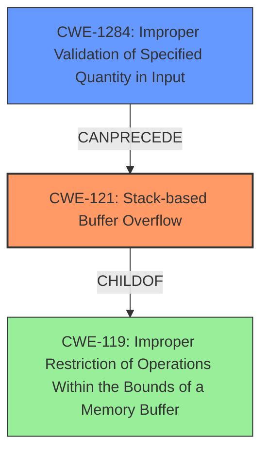

# Final Resolution for CVE-2022-40996

# Summary
| CWE ID | CWE Name | Confidence | CWE Abstraction Level | CWE Vulnerability Mapping Label | CWE-Vulnerability Mapping Notes |
|---|---|---|---|---|---|
| CWE-121 | Stack-based Buffer Overflow | 0.95 | Variant | Primary | The most specific CWE for the identified **WEAKNESS**. |
| CWE-1284 | Improper Validation of Specified Quantity in Input | 0.75 | Base | Secondary | The product receives input that is expected to specify a quantity (such as size or length), but it does not validate or incorrectly validates that the quantity has the required properties which allowed the **ROOTCAUSE** |

## Evidence and Confidence

*   **Confidence Score:** 0.90
*   **Evidence Strength:** HIGH

## Relationship Analysis
- The primary **WEAKNESS** is accurately identified as CWE-121, a variant of buffer overflow occurring on the stack, offering specificity over CWE-120.
- CWE-121 is a child of CWE-119, representing a more general class of buffer handling issues.
- CWE-1284 is added as a secondary CWE to represent the improper validation of the input size, which is a **ROOTCAUSE** that allows the stack-based buffer overflow to occur.
- This structure illustrates a chain of events where lack of input validation (CWE-1284) leads to a buffer overflow on the stack (CWE-121).

## Vulnerability Chain
The vulnerability chain starts with CWE-1284, where the product fails to validate the size of the input. This allows the subsequent unchecked buffer copy (using `sprintf`) to write past the allocated buffer on the stack (CWE-121), leading to arbitrary command execution. The sequence represents the progression from initial flaw (lack of input validation) to final impact (command execution). There are no missing links in this chain.

## Summary of Analysis
The initial analysis correctly identified CWE-121 as the primary **WEAKNESS**. The criticism correctly pointed out the opportunity to add CWE-1284 to capture the lack of input validation which leads to the **ROOTCAUSE** of this vulnerability.

The evidence provided supports the selection of CWE-121: "The vulnerability description explicitly states a "**stack-based buffer overflow**" exists within the DetranCLI command parsing functionality of Siretta QUARTZ-GOLD G5.0.1.5-210720-141020. A specially-crafted network packet can lead to arbitrary command execution."

The relationship analysis, particularly the "CanPrecede" relationship, influenced the addition of CWE-1284. The lack of proper input validation allows the stack-based buffer overflow.

CWE-121 is chosen because it is the most specific description of the buffer overflow, and CWE-1284 represents the root cause of the **WEAKNESS**.