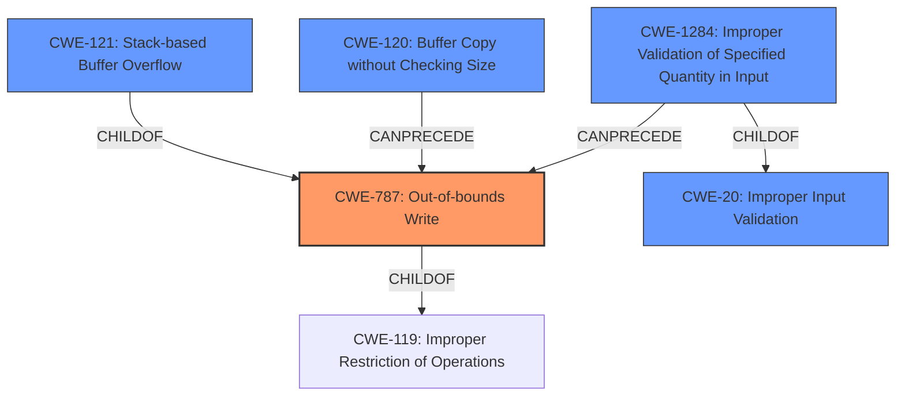

# Final Resolution for CVE-2022-41001

# Summary
| CWE ID | CWE Name | Confidence | CWE Abstraction Level | CWE Vulnerability Mapping Label | CWE-Vulnerability Mapping Notes |
|---|---|---|---|---|---|
| CWE-787 | Out-of-bounds Write | 0.90 | Base | Allowed | Primary CWE |
| CWE-121 | Stack-based Buffer Overflow | 0.85 | Variant | Allowed | Secondary Candidate |
| CWE-120 | Buffer Copy without Checking Size of Input ('Classic Buffer Overflow') | 0.80 | Base | Allowed-with-Review | Secondary Candidate |
| CWE-1284 | Improper Validation of Specified Quantity in Input | 0.70 | Base | Allowed | Secondary Candidate |
| CWE-20 | Improper Input Validation | 0.60 | Class | Discouraged | Secondary Candidate |

## Evidence and Confidence

*   **Confidence Score:** 0.90
*   **Evidence Strength:** HIGH

## Relationship Analysis
The relationships between the CWEs influenced the decision to prioritize CWE-787 [Out-of-bounds Write] as the primary **WEAKNESS**. While CWE-120 [Buffer Copy without Checking Size of Input ('Classic Buffer Overflow')] initially seemed appropriate due to the buffer copy operation, the fact that the overflow occurs on the stack makes CWE-121 [Stack-based Buffer Overflow] relevant. The parent-child relationship of CWE-121 [Stack-based Buffer Overflow] being a variant of CWE-787 [Out-of-bounds Write] and CWE-787 [Out-of-bounds Write] being a child of CWE-119 [Improper Restriction of Operations within the Bounds of a Memory Buffer] helped to choose CWE-787 [Out-of-bounds Write] as primary because it's a more general **ROOTCAUSE** of the issue, and CWE-121 [Stack-based Buffer Overflow] to show the location of the **WEAKNESS**. The addition of CWE-1284 [Improper Validation of Specified Quantity in Input] highlights a critical aspect of the vulnerability: the lack of validation of the input size before using it in the `sprintf` function. This choice is supported by the parent-child relationship between CWE-1284 [Improper Validation of Specified Quantity in Input] and CWE-20 [Improper Input Validation], further emphasizing the input validation issues. CWE-20 [Improper Input Validation] is included as a more general **ROOTCAUSE**, though it's discouraged due to its broadness.

## Vulnerability Chain
The vulnerability chain starts with the lack of proper input validation (CWE-20 [Improper Input Validation] and CWE-1284 [Improper Validation of Specified Quantity in Input]). This leads to an attacker-controlled size being used in the `sprintf` function. The `sprintf` function then copies data into a stack-based buffer (CWE-121 [Stack-based Buffer Overflow]) without checking the size of the input, resulting in an out-of-bounds write (CWE-787 [Out-of-bounds Write]) and a classic buffer overflow (CWE-120 [Buffer Copy without Checking Size of Input ('Classic Buffer Overflow')]). The final impact is arbitrary command execution.

## Summary of Analysis
The initial analysis correctly identified the buffer overflow but needed refinement to pinpoint the most accurate **ROOTCAUSE**. The criticism highlighted the importance of considering CWE-787 [Out-of-bounds Write] and CWE-121 [Stack-based Buffer Overflow] more strongly and the need to include input validation issues (CWE-20 [Improper Input Validation] and CWE-1284 [Improper Validation of Specified Quantity in Input]).

The provided evidence explicitly states "**stack-based buffer overflow**" and "specially-crafted network packet can lead to arbitrary command execution." The CVE reference link content summary confirms this with details from multiple CVEs indicating that the **ROOTCAUSE** is the use of `sprintf` with unchecked input sizes when parsing commands.

The graph relationships influenced the final selection by clarifying the hierarchical relationships between the CWEs. Prioritizing CWE-787 [Out-of-bounds Write] as the primary **WEAKNESS** and including CWE-121 [Stack-based Buffer Overflow] ensures that the classification reflects the specific nature of the vulnerability.

The selected CWEs are at the optimal level of specificity because they accurately describe the **ROOTCAUSE** (lack of input validation and unchecked buffer copy) and the resulting impact (out-of-bounds write and stack-based buffer overflow). This refined classification provides a more complete and actionable understanding of the vulnerability.