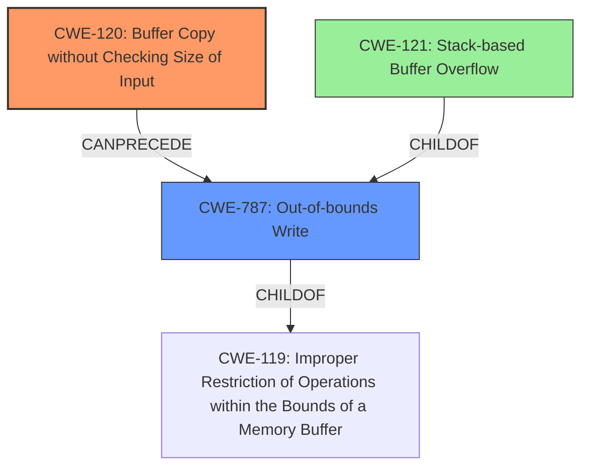

# Final Resolution for CVE-2022-41002

# Summary
| CWE ID | CWE Name | Confidence | CWE Abstraction Level | CWE Vulnerability Mapping Label | CWE-Vulnerability Mapping Notes |
|---|---|---|---|---|---|
| CWE-120 | Buffer Copy without Checking Size of Input ('Classic Buffer Overflow') | 0.95 | Base | Allowed-with-Review | Primary CWE |
| CWE-787 | Out-of-bounds Write | 0.75 | Base | Allowed | Secondary Candidate |
| CWE-121 | Stack-based Buffer Overflow | 0.50 | Base | Allowed | Tertiary Candidate |

## Evidence and Confidence

*   **Confidence Score:** 0.90
*   **Evidence Strength:** HIGH

## Relationship Analysis
The primary weakness is CWE-120, which directly leads to CWE-787 as a consequence. CWE-121 is a more specific instance of CWE-787, indicating where the out-of-bounds write occurs. The analysis considered and excluded CWE-1284 because the core issue is not the validation of the integer values themselves, but the unchecked copying of string representations.

## Vulnerability Chain
The vulnerability chain starts with **CWE-120 (Buffer Copy without Checking Size of Input)**, where the `sprintf` function copies data into a buffer without proper size validation. This leads to **CWE-787 (Out-of-bounds Write)**, as the copy operation exceeds the buffer's boundaries. The overflow occurs specifically on the stack, which leads to **CWE-121 (Stack-based Buffer Overflow)**.

## Summary of Analysis
The initial analysis correctly identified **CWE-120 (Buffer Copy without Checking Size of Input)** as the primary **ROOTCAUSE** of the vulnerability. The evidence from the vulnerability description and code snippet strongly supports this classification: *"This buffer overflow is in the function that manages the no icmp check link WORD destination WORD interval retries description (WORD|null) command template."* and *"sprintf(buff_0x80,"%d<%s<%s<%d<%d<%s",1,*argv,argv[1],atoi_argv[2],atoi_argv[3],argv[4]);"* These quotes highlight the use of `sprintf` without input size validation.

The criticism raised valid points about elaborating on potential integer overflows and clarifying the relationship between **CWE-120** and **CWE-787**. While integer overflows might contribute, the primary issue remains the lack of size checking during the buffer copy. **CWE-787** is indeed a *consequence* of the **ROOTCAUSE**, not an independent cause. The initial description mentions a stack-based overflow, so including **CWE-121 (Stack-based Buffer Overflow)** as a tertiary candidate provides additional specificity without detracting from the primary **CWE**. **CWE-1284 (Improper Validation of Specified Quantity in Input)** was considered but ultimately excluded as it is less relevant than the lack of bounds checking on the `WORD` and `description` arguments.

The final classification reflects the optimal level of specificity by identifying the root cause (**CWE-120**) and its immediate consequences (**CWE-787** and **CWE-121**). The relationship analysis and the MITRE mapping guidance were crucial in making this determination. The confidence score remains high due to the strong evidence and well-defined vulnerability chain.