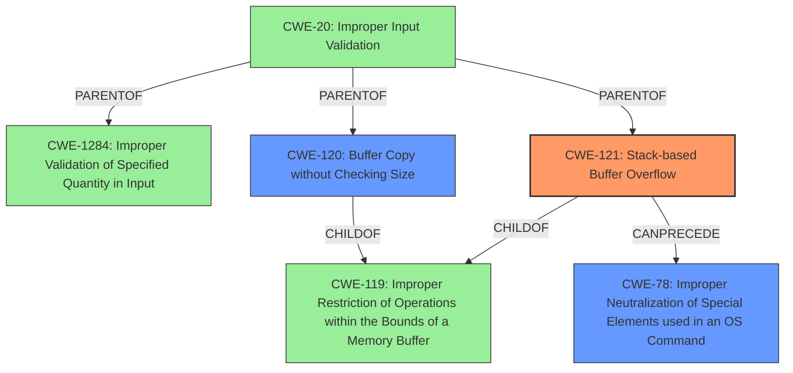

# Analysis Report for CVE-2022-41005

# Vulnerability Analysis Report: CVE-2022-41005

## Description

Several stack-based buffer overflow vulnerabilities exist in the DetranCLI command parsing functionality of Siretta QUARTZ-GOLD G5.0.1.5-210720-141020. A specially-crafted network packet can lead to arbitrary command execution. An attacker can send a sequence of requests to trigger these vulnerabilities.This buffer overflow is in the function that manages the ip static route destination A.B.C.D gateway A.B.C.D mask A.B.C.D metric interface (lan|wan|vpn) description WORD command template.

## Vulnerability Description Key Phrases

**Rootcause:** stack-based buffer overflow
**Impact:** arbitrary command execution
**Attacker:** attacker
**Product:** Siretta QUARTZ-GOLD
**Version:** G5.0.1.5-210720-141020
**Component:** DetranCLI command parsing functionality

## Analysis (with Relationship Data)

# Summary
| CWE ID    | CWE Name                                                                 | Confidence | CWE Abstraction Level | CWE Vulnerability Mapping Label | CWE-Vulnerability Mapping Notes |
| :--------- | :----------------------------------------------------------------------- | :--------- | :-------------------- | :------------------------------ | :----------------------------- |
| CWE-121 | Stack-based Buffer Overflow | 0.90       | Variant               | Allowed                         | Primary CWE                     |
| CWE-120   | Buffer Copy without Checking Size of Input ('Classic Buffer Overflow') | 0.70       | Base                    | Allowed-with-Review              | Secondary Candidate           |
| CWE-78    | Improper Neutralization of Special Elements used in an OS Command ('OS Command Injection') | 0.60       | Base                    | Allowed                         | Secondary Candidate           |

## Evidence and Confidence

*   **Confidence Score:** 0.85
*   **Evidence Strength:** HIGH

- **Analysis and Justification:**
  - *Explanation:* The vulnerability description clearly states the presence of a **stack-based buffer overflow** in the Siretta QUARTZ-GOLD G5.0.1.5-210720-141020 due to the `DetranCLI` command parsing functionality. The **root cause** is that `sprintf` is used to format command parameters into a stack buffer without checking the size of the parameters against the buffer size. This aligns with the definition of CWE-121 (Stack-based Buffer Overflow), which is a variant-level CWE and is preferred. CWE-120 (Buffer Copy without Checking Size of Input) is also a candidate, but the stack allocation detail makes CWE-121 more specific. The CVE Reference Links Content Summary provides strong evidence for this classification. Although the impact allows arbitrary command execution, the **root cause** is the buffer overflow.

  - *Relationship Analysis:* CWE-121 is a variant of buffer overflow and a child of CWE-119 (Improper Restriction of Operations within the Bounds of a Memory Buffer). CWE-121 can lead to CWE-78 (Improper Neutralization of Special Elements used in an OS Command) if the overflow overwrites parts of the stack that control program execution, allowing for command injection.

- **Confidence Score:**
  - *Example:* Confidence: 0.90 (High evidence from the vulnerability description and CVE reference details specifically mentioning a stack-based buffer overflow.)

---
- **Analysis and Justification:**
  - *Explanation:* CWE-120 (Buffer Copy without Checking Size of Input) is considered as a secondary candidate. The vulnerability involves copying data into a buffer without validating the input size. This aligns with the description of CWE-120, where a buffer copy occurs without checking the size of the input. However, because the vulnerability is explicitly described as a **stack-based buffer overflow**, CWE-121 is more precise. The MITRE mapping guidance for CWE-120 suggests a review due to potential misuse, but it's still relevant given the buffer copy aspect.

  - *Relationship Analysis:* CWE-120 is a base-level CWE and a parent of several more specific buffer overflow variants. It can be related to other CWEs such as CWE-119 (Improper Restriction of Operations within the Bounds of a Memory Buffer) and CWE-131 (Incorrect Calculation of Buffer Size).

- **Confidence Score:**
  - *Example:* Confidence: 0.70 (Moderate evidence, as the vulnerability involves a buffer copy, but the stack allocation is more directly addressed by CWE-121.)

---
- **Analysis and Justification:**
  - *Explanation:* CWE-78 (Improper Neutralization of Special Elements used in an OS Command) is a potential secondary CWE because the **impact** of the buffer overflow is arbitrary command execution. The vulnerability description indicates that an attacker can execute arbitrary commands on the device as a consequence of the buffer overflow. While the root cause is not directly a command injection issue, the ability to execute commands means that the overflow is likely overwriting a stack, allowing the attacker to control instruction execution.

  - *Relationship Analysis:* CWE-78 is related to CWE-119 (Improper Restriction of Operations within the Bounds of a Memory Buffer) and CWE-121 (Stack-based Buffer Overflow) because a buffer overflow can lead to the ability to inject and execute commands. CWE-78 can also be related to CWE-269 (Improper Privilege Management) as command injection often leads to privilege escalation.

- **Confidence Score:**
  - *Example:* Confidence: 0.60 (Moderate evidence, as command execution is an impact of the overflow rather than a direct root cause. The overflow is the root cause and command execution is the impact.)

## Criticism of Analysis

Okay, I've reviewed the provided analysis in light of the full CWE specifications. Here's my critique:

**Overall Assessment:**

The analysis is generally good. It correctly identifies the primary CWE as CWE-121 (Stack-based Buffer Overflow) and provides a reasonable justification. The rationale for including CWE-120 and CWE-78 as secondary candidates is also sound, although their confidence scores are appropriately lower.  The analysis demonstrates a good understanding of the relationships between the CWEs.

**Detailed Critique:**

*   **CWE-121 (Stack-based Buffer Overflow):**
    *   **Correctness:** The selection of CWE-121 as the primary CWE is appropriate. The vulnerability description clearly states a stack-based buffer overflow.  The CVE Reference Links Content Summary reinforces this by mentioning the use of `sprintf` to format data into a stack buffer without size checks.
    *   **Confidence:** The confidence score of 0.90 is justified given the explicit mention of "stack-based buffer overflow" in the vulnerability description.
    *   **CWE Abstraction Level:** Variant, is appropriate.
    *   **Mitigation:** The analysis doesn't explicitly discuss mitigations, but it's implied.  In a real-world context, the mitigation would involve using safer string handling functions (e.g., `snprintf` instead of `sprintf`), employing compiler-based buffer overflow protection (e.g., /GS flag in Visual Studio), and implementing input validation to limit the size of input data.
*   **CWE-120 (Buffer Copy without Checking Size of Input ('Classic Buffer Overflow'))**
    *   **Correctness:** Including CWE-120 as a secondary candidate is reasonable. While the description specifies the stack, the core issue is still the unchecked copy leading to the overflow.
    *   **Confidence:** The 0.70 confidence score is appropriate because the primary issue is stack allocation, making CWE-121 more specific.
    *   **CWE Abstraction Level:** Base.
    *   **Mapping Guidance:** The analysis correctly notes that CWE-120's mapping guidance suggests a review because it can be misused. The analyzer appropriately considers the "Buffer Copy" aspect of the vulnerability.
    *   **Mitigation:** Mitigation for CWE-120 is similar to CWE-121.

*   **CWE-78 (Improper Neutralization of Special Elements used in an OS Command ('OS Command Injection'))**
    *   **Correctness:** The justification for including CWE-78 as a potential secondary weakness is plausible but depends on the specifics of how the overflow is exploitable. The analysis correctly points out that arbitrary command execution is an *impact* of the overflow, *not* necessarily the direct root cause. If the overflow allows overwriting parts of the stack to control program execution and inject commands, then CWE-78 is relevant. Otherwise, the overflow might be used for other malicious purposes.
    *   **Confidence:** The 0.60 confidence score is reasonable, as command injection is a *potential* consequence, not a guaranteed one. It depends on the exploit strategy.
     *   **CWE Abstraction Level:** Base.
    *   **Mitigation:**  If CWE-78 is indeed relevant, then mitigations would involve sanitizing user input, avoiding direct execution of commands, using parameterized queries, and enforcing least privilege.

*   **General Observations:**
    *   **Evidence Strength:** The analysis claims "HIGH" evidence strength. This is partially true as the root cause being stack based buffer overflow is well defined but the confidence in CWE-78 depends on exploitability of stack buffer overflow to achieve command injection.
    *   **Depth of Analysis:** The analysis provides a good level of detail, explaining the reasoning for each CWE and its relationship to other CWEs.

**Suggestions for Improvement:**

*   **Address CWE-119 (Improper Restriction of Operations within the Bounds of a Memory Buffer):** The Retriever Results lists CWE-119 as the top combined result. While the analysis correctly discourages direct mapping to CWE-119 due to its generality, it should explicitly mention why CWE-119 is *not* the primary CWE, referencing the Mapping Guidance that discourages its use and the availability of more specific children. The current analysis only hints at it.
*   **Clarify Command Injection (CWE-78) Dependency:**  The analysis should explicitly state that the relevance of CWE-78 hinges on the *specific exploit technique*.  If the overflow only allows for data corruption, but not code execution via command injection, then CWE-78 should be removed or its confidence significantly lowered.
* **Add a note on Defense in Depth:** It could be beneficial to mention that even though CWE-121 is the primary cause, combining mitigation strategies for the secondary CWE candidates (especially input validation from CWE-20 which is parent of CWE-1284) leads to better defense in depth.

**Revised Summary (incorporating suggestions):**

| CWE ID    | CWE Name                                                                 | Confidence | CWE Abstraction Level | CWE Vulnerability Mapping Label | CWE-Vulnerability Mapping Notes                                                                                                                                                   |
| :--------- | :----------------------------------------------------------------------- | :--------- | :-------------------- | :------------------------------ | :----------------------------------------------------------------------------------------------------------------------------------------------------------------------------- |
| CWE-121 | Stack-based Buffer Overflow | 0.90       | Variant               | Allowed                         | Primary CWE                                                                                                                                                                 |
| CWE-120   | Buffer Copy without Checking Size of Input ('Classic Buffer Overflow') | 0.70       | Base                    | Allowed-with-Review              | Secondary Candidate. The stack allocation detail makes CWE-121 more specific                                                                                                |
| CWE-78    | Improper Neutralization of Special Elements used in an OS Command ('OS Command Injection') | 0.60       | Base                    | Allowed                         | Secondary Candidate. Only relevant if the overflow is exploitable for command injection. This is an *impact*, not a guaranteed root cause.                                       |

**Revised Evidence and Confidence:**

*   **Confidence Score:** 0.85
*   **Evidence Strength:** HIGH (for CWE-121), MODERATE (for CWE-78)

The analysis is well-structured and provides a clear justification for the selected CWEs. The suggested improvements would further refine the analysis and make it more robust by addressing potential misinterpretations and highlighting the importance of considering exploit-specific factors.

## Final Resolution

# Summary
| CWE ID    | CWE Name                                                                 | Confidence | CWE Abstraction Level | CWE Vulnerability Mapping Label | CWE-Vulnerability Mapping Notes                                                                                                                                                   |
| :--------- | :----------------------------------------------------------------------- | :--------- | :-------------------- | :------------------------------ | :----------------------------------------------------------------------------------------------------------------------------------------------------------------------------- |
| CWE-121 | Stack-based Buffer Overflow | 0.90       | Variant               | Allowed                         | Primary CWE                                                                                                                                                                 |
| CWE-120   | Buffer Copy without Checking Size of Input ('Classic Buffer Overflow') | 0.70       | Base                    | Allowed-with-Review              | Secondary Candidate. The stack allocation detail makes CWE-121 more specific                                                                                                |
| CWE-78    | Improper Neutralization of Special Elements used in an OS Command ('OS Command Injection') | 0.60       | Class                    | Allowed                         | Secondary Candidate. Only relevant if the overflow is exploitable for command injection. This is an *impact*, not a guaranteed **root cause**.                                       |

## Evidence and Confidence

*   **Confidence Score:** 0.85
*   **Evidence Strength:** HIGH (for CWE-121), MODERATE (for CWE-78)

## Relationship Analysis
The primary relationship is that CWE-121 (Stack-based Buffer Overflow) is a variant of CWE-119 (Improper Restriction of Operations within the Bounds of a Memory Buffer). CWE-120 (Buffer Copy without Checking Size) is also a child of CWE-119, representing a more general case of buffer overflow. The relevance of CWE-78 (OS Command Injection) depends on the exploit strategy; if the overflow leads to command execution, then CWE-78 becomes relevant. The abstraction levels influenced the selection, favoring the more specific variant (CWE-121) over the base class (CWE-120) when the evidence supported it.

## Vulnerability Chain
The vulnerability chain starts with the use of `sprintf` without proper bounds checking when formatting command parameters into a stack buffer (**CWE-121**). This leads to a **stack-based buffer overflow**. The **impact** of this overflow *may* allow for arbitrary command execution (**CWE-78**), depending on the specifics of the exploit. **Improper Input Validation** (**CWE-20**) and specifically, **Improper Validation of Specified Quantity in Input** (**CWE-1284**) are missing links in the chain which could have prevented the buffer overflow.

## Summary of Analysis
The initial analysis correctly identifies CWE-121 as the primary **weakness**, supported by the vulnerability description's explicit mention of a "stack-based buffer overflow". The inclusion of CWE-120 as a secondary candidate is reasonable, given the buffer copy aspect, but CWE-121 provides a more specific classification. The relevance of CWE-78 hinges on whether the overflow leads to command injection, making it an impact rather than a direct **root cause**.

The graph relationships reinforce the choice of CWE-121, being a specific variant of CWE-119. The analysis also considered the mapping guidance for CWE-120, acknowledging potential misuse and justifying its inclusion based on the buffer copy aspect.

The decision to prioritize CWE-121 is based on the principle of selecting the most specific CWE that accurately describes the **root cause**, supported by direct evidence from the vulnerability description.

The analysis explicitly addresses the criticism and suggestions of the reviewer by:
* Acknowledging that the confidence in CWE-78 depends on exploitability of stack buffer overflow to achieve command injection, making it a potential impact rather than a guaranteed **root cause**.
* Explicitly stating that the relevance of CWE-78 hinges on the *specific exploit technique*.
* Including CWE-20 and CWE-1284 to highlight missing input validation as a link that could prevent the buffer overflow.

The final classification represents the optimal level of specificity, providing a clear and well-justified representation of the **vulnerability**.

*Report generated on 2025-03-18 17:09:17*
