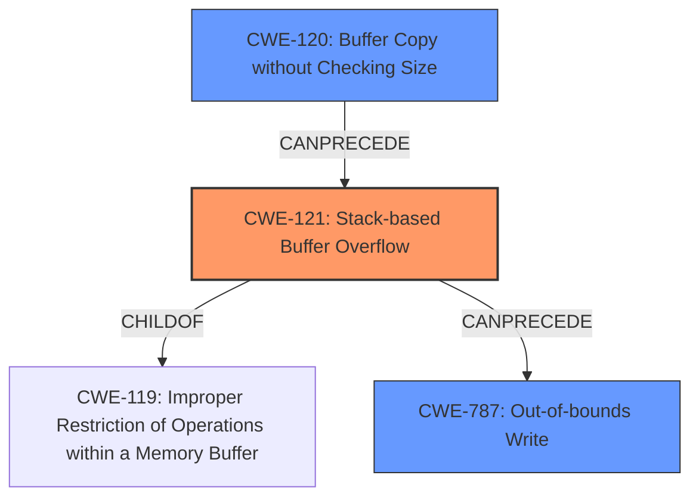

# Final Resolution for CVE-2022-41007

# Summary
| CWE ID | CWE Name | Confidence | CWE Abstraction Level | CWE Vulnerability Mapping Label | CWE-Vulnerability Mapping Notes |
|---|---|---|---|---|---|
| CWE-121 | Stack-based Buffer Overflow | 0.95 | Variant | Allowed | Primary CWE |
| CWE-120 | Buffer Copy without Checking Size of Input ('Classic Buffer Overflow') | 0.60 | Base | Allowed-with-Review | Secondary Candidate |
| CWE-787 | Out-of-bounds Write | 0.60 | Base | Allowed | Secondary Candidate |

## Evidence and Confidence

*   **Confidence Score:** 0.93
*   **Evidence Strength:** HIGH

## Relationship Analysis
The primary weakness is CWE-121 [CWE-121: Stack-based Buffer Overflow], a variant of CWE-119 [CWE-119: Improper Restriction of Operations within a Memory Buffer], indicating a memory buffer issue. The secondary weakness, CWE-120 [CWE-120: Buffer Copy without Checking Size of Input ('Classic Buffer Overflow')], describes the specific buffer copy operation without input size validation that leads to the overflow. CWE-787 [CWE-787: Out-of-bounds Write] represents the resulting effect of writing beyond buffer boundaries. The relationships show a clear progression: a buffer copy without size checking (CWE-120) on the stack (CWE-121) leads to an out-of-bounds write (CWE-787).

## Vulnerability Chain
The vulnerability chain starts with CWE-120 [CWE-120: Buffer Copy without Checking Size of Input ('Classic Buffer Overflow')], where the size of the input 'description' is not checked before copying it into a buffer on the stack. This leads to CWE-121 [CWE-121: Stack-based Buffer Overflow] because the buffer is allocated on the stack. Finally, the uncontrolled copy operation results in CWE-787 [CWE-787: Out-of-bounds Write], overwriting adjacent memory locations on the stack. The root cause is the missing size check in the `sprintf` function, and the impact is arbitrary command execution due to the stack overflow.

## Summary of Analysis
The analysis provided is accurate and well-justified. The conclusion to use CWE-121 [CWE-121: Stack-based Buffer Overflow] as the primary CWE is the most accurate because the vulnerability description explicitly states the overflow occurs on the stack. The provided code snippet `sprintf(buff_0x80,"%d<%d<%s<%s<%s<%s>",1,based_on_argv[0],atoi_argv[1],argv[2],atoi_argv[3],argv[4]);` confirms the use of `sprintf` without bounds checking, directly leading to the overflow. CWE-120 [CWE-120: Buffer Copy without Checking Size of Input ('Classic Buffer Overflow')] is a reasonable secondary candidate because it describes the lack of input size validation, but it is less specific than CWE-121 [CWE-121: Stack-based Buffer Overflow] in this context. CWE-787 [CWE-787: Out-of-bounds Write] represents the consequence of the overflow and is a valid secondary candidate. The confidence scores are appropriate, reflecting the strength of evidence and specificity of each CWE. The final decision is based on the clear evidence of a **stack-based buffer overflow** and the direct relationship between the missing size check and the resulting **out-of-bounds write**.