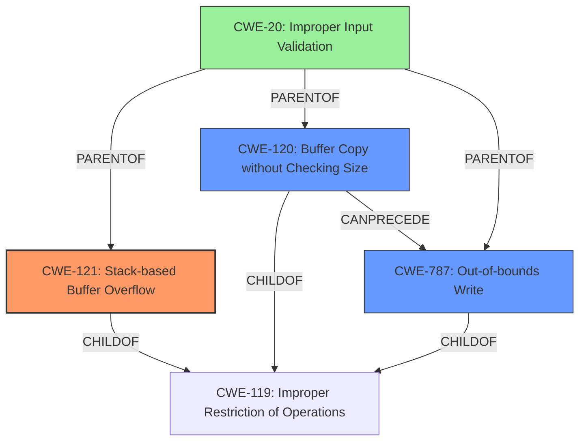

# Analysis Report for CVE-2022-41008

# Vulnerability Analysis Report: CVE-2022-41008

## Description

Several stack-based buffer overflow vulnerabilities exist in the DetranCLI command parsing functionality of Siretta QUARTZ-GOLD G5.0.1.5-210720-141020. A specially-crafted network packet can lead to arbitrary command execution. An attacker can send a sequence of requests to trigger these vulnerabilities.This buffer overflow is in the function that manages the no port redirect protocol (tcp|udp|tcp/udp) inport dstaddr A.B.C.D export description WORD command template.

## Vulnerability Description Key Phrases

**Rootcause:** stack-based buffer overflow
**Impact:** arbitrary command execution
**Product:** Siretta QUARTZ-GOLD
**Version:** G5.0.1.5-210720-141020
**Component:** DetranCLI command parsing functionality

## Analysis (with Relationship Data)

# Summary
| CWE ID | CWE Name | Confidence | CWE Abstraction Level | CWE Vulnerability Mapping Label | CWE-Vulnerability Mapping Notes |
|---|---|---|---|---|---|
| CWE-121 | Stack-based Buffer Overflow | 0.9 | Variant | Primary | Allowed |
| CWE-120 | Buffer Copy without Checking Size of Input ('Classic Buffer Overflow') | 0.7 | Base | Secondary | Allowed-with-Review |
| CWE-787 | Out-of-bounds Write | 0.6 | Base | Secondary | Allowed |

## Evidence and Confidence

*   **Confidence Score:** 0.9
*   **Evidence Strength:** HIGH

- **Analysis and Justification:**
  - *Explanation:* The vulnerability description clearly states a **stack-based buffer overflow** exists in the DetranCLI command parsing functionality. The CVE Reference Links Content Summary confirms this, stating the root cause is the `DetranCLI` binary using `sprintf` to format strings based on user-supplied parameters without proper bounds checking, leading to **stack-based buffer overflows**. This aligns directly with CWE-121 (Stack-based Buffer Overflow), which is a Variant level CWE.

  - *Relationship Analysis:* CWE-121 is a child of CWE-119 (Improper Restriction of Operations within the Bounds of a Memory Buffer). While CWE-119 is a broader category, the specific mention of "stack-based" makes CWE-121 a more precise fit. CWE-787 (Out-of-bounds Write) is also applicable, as a buffer overflow inherently involves writing beyond the intended boundaries. However, CWE-121 is more descriptive of the specific location (stack) of the overflow. CWE-120 (Buffer Copy without Checking Size of Input) is a potential candidate but the CVE summary makes the stack location explicit.

- **Confidence Score:**
  - Confidence: 0.9 (High confidence due to explicit mention of "stack-based buffer overflow" in both the vulnerability description and the CVE reference summary.)

---

- **Analysis and Justification:**
  - *Explanation:* CWE-120 (Buffer Copy without Checking Size of Input ('Classic Buffer Overflow')) is also considered as a secondary CWE because the root cause involves copying user-supplied data into a buffer without proper size validation. The `sprintf` function, mentioned in the CVE Reference Links Content Summary, is often associated with this type of vulnerability. However, the specific detail about it being stack-based warrants the primary classification as CWE-121. The MITRE mapping guidance for CWE-120 states that it's ALLOWED-WITH-REVIEW because it is sometimes misused, but it applies here as a contributing factor.

  - *Relationship Analysis:* CWE-120 is a base-level CWE and a child of CWE-119, which is a Class level CWE. This reinforces the decision to select the more specific CWE-121 as the primary weakness.

- **Confidence Score:**
  - Confidence: 0.7 (The vulnerability involves a buffer copy without checking size, but the stack-based nature is the more defining characteristic.

---

- **Analysis and Justification:**
  - *Explanation:* CWE-787 (Out-of-bounds Write) is applicable because a buffer overflow, by definition, involves writing data beyond the intended boundaries of the buffer. While this is a consequence of the overflow rather than the root cause, it represents a critical aspect of the vulnerability. It is added as a secondary CWE to provide a more complete understanding of what happens when this vulnerability is exploited.

  - *Relationship Analysis:* CWE-787 is a base-level CWE and a child of CWE-119. The "out-of-bounds write" is a direct consequence of the **stack-based buffer overflow.**

- **Confidence Score:**
  - Confidence: 0.6 (The vulnerability necessarily leads to an out-of-bounds write, making CWE-787 relevant, but less descriptive than the primary CWE.)

## Criticism of Analysis

Okay, I've reviewed the analysis against the provided full CWE specifications. Here's a detailed critique:

**Overall Assessment:**

The analysis is generally good, with a clear justification for the primary CWE and reasonable rationale for the secondary CWEs. The use of the vulnerability description, CVE reference summary, and CWE specifications to support the choices is commendable. However, some improvements can be made in clarifying relationships between CWEs and ensuring the most accurate and descriptive mappings.

**Specific Feedback:**

**1. Primary CWE: CWE-121 (Stack-based Buffer Overflow)**

*   **Assessment:**  The choice of CWE-121 is correct and well-justified. The vulnerability description and CVE summary explicitly mention "stack-based buffer overflow," making this the most accurate and descriptive CWE.
*   **Confidence:** The high confidence (0.9) is appropriate.
*   **Mitigation Relevance:** The suggested mitigations for CWE-121 (language selection, safe libraries, compiler-based protections) are all highly relevant to preventing this type of vulnerability.  The analysis accurately points out that these mitigations should be considered during operation, build, and compilation.

**2. Secondary CWE: CWE-120 (Buffer Copy without Checking Size of Input ('Classic Buffer Overflow'))**

*   **Assessment:** This is a reasonable secondary CWE, as the root cause involves a buffer copy operation without size validation. The use of `sprintf` without bounds checking makes CWE-120 applicable.
*   **Confidence:** The confidence score of 0.7 is appropriate. The stack location is a more descriptive characteristic making CWE-121 the primary.
*   **Mapping Guidance Compliance:** The analysis accurately acknowledges that CWE-120's mapping guidance is "Allowed-with-Review" due to potential misuse. The justification provided is sufficient, as the lack of size checking is a contributing factor to the stack-based overflow.
*   **Relationship Analysis:** The connection to CWE-119 is valid, as CWE-120 is a child of CWE-119.
*    **Mitigation Relevance:** The mitigations (language selection, safe libraries, compiler-based protections) are all highly relevant to preventing this type of vulnerability.

**3. Secondary CWE: CWE-787 (Out-of-bounds Write)**

*   **Assessment:** CWE-787 is also a valid secondary mapping. A buffer overflow necessarily leads to an out-of-bounds write. The explanation that it describes the *consequence* of the overflow, rather than the root cause, is correct.
*   **Confidence:** The confidence score of 0.6 is accurate. CWE-787 describes a necessary result of a buffer overflow but not the underlying cause.
*   **Relationship Analysis:** The connection to CWE-119 is valid, as CWE-787 is a child of CWE-119.
*    **Mitigation Relevance:** The mitigations (language selection, safe libraries, compiler-based protections) are all highly relevant to preventing this type of vulnerability.

**Suggestions for Improvement:**

1.  **Explicitly Address CWE-119 (Improper Restriction of Operations within the Bounds of a Memory Buffer):**  Since CWE-119 is the parent of both CWE-121, CWE-120, and CWE-787, it could be briefly mentioned and then *explicitly dismissed* as the primary CWE because it is too general. Briefly explain why the more specific CWEs are preferred.  This demonstrates a thorough consideration of the CWE hierarchy.

2.  **Consider CWE-20 (Improper Input Validation) and CWE-1284 (Improper Validation of Specified Quantity in Input):** The CVE summary states that user-supplied parameters are used without proper bounds checking. This implies a lack of input validation. Consider including CWE-20, and possibly its child CWE-1284, as potential contributing factors. However, note that CWE-20 is "Discouraged" and CWE-1284 is more specific. The sprintf function could be validating the input parameters.

3.  **Expand on `sprintf` usage:** Elaborate on how `sprintf`'s use *without* proper size checking is the direct mechanism that leads to the overflow. This reinforces the selection of CWE-120 or CWE-121.

**Revised Summary Table (incorporating suggestions):**

| CWE ID | CWE Name | Confidence | CWE Abstraction Level | CWE Vulnerability Mapping Label | CWE-Vulnerability Mapping Notes |
|---|---|---|---|---|---|
| CWE-121 | Stack-based Buffer Overflow | 0.9 | Variant | Primary | Allowed |
| CWE-120 | Buffer Copy without Checking Size of Input ('Classic Buffer Overflow') | 0.7 | Base | Secondary | Allowed-with-Review |
| CWE-787 | Out-of-bounds Write | 0.6 | Base | Secondary | Allowed |
| CWE-20| Improper Input Validation | 0.4 | Class | Contributing|Discouraged |

**Revised Analysis Snippet (example):**
```
- **Relationship Analysis:** CWE-121 is a child of CWE-119 (Improper Restriction of Operations within the Bounds of a Memory Buffer). While CWE-119 is a broader category, the specific mention of "stack-based" makes CWE-121 a more precise fit. CWE-119 is explicitly dismissed as a primary because the analysis can leverage more specific, descriptive CWE options. CWE-787 (Out-of-bounds Write) is also applicable, as a buffer overflow inherently involves writing beyond the intended boundaries. However, CWE-121 is more descriptive of the specific location (stack) of the overflow. CWE-120 (Buffer Copy without Checking Size of Input) is a potential candidate but the CVE summary makes the stack location explicit. Finally, CWE-20 (Improper Input Validation) could also be considered since the code uses sprintf without proper input size limits, however the sprintf itself could have input validation. CWE-20 is rated as discouraged and the sprintf function is the best descriptor for this exploit.
```

By incorporating these suggestions, the analysis will become even more robust and demonstrate a comprehensive understanding of CWE mapping principles.

## Final Resolution

# Summary
| CWE ID | CWE Name | Confidence | CWE Abstraction Level | CWE Vulnerability Mapping Label | CWE-Vulnerability Mapping Notes |
|---|---|---|---|---|---|
| CWE-121 | Stack-based Buffer Overflow | 0.9 | Variant | Primary | Allowed |
| CWE-120 | Buffer Copy without Checking Size of Input ('Classic Buffer Overflow') | 0.7 | Base | Secondary | Allowed-with-Review |
| CWE-787 | Out-of-bounds Write | 0.6 | Base | Secondary | Allowed |
| CWE-20| Improper Input Validation | 0.4 | Class | Contributing|Discouraged |

## Evidence and Confidence

*   **Confidence Score:** 0.9
*   **Evidence Strength:** HIGH

## Relationship Analysis
The primary CWE, CWE-121 (Stack-based Buffer Overflow), is a Variant of CWE-119 (Improper Restriction of Operations within the Bounds of a Memory Buffer). CWE-120 (Buffer Copy without Checking Size of Input) and CWE-787 (Out-of-bounds Write) are also children of CWE-119. CWE-120 can precede CWE-787. CWE-20 (Improper Input Validation) is a parent of CWE-121, CWE-120, and CWE-787. The analysis explicitly dismisses CWE-119 as too general, and acknowledges CWE-20 but discounts it as sprintf itself may be validating the input. The chosen CWEs provide a more specific and descriptive mapping of the vulnerability.



## Vulnerability Chain
The vulnerability chain starts with the use of `sprintf` without proper bounds checking (CWE-120), leading to a **stack-based buffer overflow** (CWE-121), which results in an **out-of-bounds write** (CWE-787). The **lack of input validation** (CWE-20) could be a contributing factor, however the analysis states that the `sprintf` may be validating the input parameters.

## Summary of Analysis
The initial analysis and the criticism both agree on the primary **WEAKNESS** being **CWE-121 (Stack-based Buffer Overflow)**. The explicit mention of "stack-based buffer overflow" in the vulnerability description and CVE reference summary provides strong evidence for this classification.

The secondary CWEs, **CWE-120 (Buffer Copy without Checking Size of Input)** and **CWE-787 (Out-of-bounds Write)**, are also valid contributing factors. **CWE-120** represents the root cause of the overflow, while **CWE-787** describes the consequence of writing beyond the intended buffer boundaries. **CWE-20 (Improper Input Validation)** was considered, however the analysis discounts this by stating that the `sprintf` may be validating the input.

The relationship analysis reinforces these choices. **CWE-121**, **CWE-120**, and **CWE-787** are all related to **CWE-119 (Improper Restriction of Operations within the Bounds of a Memory Buffer)**, but the selected CWEs offer a more specific and descriptive mapping of the vulnerability.

The final decision is based on the available evidence and the relationships between CWEs. The selected CWEs are at the optimal level of specificity, providing a comprehensive understanding of the vulnerability. The high confidence score reflects the strong evidence and clear justification for the chosen classifications.


*Report generated on 2025-03-18 17:11:48*
