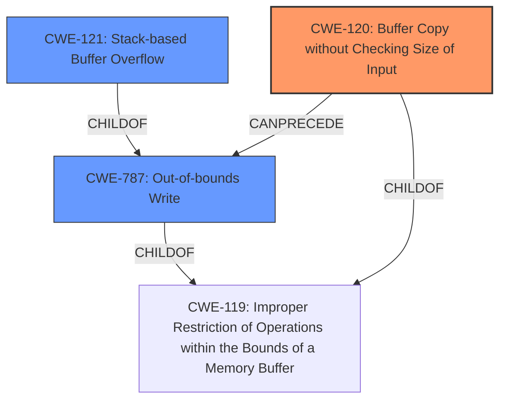

# Final Resolution for CVE-2022-41009

# Summary
| CWE ID | CWE Name | Confidence | CWE Abstraction Level | CWE Vulnerability Mapping Label | CWE-Vulnerability Mapping Notes |
|---|---|---|---|---|---|
| CWE-120 | Buffer Copy without Checking Size of Input ('Classic Buffer Overflow') | 1.0 | Base | Primary | Allowed-with-Review |
| CWE-787 | Out-of-bounds Write | 0.75 | Base | Secondary | Allowed |
| CWE-121 | Stack-based Buffer Overflow | 0.75 | Variant | Secondary | Allowed |

## Evidence and Confidence

*   **Confidence Score:** 0.95
*   **Evidence Strength:** HIGH

## Relationship Analysis
The analysis considered the hierarchical relationship between CWE-120, CWE-121 and CWE-787. CWE-120 is a specific type of buffer overflow, and CWE-121 specifies the location of the overflow on the stack, making it a variant. The addition of CWE-787 indicates that the root cause is the out-of-bounds write. These all stem from the lack of input validation. The primary classification remains CWE-120 due to the direct buffer copy operation without size checking.

## Vulnerability Chain
The vulnerability chain begins with the lack of input validation, leading to an unchecked buffer copy (CWE-120) using `sprintf`. This results in an out-of-bounds write (CWE-787) on the stack (CWE-121), which can lead to arbitrary command execution.
  - **Root Cause:** Lack of input validation, leading to unchecked buffer copy.
  - **Weakness 1:** CWE-120 (Buffer Copy without Checking Size of Input)
  - **Weakness 2:** CWE-787 (Out-of-bounds Write)
  - **Context:** Stack-based (CWE-121)
  - **Impact:** Arbitrary command execution

## Summary of Analysis
The initial analysis correctly identified CWE-120 as the primary **WEAKNESS**. The criticism offered valuable suggestions, particularly the addition of CWE-787. The vulnerability description clearly states a "**stack-based buffer overflow**" exists, and the CVE reference content summary mentions the use of `sprintf` and lack of input size checking, confirming CWE-120's applicability. The addition of CWE-787 is justified because the `sprintf` function copies the input to `buff_0x80` without checking for size, leading to writing outside the bounds of the buffer. The graph relationships influenced the decision to include CWE-787 as a secondary CWE, recognizing the out-of-bounds write aspect of the vulnerability. The selected CWEs are at the optimal level of specificity, with CWE-120 capturing the core issue of unchecked buffer copy, CWE-787 highlighting the out-of-bounds write, and CWE-121 providing the context of the stack location.