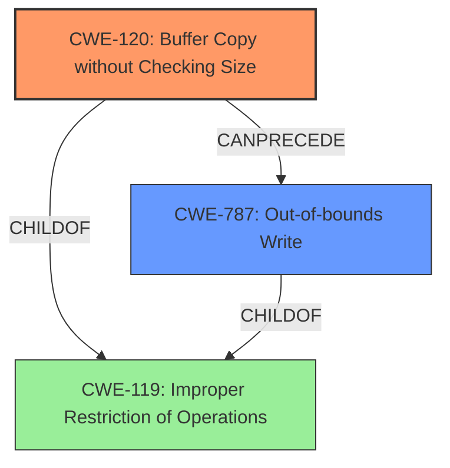

# Analysis Report for CVE-2022-41010

# Vulnerability Analysis Report: CVE-2022-41010

## Description

Several stack-based buffer overflow vulnerabilities exist in the DetranCLI command parsing functionality of Siretta QUARTZ-GOLD G5.0.1.5-210720-141020. A specially-crafted network packet can lead to arbitrary command execution. An attacker can send a sequence of requests to trigger these vulnerabilities.This buffer overflow is in the function that manages the no port triger protocol (tcp|udp|tcp/udp) triger port forward port description WORD command template.

## Vulnerability Description Key Phrases

**Rootcause:** stack-based buffer overflow
**Impact:** arbitrary command execution
**Product:** Siretta QUARTZ-GOLD
**Version:** G5.0.1.5-210720-141020
**Component:** DetranCLI command parsing functionality

## Analysis (with Relationship Data)

# Summary
| CWE ID | CWE Name | Confidence | CWE Abstraction Level | CWE Vulnerability Mapping Label | CWE-Vulnerability Mapping Notes |
|---|---|---|---|---|---|
| CWE-120 | Buffer Copy without Checking Size of Input ('Classic Buffer Overflow') | 0.95 | Base | Allowed-with-Review | Primary CWE |
| CWE-787 | Out-of-bounds Write | 0.70 | Base | Allowed | Secondary Candidate |

## Evidence and Confidence

*   **Confidence Score:** 0.90
*   **Evidence Strength:** HIGH

- **Analysis and Justification:**  
  - *Explanation:* The vulnerability description clearly states that there is a **stack-based buffer overflow** due to improper handling of input size when copying data to a buffer. Specifically, the `sprintf` function is used without checking the size of the input, leading to a buffer overflow in the `DetranCLI` command parsing functionality. This directly aligns with CWE-120 [Buffer Copy without Checking Size of Input ('Classic Buffer Overflow')], which describes copying an input buffer to an output buffer without proper size validation. The CVE Reference Links Content Summary also confirms this by mentioning that the root cause is a **stack-based buffer overflow** and the use of `sprintf` without bounds checking. Although CWE-787 (Out-of-bounds Write) is also a potential candidate, CWE-120 is more specific to the **buffer copy** operation being performed without proper size checks, making it a more accurate primary mapping. The MITRE mapping guidance for CWE-120 indicates that it is ALLOWED-WITH-REVIEW, with the rationale that it should only be used for "Buffer Copy" operations where there is no "Checking [the] Size of Input". This vulnerability fits that description.

  - *Relationship Analysis:* CWE-120 is a Base level CWE. It is related to other buffer overflow CWEs like CWE-121 (Stack-based Buffer Overflow) and CWE-122 (Heap-based Buffer Overflow). It can also be related to CWE-190 (Integer Overflow or Wraparound) and CWE-131 (Incorrect Calculation of Buffer Size) if the size calculation is the root cause of the overflow.

- **Confidence Score:**
  - Confidence: 0.95 (High confidence due to explicit mention of **stack-based buffer overflow** and the use of `sprintf` without bounds checking, confirmed by the CVE reference content.)

---
- **Analysis and Justification:**
  - *Explanation:* CWE-787 [Out-of-bounds Write] is considered as a secondary candidate because the root cause is a **buffer overflow**. While the primary issue is the lack of size checking during the copy operation (CWE-120), the ultimate result is writing data beyond the intended buffer boundaries. CWE-787 represents the outcome of the overflow. The retriever results also list CWE-787 as a highly relevant CWE.

  - *Relationship Analysis:* CWE-787 is a base level CWE and a parent of CWE-121 [Stack-based Buffer Overflow] and CWE-122 [Heap-based Buffer Overflow].

- **Confidence Score:**
  - Confidence: 0.70 (Medium confidence as it describes the effect of the primary weakness.)

## Criticism of Analysis

Okay, I've reviewed the provided analysis against the full CWE specifications. Here's a breakdown of my critique:

**Overall Assessment:**

The analysis is generally good, demonstrating a solid understanding of the vulnerability and the relevant CWEs. The primary CWE selection (CWE-120) is accurate and well-justified. The secondary CWE choice (CWE-787) is also reasonable as it represents the *result* of the primary weakness.  The confidence scores are appropriate. The explanations are clear and supported by evidence from the vulnerability description and code snippet.

**Detailed Review:**

1.  **CWE-120: Buffer Copy without Checking Size of Input ('Classic Buffer Overflow')**

    *   **Assessment:** Excellent choice as the primary CWE.
    *   **Justification:** The analysis accurately highlights the root cause: `sprintf` is used to copy data into a fixed-size buffer without proper bounds checking.  The specification for CWE-120 clearly states it applies to "Buffer Copy" operations "in which where there is no 'Checking [the] Size of Input'". This vulnerability precisely matches that definition.
    *   **Mapping Guidance Adherence:** The analysis explicitly acknowledges and adheres to the "Allowed-with-Review" usage guidance for CWE-120, which is crucial. It avoids the common misuse of CWE-120 as a generic "buffer overflow" catch-all.
    *   **Relationship Analysis:** The relationship analysis is accurate.  Mentioning the connections to CWE-121, CWE-122, CWE-190, and CWE-131 is helpful for a comprehensive understanding, although these relationships aren't directly applicable as primary weaknesses in *this specific case*.
    *   **Confidence:** The confidence score of 0.95 is well-deserved given the explicit details in the vulnerability description and code snippet.
    *   **Mitigations:** The analysis doesn't explicitly discuss mitigations but it's implied when referring to safer libraries or functions that avoid this vulnerability.

2.  **CWE-787: Out-of-bounds Write**

    *   **Assessment:** A reasonable secondary CWE, but *less precise* than CWE-120 for the *root cause*.
    *   **Justification:**  The analysis correctly identifies CWE-787 as the consequence of the buffer overflow.  The lack of input size checking leads to writing data beyond the allocated buffer's boundaries.
    *   **Mapping Guidance Adherence:** The analysis acknowledges that CWE-787 describes the effect of the vulnerability, but not the underlying cause.
    *   **Relationship Analysis:** Accurate. CWE-787 is a parent of CWE-121 and CWE-122, but in this scenario, focusing on the copy operation that *causes* the write (CWE-120) is more precise.
    *   **Confidence:** The confidence score of 0.70 is appropriate. It's a valid secondary concern, but less directly connected to the initial error.
    *   **Mitigations:** The analysis doesn't explicitly discuss mitigations for CWE-787.

3.  **Top Combined Retrievers Results critique:**

    * The retriever results are mostly relevant, with CWE-120 being ranked highest. Some of the others like integer overflow, off-by-one errors are possible in some buffer overflows, but not explicitly in this case.

**Suggestions for Improvement:**

*   **Chain potential:** Though it is not a main focus, mentioning that this is a direct consequence, meaning that there is no specific check or validation performed, as opposed to an incorrect check that could fall under children of CWE-20, would make the report more complete.

**Example of how to incorporate mitigation discussion**

To strengthen the analysis, the mitigations for each CWE can be discussed more specifically in context. For instance, under the CWE-120 analysis, you could add:

"Given that CWE-120 is the primary weakness, using safer alternatives to `sprintf` (like `snprintf`, which takes a size argument) would be a direct mitigation. Additionally, using a language or library with automatic memory management would prevent this class of vulnerabilities altogether."

Similarly, for CWE-787, you could add:

"Mitigating CWE-787 directly involves ensuring that all write operations stay within the bounds of the allocated memory. This can be achieved through robust input validation and bounds checking *before* the copy operation, reinforcing the need for the mitigations suggested for CWE-120."

**Revised Summary Table**

| CWE ID | CWE Name | Confidence | CWE Abstraction Level | CWE Vulnerability Mapping Label | CWE-Vulnerability Mapping Notes |
|---|---|---|---|---|---|
| CWE-120 | Buffer Copy without Checking Size of Input ('Classic Buffer Overflow') | 0.95 | Base | Allowed-with-Review | Primary CWE. Root cause is the unbounded `sprintf` copy. |
| CWE-787 | Out-of-bounds Write | 0.70 | Base | Allowed | Secondary Candidate. Represents the *effect* of the buffer overflow. |

By incorporating these suggestions, the analysis would be even more robust and informative. The inclusion of specific mitigations related to the chosen CWEs is very useful.

## Final Resolution

# Summary
| CWE ID | CWE Name | Confidence | CWE Abstraction Level | CWE Vulnerability Mapping Label | CWE-Vulnerability Mapping Notes |
|---|---|---|---|---|---|
| CWE-120 | Buffer Copy without Checking Size of Input ('Classic Buffer Overflow') | 0.95 | Base | Allowed-with-Review | Primary CWE. Root cause is the unbounded `sprintf` copy. |
| CWE-787 | Out-of-bounds Write | 0.70 | Base | Allowed | Secondary Candidate. Represents the *effect* of the buffer overflow. |

## Evidence and Confidence

*   **Confidence Score:** 0.95
*   **Evidence Strength:** HIGH

## Relationship Analysis
The primary relationship that influenced the decision was the parent-child relationship between **CWE-119** [Improper Restriction of Operations within the Bounds of a Memory Buffer] and both **CWE-120** [Buffer Copy without Checking Size of Input ('Classic Buffer Overflow')] and **CWE-787** [Out-of-bounds Write]. **CWE-120** is a specific type of **CWE-119** where the **buffer overflow** occurs due to a copy operation without size checking. **CWE-787** represents the outcome of **CWE-120**. The chain relationship shows that **CWE-120** *CanPrecede* **CWE-787**. There are no peer relationships that significantly alter the classification decision, as **CWE-120** is the most precise representation of the root cause. The base abstraction levels of **CWE-120** and **CWE-787** are appropriate for mapping to the specific vulnerability.

## Vulnerability Chain
The vulnerability chain starts with the use of `sprintf` without bounds checking (**CWE-120**), which leads to writing data beyond the intended buffer boundaries (**CWE-787**).
  - Root Cause: Unbounded `sprintf` copy (**CWE-120**)
  - Weakness: **Stack-based buffer overflow** due to missing input size validation
  - Impact: Arbitrary command execution

## Summary of Analysis
The initial analysis and criticism both converge on the root cause being **CWE-120** [Buffer Copy without Checking Size of Input ('Classic Buffer Overflow')], due to the use of `sprintf` without bounds checking, leading to a **stack-based buffer overflow**. The vulnerability description states: "This buffer overflow is in the function that manages the no port triger protocol (tcp|udp|tcp/udp) triger port forward port description WORD command template."

The graph relationships confirm that **CWE-120** is a specific type of **CWE-119** [Improper Restriction of Operations within the Bounds of a Memory Buffer], and **CWE-787** [Out-of-bounds Write] is the direct consequence. The mapping guidance for **CWE-120** indicates that it is ALLOWED-WITH-REVIEW, with the rationale that it should only be used for "Buffer Copy" operations where there is no "Checking [the] Size of Input". This vulnerability fits that description.

The selection of **CWE-120** as the primary CWE is at the optimal level of specificity because it directly addresses the root cause of the vulnerability, which is the **buffer copy** operation without proper size checks.

*Report generated on 2025-03-18 17:13:30*
