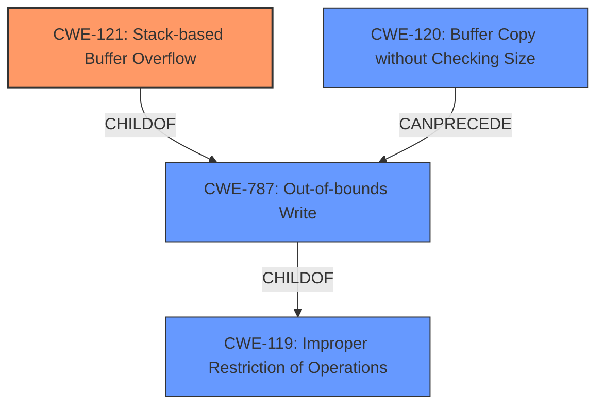

# Analysis Report for CVE-2022-41011

# Vulnerability Analysis Report: CVE-2022-41011

## Description

Several stack-based buffer overflow vulnerabilities exist in the DetranCLI command parsing functionality of Siretta QUARTZ-GOLD G5.0.1.5-210720-141020. A specially-crafted network packet can lead to arbitrary command execution. An attacker can send a sequence of requests to trigger these vulnerabilities.This buffer overflow is in the function that manages the schedule link1 WORD link2 WORD policy (failover|backup) description (WORD|null) command template.

## Vulnerability Description Key Phrases

**Rootcause:** stack-based buffer overflow
**Impact:** arbitrary command execution
**Attacker:** attacker
**Product:** Siretta QUARTZ-GOLD
**Version:** G5.0.1.5-210720-141020
**Component:** DetranCLI command parsing functionality

## Analysis (with Relationship Data)

# Summary
| CWE ID | CWE Name | Confidence | CWE Abstraction Level | CWE Vulnerability Mapping Label | CWE-Vulnerability Mapping Notes |
|---|---|---|---|---|---|
| CWE-121 | Stack-based Buffer Overflow | 0.95 | Variant | Allowed | Primary CWE |
| CWE-120 | Buffer Copy without Checking Size of Input ('Classic Buffer Overflow') | 0.75 | Base | Allowed-with-Review | Secondary Candidate |
| CWE-787 | Out-of-bounds Write | 0.60 | Base | Allowed | Secondary Candidate |

## Evidence and Confidence

*   **Confidence Score:** 0.90
*   **Evidence Strength:** HIGH

- **Analysis and Justification:**  
  - *Explanation:* The vulnerability is described as a **stack-based buffer overflow**. The "CVE Reference Links Content Summary" confirms this by stating, "The `DetranCLI` binary uses `sprintf` with format strings and command parameters without checking the size of the input parameters against the size of the stack buffer, leading to stack-based buffer overflows." This aligns directly with CWE-121 (Stack-based Buffer Overflow), which is a Variant of buffer overflow that occurs on the stack. The description explicitly mentions the stack, making CWE-121 the most appropriate choice. CWE-120 (Buffer Copy without Checking Size of Input) is a more general case of buffer overflow and is less specific than CWE-121 in this context. The "Top CWEs" section in the "CWE for similar CVE Descriptions" section includes CWE-120, but the more specific CWE-121 is a better fit given the explicit mention of stack-based overflow.

  - *Relationship Analysis:* CWE-121 is a Variant of CWE-787 (Out-of-bounds Write) and CWE-119 (Improper Restriction of Operations within the Bounds of a Memory Buffer). Given that the vulnerability is a buffer overflow, CWE-787 is relevant. However, the specific location on the stack makes CWE-121 a more precise classification.

- **Confidence Score:**  
  - Confidence: 0.95 (High confidence due to explicit mention of "stack-based buffer overflow" in the vulnerability description and supporting CVE reference.)

## Criticism of Analysis

Okay, I've reviewed the provided analysis and the full CWE specifications. Here's my critique:

**Overall Assessment:**

The analysis correctly identifies CWE-121 (Stack-based Buffer Overflow) as the primary CWE. The reasoning is sound and well-supported by the vulnerability description and the CVE Reference Links Content Summary. The choice to prioritize CWE-121 over the more general CWE-120 is appropriate, given the explicit mention of the stack. The secondary CWE candidates are also reasonable, but CWE-121 is clearly the best fit.

**Detailed Critique:**

1.  **CWE-121: Stack-based Buffer Overflow (Primary CWE)**

    *   **Correctness:** The mapping is accurate. The vulnerability description mentions "stack-based buffer overflow," and the CVE reference confirms the use of `sprintf` without bounds checking, directly leading to a stack overflow.
    *   **Abstraction Level:** CWE-121 is a Variant, which is a preferred level of abstraction.
    *   **Mapping Guidance Adherence:** The analysis follows the "Allowed" usage guidance for CWE-121.
    *   **Mitigations:** The analysis could be improved by explicitly mentioning some mitigations described in the CWE.
        *   Using compiler flags like `/GS` (Microsoft Visual Studio) or `FORTIFY_SOURCE` (GCC) to enable stack canaries.
        *   Implementing input validation and bounds checking on the input parameters before using them in `sprintf`.
    *   **Confidence:** The confidence score of 0.95 is justified given the strong evidence.

2.  **CWE-120: Buffer Copy without Checking Size of Input ('Classic Buffer Overflow') (Secondary Candidate)**

    *   **Correctness:** While CWE-120 is related, it's less specific than CWE-121.  It's a more general case of a buffer overflow. The analysis correctly identifies this.
    *   **Abstraction Level:** CWE-120 is a Base.
    *   **Mapping Guidance Adherence:** The analysis follows the "Allowed-with-Review" usage guidance for CWE-120.  The review is present and discusses why it is a secondary candidate.
    *   **Mitigations:** The analysis could be improved by briefly mentioning mitigations, such as using safer string handling functions (e.g., `snprintf` instead of `sprintf`) or using a language with automatic memory management.
    *   **Considerations:** It is reasonable to consider this as a secondary because the root cause analysis does not explicitly call out the usage of the `strcpy` style of calls. However, the lack of size checking is present.
    *   **Confidence:** The confidence level of 0.75 is reasonable, reflecting the less direct connection.

3.  **CWE-787: Out-of-bounds Write (Secondary Candidate)**

    *   **Correctness:** CWE-787 is a valid, high-level consequence of a buffer overflow.  The overflow results in writing outside the intended memory boundaries.
    *   **Abstraction Level:** CWE-787 is a Base.
    *   **Mapping Guidance Adherence:** The analysis follows the "Allowed" usage guidance for CWE-787.
    *   **Mitigations:** The analysis could be improved by briefly mentioning mitigations, such as input validation, language selection (using languages with memory safety), and compiler-level protection mechanisms.
    *   **Considerations:** While correct, it's less informative than CWE-121. CWE-787 represents the effect, while CWE-121 represents the specific type and location of the weakness.
    *   **Confidence:** The confidence level of 0.60 is appropriate.

**Suggestions for Improvement:**

*   **Expand Mitigations:** Briefly mention relevant mitigations from the CWE specifications for each CWE.  This adds practical value to the analysis.  For example, under CWE-121, you could add a sentence about enabling stack canaries in the compiler. Under CWE-787, you could briefly mention using memory-safe languages.
*   **Consider a Chaining Relationship:** While not strictly required, it might be beneficial to briefly discuss the potential for a chain involving CWE-20 (Improper Input Validation). If the input parameters to the `DetranCLI` command are not properly validated for length *before* being passed to `sprintf`, this contributes to the overflow. However, it was not explicitly called out in the summary.

**Revised Summary Table (with example mitigations):**

| CWE ID | CWE Name | Confidence | CWE Abstraction Level | CWE Vulnerability Mapping Label | CWE-Vulnerability Mapping Notes |
|---|---|---|---|---|---|
| CWE-121 | Stack-based Buffer Overflow | 0.95 | Variant | Allowed | Primary CWE. Mitigate by using compiler flags like /GS or FORTIFY_SOURCE. |
| CWE-120 | Buffer Copy without Checking Size of Input ('Classic Buffer Overflow') | 0.75 | Base | Allowed-with-Review | Secondary Candidate. Mitigate by using safer string handling functions like snprintf. |
| CWE-787 | Out-of-bounds Write | 0.60 | Base | Allowed | Secondary Candidate. Mitigate by using memory-safe languages. |

**Conclusion:**

This is a solid analysis. The primary CWE is correctly identified and well-justified. The secondary candidates are also relevant. Adding brief mentions of mitigations would further enhance the analysis and make it more actionable. The provided full CWE specifications have helped to add additional context and justification.

## Final Resolution

# Summary
| CWE ID | CWE Name | Confidence | CWE Abstraction Level | CWE Vulnerability Mapping Label | CWE-Vulnerability Mapping Notes |
|---|---|---|---|---|---|
| CWE-121 | Stack-based Buffer Overflow | 0.95 | Variant | Allowed | Primary CWE |
| CWE-120 | Buffer Copy without Checking Size of Input ('Classic Buffer Overflow') | 0.75 | Base | Allowed-with-Review | Secondary Candidate |
| CWE-787 | Out-of-bounds Write | 0.60 | Base | Allowed | Secondary Candidate |

## Evidence and Confidence

*   **Confidence Score:** 0.95
*   **Evidence Strength:** HIGH

## Relationship Analysis
The primary weakness is identified as CWE-121 (**Stack-based Buffer Overflow**), a variant of CWE-787 (**Out-of-bounds Write**) and CWE-119 (**Improper Restriction of Operations within the Bounds of a Memory Buffer**). CWE-120 (**Buffer Copy without Checking Size**) can lead to CWE-787. Since the overflow occurs specifically on the stack, CWE-121 is a more specific and appropriate classification than the base CWE-120 and CWE-787.

## Vulnerability Chain
The vulnerability chain starts with the lack of input validation which is then followed by a buffer copy without checking the size, leading to a stack-based buffer overflow and finally an out-of-bounds write that can lead to arbitrary command execution.
  - **Root Cause:** Missing or insufficient input validation.
  - **Weakness 1:** CWE-120 (**Buffer Copy without Checking Size**) - The `sprintf` function copies data without validating the size of the input.
  - **Weakness 2:** CWE-121 (**Stack-based Buffer Overflow**) - Because data is copied without size checking, a stack-based buffer is overflowed.
  - **Impact:** Arbitrary command execution.

## Summary of Analysis
The initial analysis and criticism both correctly identified CWE-121 (**Stack-based Buffer Overflow**) as the primary CWE. The vulnerability description explicitly mentions a "stack-based buffer overflow," which strongly supports this classification. The CVE Reference Links Content Summary further reinforces this by stating the use of `sprintf` without bounds checking. This explicit evidence makes CWE-121 the most accurate and specific choice.

The graph relationships confirm that CWE-121 is a variant of CWE-787 (**Out-of-bounds Write**) and CWE-119 (**Improper Restriction of Operations**), but it provides the necessary specificity given the stack location. CWE-120 (**Buffer Copy without Checking Size**) is a reasonable secondary candidate as it describes the mechanism that leads to the overflow.

The selection of CWE-121 as the primary CWE is justified due to the explicit mention of "stack-based buffer overflow" in the vulnerability description, the supporting evidence from the CVE reference, and the hierarchical relationship that places it as a specific variant of a more general out-of-bounds write. The use of a Variant CWE here is appropriate because it is more precise than the Base or Class level CWEs. The confidence score of 0.95 reflects the high degree of certainty in this classification.

*Report generated on 2025-03-18 17:14:16*
