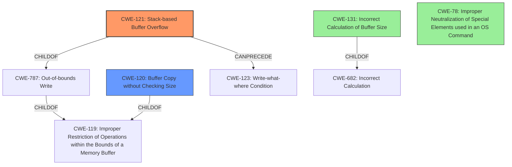

# Final Resolution for CVE-2022-41012

# Summary
| CWE ID | CWE Name | Confidence | CWE Abstraction Level | CWE Vulnerability Mapping Label | CWE-Vulnerability Mapping Notes |
|---|---|---|---|---|---|
| CWE-121 | Stack-based Buffer Overflow | 0.95 | Variant | Allowed | Primary CWE |
| CWE-120 | Buffer Copy without Checking Size of Input ('Classic Buffer Overflow') | 0.75 | Base | Allowed-with-Review | Secondary Candidate |
| CWE-131 | Incorrect Calculation of Buffer Size | 0.60 | Base | Allowed | Tertiary Candidate |
| CWE-78 | Improper Neutralization of Special Elements used in an OS Command ('OS Command Injection') | 0.30 | Base | Allowed | Quaternary Candidate |

## Evidence and Confidence

*   **Confidence Score:** 0.92
*   **Evidence Strength:** HIGH

## Relationship Analysis
The primary CWE is CWE-121 (Stack-based Buffer Overflow), which is a variant of CWE-119 (Improper Restriction of Operations within the Bounds of a Memory Buffer) and a child of CWE-787 (Out-of-bounds Write). The analysis correctly identifies CWE-121 as the most specific and appropriate choice due to the explicit mention of "stack-based buffer overflow" in the vulnerability description. CWE-120 (Buffer Copy without Checking Size) is considered as a secondary candidate, as it represents the lack of size checks when copying data into the buffer. CWE-131 (Incorrect Calculation of Buffer Size) is a tertiary candidate because the lack of size check implies an incorrect buffer size calculation. CWE-78 (Improper Neutralization of Special Elements used in an OS Command) is considered as a quaternary candidate because the result of the buffer overflow could lead to arbitrary command execution.

## Vulnerability Chain
The vulnerability chain starts with the lack of size checks when copying data into a stack-based buffer (CWE-120). This can stem from an incorrect calculation of the buffer size (CWE-131), though this is less direct. The unchecked copy operation leads to a stack-based buffer overflow (CWE-121), which allows an attacker to overwrite memory on the stack, including the return address. If successful, the attacker could achieve arbitrary command execution, which can be related to improper neutralization of special elements used in an OS command (CWE-78) and can lead to a write-what-where condition (CWE-123).

## Summary of Analysis
The initial analysis and criticism are well-reasoned and supported by evidence from the vulnerability description. The primary CWE mapping to CWE-121 is highly appropriate and justified due to the explicit mention of "stack-based buffer overflow." The selection of secondary candidates (CWE-120 and CWE-131) is also defensible, although their confidence levels reflect a more nuanced understanding of their roles. The inclusion of CWE-78 is a valid consideration based on the potential impact of the vulnerability.

The graph relationships influenced the final selection by highlighting the hierarchical relationships between the CWEs. CWE-121 is a variant of CWE-119 and a child of CWE-787, representing the specific case of a stack-based buffer overflow. The other CWEs are included as contributing factors or potential consequences of the vulnerability.

The selected CWEs are at the optimal level of specificity. CWE-121 is a Variant-level CWE that accurately describes the stack-based nature of the buffer overflow. CWE-120 and CWE-131 are included as contributing factors, while CWE-78 represents the potential impact of the vulnerability.