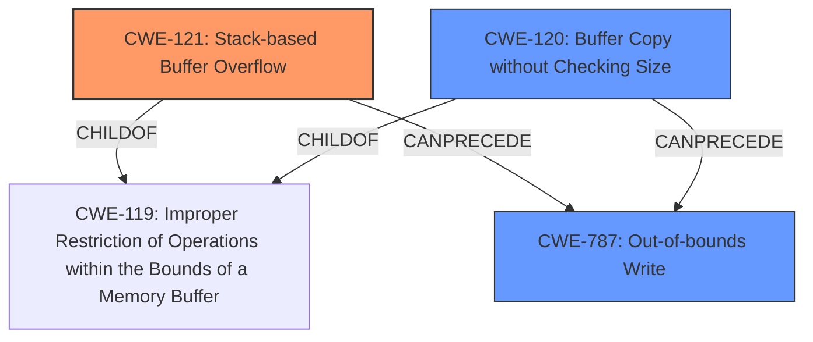

# Final Resolution for CVE-2022-41014

# Summary

| CWE ID    | CWE Name                                                              | Confidence | CWE Abstraction Level | CWE Vulnerability Mapping Label | CWE-Vulnerability Mapping Notes |
| :---------- | :-------------------------------------------------------------------- | :--------- | :-------------------- | :-------------------------------- | :------------------------------ |
| CWE-121     | Stack-based Buffer Overflow                                           | 0.95       | Variant               | Allowed                         | Primary CWE                     |
| CWE-120     | Buffer Copy without Checking Size of Input ('Classic Buffer Overflow') | 0.75       | Base                  | Allowed-with-Review             | Secondary Candidate             |
| CWE-787     | Out-of-bounds Write                                                   | 0.60       | Base                  | Allowed                         | Secondary Candidate             |

## Evidence and Confidence

*   **Confidence Score:** 0.92
*   **Evidence Strength:** HIGH

## Relationship Analysis

The primary relationship that impacted the decision was the parent-child relationship between CWE-119 (Improper Restriction of Operations within the Bounds of a Memory Buffer) and both CWE-121 and CWE-120. CWE-121 is a variant of CWE-119, representing a stack-based buffer overflow, making it more specific than CWE-120, which is a base-level CWE describing a buffer copy without checking size. Additionally, CWE-787 (Out-of-bounds Write) is a consequence of both CWE-121 and CWE-120. This led to including CWE-787 as a secondary candidate. Choosing CWE-121 provides a more precise classification due to the explicit mention of "stack-based" in the vulnerability description.

## Vulnerability Chain

The vulnerability chain starts with a missing check on the size of the input when copying data into a stack-allocated buffer. This lack of validation (**ROOTCAUSE: CWE-120** or **ROOTCAUSE: CWE-121**) leads to a **WEAKNESS: CWE-787**, where the buffer is overwritten. This out-of-bounds write allows an attacker to potentially execute arbitrary commands.

## Summary of Analysis

The initial analysis correctly identified CWE-121 as the primary issue due to the explicit mention of a "stack-based buffer overflow" in the vulnerability description: "Several **stack-based buffer overflow** vulnerabilities exist...". The CVE Reference Links Content Summary reinforces this: "root cause is a **stack-based buffer overflow** and the `sprintf` function copies command parameters into a stack buffer without proper size checks."

The criticism highlighted the importance of acknowledging that CWE-121 leads to CWE-787 (Out-of-bounds Write). Thus, I've added CWE-787 as a secondary candidate.

The graph relationships influenced the final selection by emphasizing the hierarchical relationship between CWE-119, CWE-120 and CWE-121. I considered the parent-child relationship to select the most specific CWE available. Additionally, the potential for CWE-121 and CWE-120 to lead to CWE-787 was considered for the vulnerability chain.

The selected CWEs are at the optimal level of specificity. CWE-121 is a Variant, providing more detail than the Base CWE-120. Given the available information, CWE-121 accurately reflects the root cause of the vulnerability.