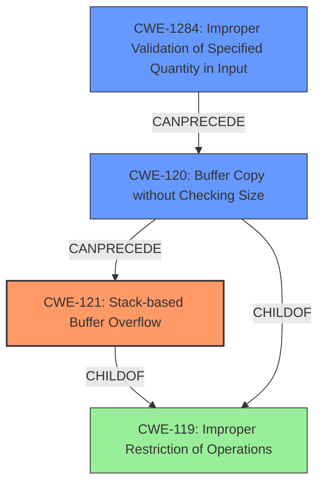

# Analysis Report for CVE-2022-41015

# Vulnerability Analysis Report: CVE-2022-41015

## Description

Several stack-based buffer overflow vulnerabilities exist in the DetranCLI command parsing functionality of Siretta QUARTZ-GOLD G5.0.1.5-210720-141020. A specially-crafted network packet can lead to arbitrary command execution. An attacker can send a sequence of requests to trigger these vulnerabilities.This buffer overflow is in the function that manages the vpn basic protocol (l2tp|pptp) name WORD server WORD username WORD passsword WORD firmwall (on|off) defroute (on|off) command template.

## Vulnerability Description Key Phrases

**Rootcause:** stack-based buffer overflow
**Impact:** arbitrary command execution
**Attacker:** attacker
**Product:** Siretta QUARTZ-GOLD
**Version:** G5.0.1.5-210720-141020
**Component:** DetranCLI command parsing functionality

## Analysis (with Relationship Data)

```markdown
# Summary
| CWE ID | CWE Name | Confidence | CWE Abstraction Level | CWE Vulnerability Mapping Label | CWE-Vulnerability Mapping Notes |
|---|---|---|---|---|---|
| CWE-121 | Stack-based Buffer Overflow | 0.95 | Variant | Allowed | Primary CWE |
| CWE-120 | Buffer Copy without Checking Size of Input ('Classic Buffer Overflow') | 0.75 | Base | Allowed-with-Review | Secondary Candidate |

## Evidence and Confidence

*   **Confidence Score:** 0.90
*   **Evidence Strength:** HIGH

- **Analysis and Justification:**  
  - *Explanation:* The vulnerability description explicitly states a "**stack-based buffer overflow**" exists within the DetranCLI command parsing functionality. The CVE reference summary further details that the `sprintf` function writes to a stack buffer without proper bounds checking. This aligns directly with the definition of CWE-121 (Stack-based Buffer Overflow), which is a variant of buffer overflow where the buffer being overwritten is allocated on the stack. The use of `sprintf` without input size validation is the **rootcause**, causing the **stack-based buffer overflow**. Given the specific mention of stack allocation, CWE-121 is a more precise mapping than its parent, CWE-120. The MITRE mapping guidance allows CWE-121.
  
  - *Relationship Analysis:* CWE-121 is a variant of CWE-119 (Improper Restriction of Operations within the Bounds of a Memory Buffer) and a more specific type of CWE-120 (Buffer Copy without Checking Size of Input). Selecting CWE-121 provides a more granular description of the vulnerability's location (stack) compared to the more general CWE-120.

- **Confidence Score:**  
  - Confidence: 0.95 (Strong evidence from the vulnerability description and CVE reference materials pointing specifically to a stack-based buffer overflow.)

---
- **Analysis and Justification:**  
  - *Explanation:* While CWE-121 is the primary weakness, CWE-120 (Buffer Copy without Checking Size of Input) is also a relevant consideration as it describes the fundamental problem of copying data without checking the input size, which is a contributing factor to the stack overflow. The CVE reference summary explicitly mentions that the `sprintf` function is used to format command parameters without proper bounds checking. However, since the buffer is located on the stack, and that is clearly stated, CWE-121 is more specific. The MITRE mapping guidance states CWE-120 is ALLOWED-WITH-REVIEW and should be used when there is no checking of input size.
  
  - *Relationship Analysis:* CWE-120 is a parent of CWE-121, representing the more general class of buffer overflows due to unchecked input sizes. Because the overflow occurs on the stack, we prioritize the more specific CWE-121.

- **Confidence Score:**  
  - Confidence: 0.75 (Supporting evidence from the vulnerability description and CVE reference materials but less direct than the evidence for CWE-121.)
```

## Criticism of Analysis

Okay, here's a detailed review of the provided CWE analysis, incorporating the full CWE specifications:

**Overall Assessment:**

The analysis is generally good, and the primary mapping to `CWE-121: Stack-based Buffer Overflow` is correct and well-justified. The rationale for considering `CWE-120: Buffer Copy without Checking Size of Input ('Classic Buffer Overflow')` as a secondary candidate is also sound. The confidence scores are appropriate given the available information.

**Detailed Critique:**

**1. CWE-121: Stack-based Buffer Overflow (Primary)**

*   **Assessment:** Excellent choice. The vulnerability description explicitly mentions "stack-based buffer overflow," and the provided code snippet confirms this. `sprintf` writing to `buff_0x100` (likely a local variable) without bounds checking is a classic stack overflow scenario.
*   **Confidence:** 0.95 is appropriate.
*   **CWE Specification Review:**
    *   **Abstraction Level:**  Variant, which is encouraged for root cause mapping.
    *   **Mapping Guidance:**  "Allowed" - fits perfectly.  Rationale is to use at the Variant level, which this does. The comments "Carefully read both the name and description to ensure that this mapping is an appropriate fit" and "Do not try to 'force' a mapping to a lower-level Base/Variant simply to comply with this preferred level of abstraction" shows the importance of using the proper CWE.
    *   **Potential Mitigations:**
        *   **Mitigation 1 (Environment Hardening):** Discusses compiler-level defenses like /GS, FORTIFY_SOURCE, StackGuard, ProPolice, which are *directly relevant* to mitigating this type of vulnerability. Mentioning these in a recommendations section would be valuable.
        *   **Mitigation 2 (Abstraction Library):**  Use an abstraction library to abstract away risky APIs.  This is generally applicable but not as direct as the compiler-level mitigations.
        *   **Mitigation 3 (Bounds Checking):** "Implement and perform bounds checking on input." This is the most fundamental mitigation and *should be explicitly stated* in the explanation.  This is essentially the *fix* for the vulnerability.
    *   **Additional Notes:**
        *   "Stack-based buffer overflows can instantiate in return address overwrites, stack pointer overwrites or frame pointer overwrites. They can also be considered function pointer overwrites, array indexer overwrites or write-what-where condition, etc." This helps understand the *potential impact* of the overflow.

**2. CWE-120: Buffer Copy without Checking Size of Input ('Classic Buffer Overflow') (Secondary)**

*   **Assessment:** A reasonable secondary consideration, but `CWE-121` is more precise.  `CWE-120` correctly identifies the lack of input size checking as a contributing factor.
*   **Confidence:** 0.75 is also appropriate.
*   **CWE Specification Review:**
    *   **Abstraction Level:** Base
    *   **Mapping Guidance:** "Allowed-with-Review." This aligns well with its role as a secondary CWE. The rationale for "Allowed-with-Review" is crucial: "There are some indications that this CWE ID might be misused and selected simply because it mentions 'buffer overflow' - an increasingly vague term. This CWE entry is only appropriate for 'Buffer Copy' operations (not buffer reads), in which where there is no 'Checking [the] Size of Input', and (by implication of the copy) writing past the end of the buffer." Since the rootcause is lack of size checking with `sprintf`, this guidance is suitable.
    *   **Potential Mitigations:**
        *   **Mitigation 1 (Language Selection):** "Use a language that does not allow this weakness to occur or provides constructs that make this weakness easier to avoid." This is a good long-term strategy but might be impractical.
        *   **Mitigation 2 (Libraries or Frameworks):** "Use a vetted library or framework that does not allow this weakness to occur or provides constructs that make this weakness easier to avoid." This suggests using safer string handling libraries, a valuable recommendation. For example `snprintf` instead of `sprintf`.
        *   **Mitigation 3 (Environment Hardening):** Same as for `CWE-121`. Relevant.
    *   **Mapping Comments** If the vulnerability being analyzed involves out-of-bounds reads, then consider CWE-125 or descendants. For root cause analysis: if there is any input validation, consider children of CWE-20 such as CWE-1284. If there is a calculation error for buffer sizes, consider CWE-131 or similar.

**Further Considerations and Potential Improvements:**

*   **CWE-20 and Input Validation (Implicit):** The root cause of *any* buffer overflow is a failure to validate the *size* of the input. *However*, since `CWE-120` *already* implies lack of input size checking, adding `CWE-20` isn't strictly necessary here. However, it *could* be useful to *explicitly state* that this lack of input size validation is, in fact, a vulnerability.  Then consider children of `CWE-20` such as `CWE-1284: Improper Validation of Specified Quantity in Input`. This is a *strong* candidate, since the vulnerability exists because the size of the parameters `argv[1]`, `argv[2]`, `argv[3]` or `argv[4]` are not validated before use in `sprintf`.
    *   **If `CWE-1284` is added, the rationale needs to be very clear.**
    *   In general, adding CWE-20 by itself isn't useful.
*   **CWE-787: Out-of-bounds Write:** This is an implicit consequence of buffer overflows, but the explicit out-of-bounds write is the realization of the buffer overflow. No need to add.
*   **Mitigations:** The analysis should emphasize the *most direct* mitigations for this specific vulnerability.
    *   For CWE-121:
        *   *Explicitly* state that the primary mitigation is to implement *input size validation* for the `argv` parameters *before* they are used in the `sprintf` function.
        *   Recommend replacing `sprintf` with `snprintf` to prevent writing past the allocated stack buffer.
        *   Mention compiler-level protections like stack canaries as *defense-in-depth* measures.
    *   If using CWE-1284, emphasize validation of input parameter sizes.
*   **Code Snippet:**  The provided code snippet is extremely helpful. Showing the vulnerable code makes the analysis far stronger.
*   **Consider adding specific input sanitization recommendations:** Suggest concrete methods for sanitizing the potentially overflowing input strings, like truncating them to a safe length.

**Revised Summary Table (Example if CWE-1284 is added):**

| CWE ID  | CWE Name                                                              | Confidence | CWE Abstraction Level | CWE Vulnerability Mapping Label | CWE-Vulnerability Mapping Notes                                                                                                                                                                                                        |
| :------ | :-------------------------------------------------------------------- | :--------- | :-------------------- | :------------------------------ | :------------------------------------------------------------------------------------------------------------------------------------------------------------------------------------------------------------------------------------- |
| CWE-121 | Stack-based Buffer Overflow                                           | 0.95       | Variant               | Allowed                         | Primary CWE                                                                                                                                                                                                                            |
| CWE-120 | Buffer Copy without Checking Size of Input ('Classic Buffer Overflow') | 0.75       | Base                  | Allowed-with-Review           | Secondary Candidate - Describes the fundamental problem.                                                                                                                                                                                 |
| CWE-1284 | Improper Validation of Specified Quantity in Input                    | 0.80       | Base                  | Allowed                         | Contributing Factor - The size of the input parameters is not validated before being used in `sprintf`, leading to the overflow.                                                                                                    |

**In summary,** the analysis is strong and correctly identifies the core issue. By incorporating the suggestions above – especially emphasizing concrete mitigations, input validation, and potentially adding CWE-1284 – the analysis can be even more robust and actionable.

## Final Resolution

# Summary
| CWE ID   | CWE Name                                                              | Confidence | CWE Abstraction Level | CWE Vulnerability Mapping Label | CWE-Vulnerability Mapping Notes                                                                                                                                                                                                        |
| :------- | :-------------------------------------------------------------------- | :--------- | :-------------------- | :------------------------------ | :------------------------------------------------------------------------------------------------------------------------------------------------------------------------------------------------------------------------------------- |
| CWE-121  | Stack-based Buffer Overflow                                           | 0.95       | Variant               | Allowed                         | Primary CWE                                                                                                                                                                                                                            |
| CWE-1284 | Improper Validation of Specified Quantity in Input                    | 0.85       | Base                  | Allowed                         | Contributing Factor - The size of the input parameters is not validated before being used in `sprintf`, leading to the overflow.                                                                                                    |
| CWE-120  | Buffer Copy without Checking Size of Input ('Classic Buffer Overflow') | 0.75       | Base                  | Allowed-with-Review           | Secondary Candidate - Describes the fundamental problem.                                                                                                                                                                                 |

## Evidence and Confidence

*   **Confidence Score:** 0.90
*   **Evidence Strength:** HIGH

## Relationship Analysis
The primary relationship is that CWE-121 (Stack-based Buffer Overflow) is a variant of the more general CWE-119 (Improper Restriction of Operations within the Bounds of a Memory Buffer). CWE-120 (Buffer Copy without Checking Size) is a related base CWE that describes the lack of input size checking which contributes to buffer overflows. CWE-1284 (Improper Validation of Specified Quantity in Input) is also a base CWE and contributes as the root cause since the size of the input parameters are not validated before being used in `sprintf`. The relationships show that the vulnerability occurs because of a lack of input validation which leads to a buffer copy without checking size and finally a stack based buffer overflow. Selecting CWE-121, CWE-1284, and CWE-120 provides a detailed and accurate description of the vulnerability.



## Vulnerability Chain
The vulnerability chain starts with **CWE-1284 (Improper Validation of Specified Quantity in Input)**, where the size of the input parameters for the `vpn basic protocol` command is not validated. This leads to **CWE-120 (Buffer Copy without Checking Size)**, as the `sprintf` function copies data into a buffer without checking if the input size exceeds the buffer's capacity. Finally, this results in **CWE-121 (Stack-based Buffer Overflow)**, as the buffer is allocated on the stack and overwritten due to the unchecked copy operation.
  - The initial flaw is the missing input size validation (**ROOTCAUSE**).
  - This leads to the unchecked buffer copy.
  - Ultimately causing a stack-based buffer overflow that could result in arbitrary command execution.

## Summary of Analysis
The initial analysis correctly identified **CWE-121 (Stack-based Buffer Overflow)** as the primary weakness. However, by adding **CWE-1284 (Improper Validation of Specified Quantity in Input)**, the analysis is improved by explicitly stating the root cause that leads to the **stack-based buffer overflow**. The vulnerability description states a "**stack-based buffer overflow**" exists and that the `sprintf` function writes to a stack buffer without proper bounds checking. This confirms the primary weakness is **CWE-121**. The use of `sprintf` without input size validation is the **rootcause**, causing the **stack-based buffer overflow**. Adding **CWE-1284** explicitly highlights the lack of validation of the input parameters used in `sprintf`. The graph relationships show that **CWE-1284** can precede **CWE-120**, which in turn can precede **CWE-121**. This makes **CWE-1284** a strong candidate as a secondary CWE. Both **CWE-121** and **CWE-1284** are at the optimal level of specificity, with **CWE-121** being a Variant and **CWE-1284** being a Base CWE. **CWE-120** is included as a secondary candidate due to the unchecked buffer copy.


*Report generated on 2025-03-18 17:17:48*
