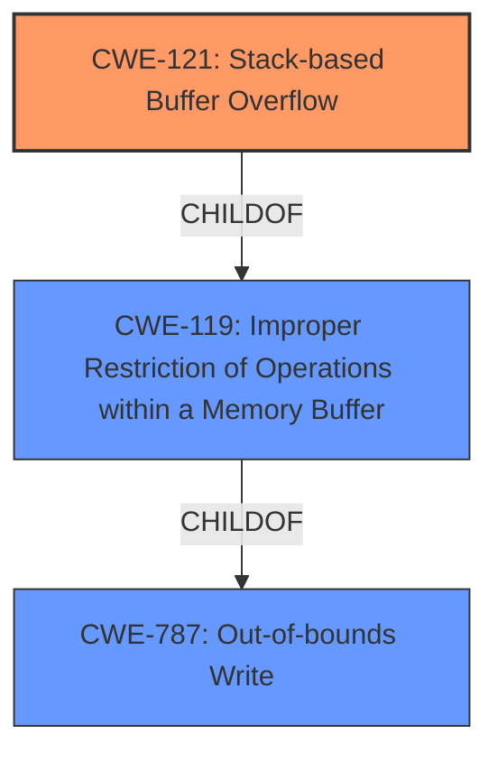

# Analysis Report for CVE-2022-41016

# Vulnerability Analysis Report: CVE-2022-41016

## Description

Several stack-based buffer overflow vulnerabilities exist in the DetranCLI command parsing functionality of Siretta QUARTZ-GOLD G5.0.1.5-210720-141020. A specially-crafted network packet can lead to arbitrary command execution. An attacker can send a sequence of requests to trigger these vulnerabilities.This buffer overflow is in the function that manages the no vpn basic protocol (l2tp|pptp) name WORD server WORD username WORD passsword WORD firmwall (on|off) defroute (on|off) command template.

## Vulnerability Description Key Phrases

**Rootcause:** stack-based buffer overflow
**Impact:** arbitrary command execution
**Attacker:** attacker
**Product:** Siretta QUARTZ-GOLD
**Version:** G5.0.1.5-210720-141020
**Component:** DetranCLI command parsing functionality

## Analysis (with Relationship Data)

# Summary
| CWE ID | CWE Name | Confidence | CWE Abstraction Level | CWE Vulnerability Mapping Label | CWE-Vulnerability Mapping Notes |
|---|---|---|---|---|---|
| CWE-121 | Stack-based Buffer Overflow | 0.95 | Variant | Allowed | Primary CWE |

## Evidence and Confidence

*   **Confidence Score:** 0.95
*   **Evidence Strength:** HIGH

- **Analysis and Justification:**  
  - *Explanation:* The vulnerability description clearly states that there are several **stack-based buffer overflow** vulnerabilities. The **root cause** is a **stack-based buffer overflow** in the DetranCLI command parsing functionality. The CVE Reference Links Content Summary also states "Stack-based buffer overflow (CWE-120) in the `DetranCLI` command parsing functionality.". However, CWE-121 is more specific than CWE-120 as it specifies the overflow is stack-based, which aligns with the description. CWE-121 is a Variant, which is the preferred level of abstraction. The MITRE mapping guidance for CWE-121 indicates this is ALLOWED.

  - *Relationship Analysis:* CWE-121 is a variant of a buffer overflow. It is related to CWE-120 (Buffer Copy without Checking Size of Input) but is more specific.

- **Confidence Score:**  
  - Confidence: 0.95 (High evidence from technical description and CVE reference materials)

---

## Criticism of Analysis

Okay, here's a review of the provided CWE analysis, taking into account the full CWE specifications provided.

**Overall Assessment:**

The analysis is generally good.  The identification of CWE-121 (Stack-based Buffer Overflow) as the primary CWE seems accurate and well-supported by the provided information. The confidence score of 0.95 is also justified.  The reasoning for selecting CWE-121 over CWE-120 is valid, as CWE-121 provides more specificity about the location of the buffer.

**Detailed Review and Suggestions:**

1.  **CWE Selection and Justification:**

    *   **CWE-121: Stack-based Buffer Overflow:** The choice of CWE-121 is correct. The vulnerability description explicitly mentions "stack-based buffer overflow."  The justification provided is sound. The use of `sprintf` without proper bounds checking is a classic cause of this type of vulnerability. The CVE Reference Links Content Summary strongly supports this classification.
    *   The analysis appropriately considered CWE-120 but correctly opted for the more specific variant, CWE-121.

2.  **Confidence Score:**

    *   A confidence score of 0.95 is suitable given the strong evidence provided in both the vulnerability description and the CVE reference summary. The evidence is direct and unambiguous.

3.  **Alternative CWEs Considered (and why they were rejected):**

    *   The analysis implicitly considers other potential CWEs based on the Retriever Results, but it would be beneficial to explicitly address why these CWEs are *not* the primary cause, even if they are related. For example:

        *   **CWE-787: Out-of-bounds Write:**  While a stack-based buffer overflow *is* an out-of-bounds write, CWE-787 is a more general description.  CWE-121 provides the specific context of *where* the write is occurring (the stack).
        *   **CWE-120: Buffer Copy without Checking Size of Input:** As noted, while related, CWE-121 provides the *stack* context. CWE-120 is also flagged as "Allowed-with-Review" due to frequent misuse, so opting for the more specific CWE-121 is a good practice.
        *   **CWE-193: Off-by-one Error** and **CWE-131: Incorrect Calculation of Buffer Size**: These are potential *contributing* factors. It's possible an off-by-one error in a size calculation could lead to the overflow.  However, without explicit information about the code's logic leading to the overflow, these remain speculative and should not be the primary CWE.  If analysis showed these factors, chaining could be considered.
        *   **CWE-1284: Improper Validation of Specified Quantity in Input:** If there's a validation step that attempts to limit the size of the input, but fails, this could be a contributing factor. If the input validation code was present but flawed, CWE-1284 could be chained to CWE-121/CWE-787.

4.  **CWE Relationships:**

    *   The analysis correctly identifies the relationship between CWE-121 and CWE-120. It also correctly notes CWE-121's relationship as a child of CWE-787 (Out-of-bounds Write).

5.  **CWE Examples:**

    *   The provided CWE examples are helpful for understanding the nature of buffer overflows in general, and stack-based overflows in particular. No changes needed here.

6.  **Mitigations:**

    *   The analysis does not directly discuss mitigations. It should be expanded to include mitigations specifically related to CWE-121 and possibly related to the identified root cause (`sprintf` usage).

    *   **CWE-121 Mitigations:**
        *   **Compiler-based protections:** Mention the use of compiler flags like `/GS` (Microsoft Visual Studio) and `-D_FORTIFY_SOURCE` (GCC) to enable stack canaries and other protections.
        *   **Safe String Handling Functions:**  Encourage the use of safer alternatives to `sprintf`, such as `snprintf`, that take a maximum output buffer size as an argument.  This is crucial!
        *   **Input Validation:** Reinforce the importance of strictly validating the size and format of input data before using it in string operations. The vulnerability report indicates there is a "no vpn basic protocol (l2tp|pptp) name WORD server WORD username WORD passsword WORD firmwall (on|off) defroute (on|off) command template" so validation of each WORD is critical.
        *   **Language Choice:** If possible, consider using languages with built-in memory safety features.
        *   **Address Space Layout Randomization (ASLR):** While not a direct mitigation, ASLR makes exploiting stack-based overflows more difficult.

7. **Mapping Guidance:**

*   The analysis should more directly acknowledge that the root cause identified in the CVE Reference Links Content Summary section is "The `DetranCLI` binary uses `sprintf` to format strings based on user-supplied input without proper size checks, leading to stack-based buffer overflows." and use this to inform how mitigations should be applied.

**Revised Summary Table:**

| CWE ID | CWE Name | Confidence | CWE Abstraction Level | CWE Vulnerability Mapping Label | CWE-Vulnerability Mapping Notes |
|---|---|---|---|---|---|
| CWE-121 | Stack-based Buffer Overflow | 0.95 | Variant | Allowed | Primary CWE. Vulnerability caused by the use of `sprintf` with user-supplied input without proper size checks in `DetranCLI` command parsing. |

**Example Expanded Analysis Section:**

- **Analysis and Justification:**
  - *Explanation:* The vulnerability description clearly states that there are several **stack-based buffer overflow** vulnerabilities. The **root cause** is a **stack-based buffer overflow** in the DetranCLI command parsing functionality. The CVE Reference Links Content Summary also states "Stack-based buffer overflow (CWE-120) in the `DetranCLI` command parsing functionality." The vulnerability is caused by the use of `sprintf` with user-supplied input without proper size checks in `DetranCLI` command parsing. However, CWE-121 is more specific than CWE-120 as it specifies the overflow is stack-based, which aligns with the description. CWE-121 is a Variant, which is the preferred level of abstraction. The MITRE mapping guidance for CWE-121 indicates this is ALLOWED.

  - *Relationship Analysis:* CWE-121 is a variant of a buffer overflow. It is related to CWE-120 (Buffer Copy without Checking Size of Input) but is more specific. It is a child of CWE-787 (Out-of-bounds Write).

  - *Mitigation Considerations:* Mitigations should focus on preventing uncontrolled string copying to the stack. Key mitigations include: using `snprintf` or other length-limited string functions instead of `sprintf`; enabling compiler-based stack protection mechanisms (e.g., stack canaries via `/GS` or `-D_FORTIFY_SOURCE`); strictly validating the size and content of all input before using it in string operations; and, if feasible, using memory-safe languages or libraries.
- **Confidence Score:**
  - Confidence: 0.95 (High evidence from technical description and CVE reference materials)

**In summary, the analysis is strong, but it could be improved by explicitly discussing the rejected alternative CWEs and, most importantly, by including a section on specific mitigations tailored to the identified root cause and CWE-121.**

## Final Resolution

# Summary
| CWE ID | CWE Name | Confidence | CWE Abstraction Level | CWE Vulnerability Mapping Label | CWE-Vulnerability Mapping Notes |
|---|---|---|---|---|---|
| CWE-121 | Stack-based Buffer Overflow | 0.95 | Variant | Allowed | Primary CWE. Vulnerability caused by the use of `sprintf` with user-supplied input without proper size checks in `DetranCLI` command parsing. |

## Evidence and Confidence

*   **Confidence Score:** 0.95
*   **Evidence Strength:** HIGH

## Relationship Analysis
The primary relationship that impacted the decision was the hierarchical relationship between CWE-787 (**Out-of-bounds Write**), CWE-119 (**Improper Restriction of Operations within a Memory Buffer**), and CWE-121 (**Stack-based Buffer Overflow**). CWE-121 is a variant of CWE-119, which in turn is a child of CWE-787. Selecting CWE-121 provides the most specific classification, as the vulnerability is explicitly described as a stack-based buffer overflow.

## Vulnerability Chain
The vulnerability chain starts with the use of `sprintf` without proper size checks on user-supplied input within the `DetranCLI` command parsing functionality. This leads to a **stack-based buffer overflow** (CWE-121), where data is written beyond the intended buffer on the stack. The consequence of this overflow can be arbitrary command execution.

## Summary of Analysis
The initial analysis correctly identified CWE-121 (**Stack-based Buffer Overflow**) as the primary CWE. The criticism highlighted the importance of explicitly addressing why other potential CWEs were rejected and suggested including specific mitigations.

The decision is primarily based on the provided evidence, specifically the vulnerability description stating "Several stack-based buffer overflow vulnerabilities exist" and the CVE Reference Links Content Summary stating "Stack-based buffer overflow (CWE-120) in the `DetranCLI` command parsing functionality.".

The graph relationships influenced the final selection by confirming that CWE-121 is the most specific and appropriate classification within the hierarchy of buffer overflow related CWEs.

The selected CWE is at the optimal level of specificity because it accurately reflects the nature of the vulnerability as a **stack-based buffer overflow**, and the evidence strongly supports this classification. The use of `sprintf` without validation is the **rootcause** that allows the buffer overflow.

*Report generated on 2025-03-18 17:18:28*
