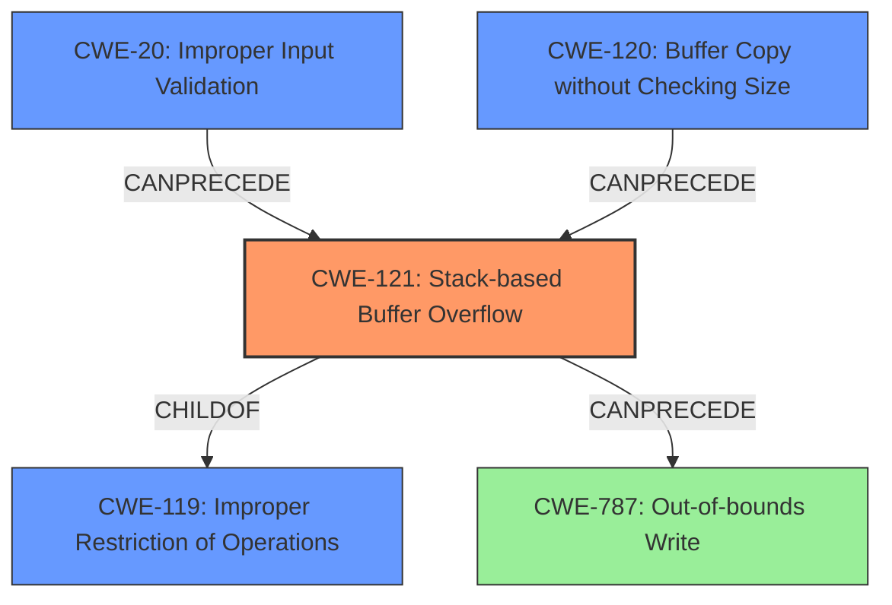

# Final Resolution for CVE-2022-41017

# Summary
| CWE ID  | CWE Name                                                                    | Confidence | CWE Abstraction Level | CWE Vulnerability Mapping Label | CWE-Vulnerability Mapping Notes |
| :-------- | :-------------------------------------------------------------------------- | :---------- | :-------------------- | :------------------------------ | :----------------------------- |
| CWE-121 | Stack-based Buffer Overflow                                               | 0.90      | Variant               | Primary                         | Allowed                        |
| CWE-20  | Improper Input Validation                                                   | 0.75      | Class                 | Contributing                    | Allowed                        |
| CWE-120 | Buffer Copy without Checking Size of Input ('Classic Buffer Overflow') | 0.65      | Base                  | Contributing                    | Allowed-with-Review           |
| CWE-787  | Out-of-bounds Write                                                         | 0.70      | Base                  | Secondary                       | Allowed                        |

## Evidence and Confidence

*   **Confidence Score:** 0.90
*   **Evidence Strength:** HIGH

## Relationship Analysis
The primary **WEAKNESS** is a **CWE-121 (Stack-based Buffer Overflow)**, which is a variant of **CWE-119 (Improper Restriction of Operations within the Bounds of a Memory Buffer)**. The overflow occurs because the input size isn't validated (**CWE-20 (Improper Input Validation)**) before being copied using `sprintf`, a buffer copy operation (**CWE-120 (Buffer Copy without Checking Size of Input)**). The result of the overflow is an out-of-bounds write (**CWE-787 (Out-of-bounds Write)**).

## Vulnerability Chain
The vulnerability chain starts with **CWE-20 (Improper Input Validation)**, where the size of the input strings is not validated. This leads to **CWE-120 (Buffer Copy without Checking Size of Input)** via the `sprintf` function, resulting in **CWE-121 (Stack-based Buffer Overflow)**. The direct consequence of the overflow is **CWE-787 (Out-of-bounds Write)**, which can lead to arbitrary code execution.
  - **Root Cause:** Improper Input Validation (CWE-20)
  - **Weakness:** Stack-based Buffer Overflow (CWE-121)
  - **Impact:** Out-of-bounds Write (CWE-787)

## Summary of Analysis
The initial analysis correctly identified **CWE-121 (Stack-based Buffer Overflow)** as the primary **WEAKNESS**. The criticism highlighted the importance of **CWE-20 (Improper Input Validation)** as a contributing factor, since the root cause is the lack of input validation on the arguments. Additionally, the criticism suggested including **CWE-787 (Out-of-bounds Write)** as a secondary consequence. The vulnerability description explicitly states a "stack-based buffer overflow" exists. The CVE reference summary confirms this, stating the "**root cause** of the vulnerability is a **stack-based buffer overflow**" due to the use of `sprintf` without proper bounds checking. The graph relationships clearly show how the lack of input validation leads to the buffer overflow and subsequent out-of-bounds write.

The selected CWEs are at the optimal level of specificity because:
  - **CWE-121** is a variant that accurately describes the type of buffer overflow (stack-based).
  - **CWE-20** captures the root cause of the vulnerability, which is the lack of input validation.
  - **CWE-787** represents the direct consequence of the buffer overflow.
  - **CWE-120** is a contributing factor as the overflow is caused by a buffer copy without size checking.