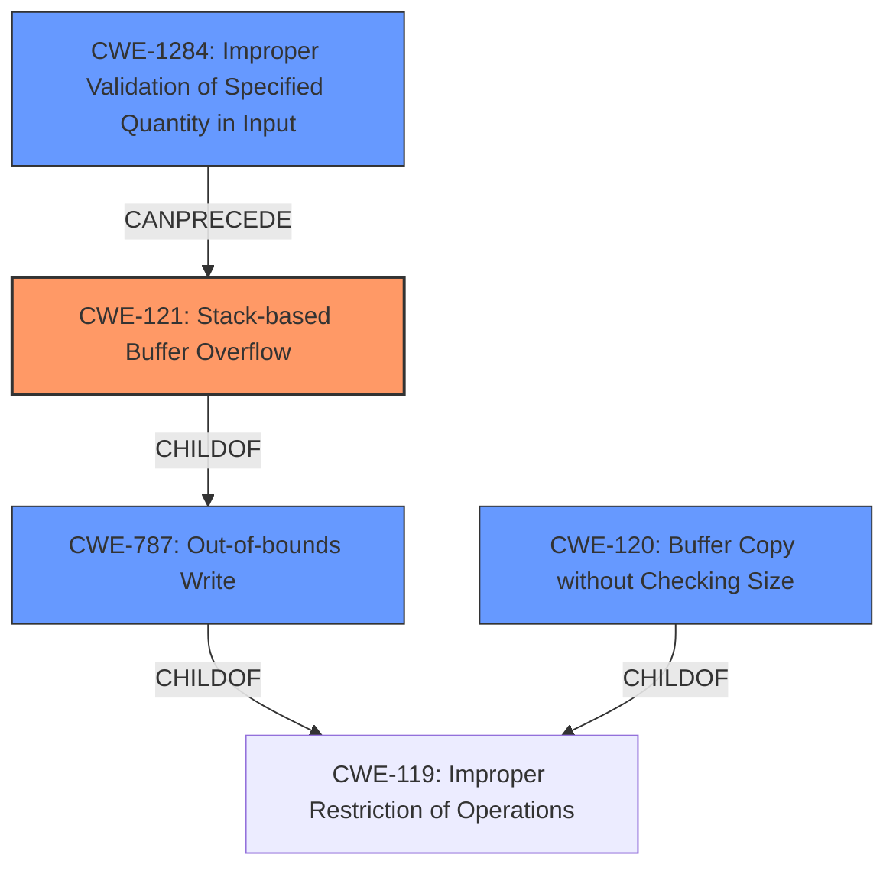

# Analysis Report for CVE-2022-41024

# Vulnerability Analysis Report: CVE-2022-41024

## Description

Several stack-based buffer overflow vulnerabilities exist in the DetranCLI command parsing functionality of Siretta QUARTZ-GOLD G5.0.1.5-210720-141020. A specially-crafted network packet can lead to arbitrary command execution. An attacker can send a sequence of requests to trigger these vulnerabilities.This buffer overflow is in the function that manages the no vpn pptp advanced name WORD dns (yes|no) mtu mru mppe (on|off) stateful (on|off) command template.

## Vulnerability Description Key Phrases

**Rootcause:** stack-based buffer overflow
**Impact:** arbitrary command execution
**Vector:** specially-crafted network packet
**Product:** Siretta QUARTZ-GOLD
**Version:** G5.0.1.5-210720-141020
**Component:** DetranCLI command parsing functionality

## Analysis (with Relationship Data)

```markdown
# Summary 
| CWE ID | CWE Name | Confidence | CWE Abstraction Level | CWE Vulnerability Mapping Label | CWE-Vulnerability Mapping Notes |
|---|---|---|---|---|---|
| CWE-121 | Stack-based Buffer Overflow | 0.9 | Variant | Allowed | Primary CWE |
| CWE-120 | Buffer Copy without Checking Size of Input ('Classic Buffer Overflow') | 0.7 | Base | Allowed-with-Review | Secondary Candidate |

## Evidence and Confidence

*   **Confidence Score:** 0.9
*   **Evidence Strength:** HIGH

- **Analysis and Justification:**  
  - *Explanation:* The vulnerability description explicitly states "**stack-based buffer overflow**" and the CVE reference link summaries reiterate that the root cause is a stack-based buffer overflow due to unchecked input sizes with the `sprintf` function. CWE-121 (Stack-based Buffer Overflow) is a Variant of CWE-119 (Improper Restriction of Operations within the Bounds of a Memory Buffer) and is a more specific match than the Base level CWE-120 (Buffer Copy without Checking Size of Input). The `sprintf` function copies data to the buffer without size checking. The use of a stack buffer makes CWE-121 the more precise choice. MITRE mapping guidance allows CWE-121 at the Variant level of abstraction.

  - *Relationship Analysis:* CWE-121 is a variant of CWE-119. The vulnerability involves writing past the end of a buffer allocated on the stack. CWE-787 (Out-of-bounds Write) is a parent of CWE-121, but CWE-121 is more specific and suitable in this context.

- **Confidence Score:**  
  - *Example:* Confidence: 0.9 (High evidence from technical description, CVE reference materials, and explicit mention of "stack-based buffer overflow")

---
```

## Criticism of Analysis

Okay, I've reviewed your analysis and the provided CWE specifications. Here's my critique:

**Overall Assessment:**

The analysis is generally sound and arrives at the correct primary CWE (CWE-121). The justification for choosing CWE-121 over CWE-120 is also correct. The explanation is thorough and well-reasoned.

**Specific Comments and Suggestions:**

1.  **CWE-121 as Primary CWE (Confidence 0.9):**
    *   **Strengths:**  The choice of CWE-121 is appropriate given the explicit mention of "stack-based buffer overflow" in the vulnerability description and the code snippet confirms the overflow happens on a stack allocated buffer.
    *   **Justification:** The explanation clearly articulates why CWE-121 is a more precise match than CWE-120. It correctly points out that CWE-121 is a *Variant* of CWE-119 and focuses on stack allocation, making it more specific.  The reference to MITRE mapping guidance is valuable.
    *   **Suggestion:** No changes needed. The confidence score of 0.9 is well justified.

2.  **CWE-120 as Secondary Candidate (Confidence Implied, but Should be Lower):**
    *   **Strengths:**  Acknowledging CWE-120 is worthwhile, since it represents the broader class of buffer overflows where input size isn't checked before copying. The code snippet show that `sprintf` function is used, which is known for buffer copy issues.
    *   **Weaknesses:**  It's less specific than CWE-121 because it doesn't explicitly capture the "stack" aspect. The usage of `sprintf` without size validation is the core of the issue, which CWE-120 reflects.

3.  **General Strengths:**

    *   **Evidence Strength:** The evidence is indeed HIGH as there is an explicit mention of "stack-based buffer overflow" and source code evidence that supports a lack of size validation when copying to stack buffer.
    *   **Relationship Analysis:** The relationship analysis is accurate. CWE-121 is correctly identified as a child of CWE-787 and CWE-119.
    *   **Mitigation Awareness:** While not explicitly stated, the analysis demonstrates understanding of mitigations by identifying unchecked input with `sprintf`. A language with automatic memory management will avoid this issue. Stack canaries will detect the buffer overflow.
    *   **CWE Examples:** The examples provided for CWE-120 are relevant to buffer overflow vulnerabilities in general.

4.  **Recommendations:**

    * Consider including the **CWE-787 (Out-of-bounds Write)** for the secondary candidate. Since CWE-121 is a child of CWE-787, it could be useful to mention the parent.

    *   **Input Validation (CWE-20 and CWE-1284):** It would be beneficial to explicitly mention the *lack* of input validation in the analysis as a contributing factor. `sprintf` is dangerous when combined with lack of validation on its arguments. While CWE-120 implies the lack of size checking, highlighting the broader input validation issue could be valuable, leading to detection of *improper* input validation.
     * The attacker controls the `WORD` parameter in the vulnerable code
     ```
     sprintf(buff_0x100,"%d<%s<%d<%s<%s<%d<%d<%s",1,*argv,based_on_argv[1],argv[2],argv[3],based_on_argv[4],based_on_argv[5],"");
     ```
     Therefore the `WORD` parameter is copied to stack buffer `buff_0x100` without proper size check. This is an instance of CWE-1284.
        Therefore consider adding  **CWE-1284: Improper Validation of Specified Quantity in Input** as a contributing factor.

**Revised Summary Table**
```markdown
# Summary 
| CWE ID | CWE Name | Confidence | CWE Abstraction Level | CWE Vulnerability Mapping Label | CWE-Vulnerability Mapping Notes |
|---|---|---|---|---|---|
| CWE-121 | Stack-based Buffer Overflow | 0.9 | Variant | Allowed | Primary CWE |
| CWE-787 | Out-of-bounds Write | 0.6 | Base | Allowed | Secondary Candidate |
| CWE-120 | Buffer Copy without Checking Size of Input ('Classic Buffer Overflow') | 0.5 | Base | Allowed-with-Review | Contributing Factor |
| CWE-1284 | Improper Validation of Specified Quantity in Input | 0.4 | Base | Allowed | Contributing Factor |
```

**Justification for Revisions:**

*   **CWE-787** is a direct parent of the actual variant. The `sprintf` without size checking causes a write beyond what is allocated in stack.
*   **CWE-120** highlights the root cause of the lack of buffer size checking.
* **CWE-1284** is a missing input validation on `WORD` parameter of DetranCLI.

By incorporating these suggestions, the analysis becomes more complete and nuanced, capturing the various facets of the vulnerability. The explicit acknowledgement of the lack of input validation (via CWE-20 or CWE-1284) and the more direct parent CWE (CWE-787) will enrich the understanding of the vulnerability.

## Final Resolution

# Summary
| CWE ID | CWE Name | Confidence | CWE Abstraction Level | CWE Vulnerability Mapping Label | CWE-Vulnerability Mapping Notes |
|---|---|---|---|---|---|
| CWE-121 | Stack-based Buffer Overflow | 0.9 | Variant | Allowed | Primary CWE |
| CWE-787 | Out-of-bounds Write | 0.7 | Base | Allowed | Secondary Candidate |
| CWE-1284 | Improper Validation of Specified Quantity in Input | 0.6 | Base | Allowed | Contributing Factor |
| CWE-120 | Buffer Copy without Checking Size of Input ('Classic Buffer Overflow') | 0.5 | Base | Allowed-with-Review | Contributing Factor |

## Evidence and Confidence

*   **Confidence Score:** 0.9
*   **Evidence Strength:** HIGH

## Relationship Analysis
The primary CWE is CWE-121 (**Stack-based Buffer Overflow**), which is a variant of CWE-119 (**Improper Restriction of Operations within the Bounds of a Memory Buffer**) and a child of CWE-787 (**Out-of-bounds Write**). CWE-1284 (**Improper Validation of Specified Quantity in Input**) contributes to the vulnerability by not validating the size of the input before it's copied to the stack buffer. CWE-120 (**Buffer Copy without Checking Size of Input**) is a base class of buffer overflow that describes the core issue of copying without size checks. The relationships demonstrate a clear progression from input validation failure to out-of-bounds write on the stack. The abstraction levels are appropriately chosen to reflect the specificity of the vulnerability.



## Vulnerability Chain
The vulnerability chain starts with **CWE-1284 (Improper Validation of Specified Quantity in Input)**, where the size of the input 'WORD' parameter is not validated. This leads to **CWE-120 (Buffer Copy without Checking Size of Input)** when `sprintf` copies the unvalidated input to a stack buffer without checking its size. This results in **CWE-121 (Stack-based Buffer Overflow)**, a specific type of **CWE-787 (Out-of-bounds Write)**, as data is written beyond the boundaries of the stack-allocated buffer. The ultimate impact is arbitrary command execution.

## Summary of Analysis
The initial analysis correctly identified **CWE-121 (Stack-based Buffer Overflow)** as the primary weakness, based on the explicit mention in the vulnerability description: "Several stack-based buffer overflow vulnerabilities exist...". The criticism suggested adding **CWE-787 (Out-of-bounds Write)** and **CWE-1284 (Improper Validation of Specified Quantity in Input)** as contributing factors, which is a valuable addition. The `sprintf` function's use without size validation leads to the overflow. The final determination includes **CWE-121** as the primary issue, **CWE-787** as a general out-of-bounds write, and **CWE-1284** and **CWE-120** as contributing factors that lead to the overflow. The chosen CWEs are at the optimal level of specificity, with **CWE-121** accurately representing the stack-based nature of the overflow, **CWE-787** representing the more general out-of-bounds write, and **CWE-1284** capturing the lack of input validation.

The vulnerability description states, "This buffer overflow is in the function that manages the no vpn pptp advanced name WORD dns (yes|no) mtu mru mppe (on|off) stateful (on|off) command template." The `WORD` parameter is copied to a stack buffer via `sprintf`, and if this parameter is not validated for size, a stack-based buffer overflow can occur.

The graph relationships influenced the selection by highlighting the hierarchical relationship between **CWE-121** and its parents, **CWE-787** and **CWE-119**. This helped to ensure that the chosen CWEs were at the appropriate level of specificity. The `CANPRECEDE` relationship from **CWE-1284** to **CWE-121** helped to identify the role of input validation in the vulnerability.


*Report generated on 2025-03-18 17:21:04*
