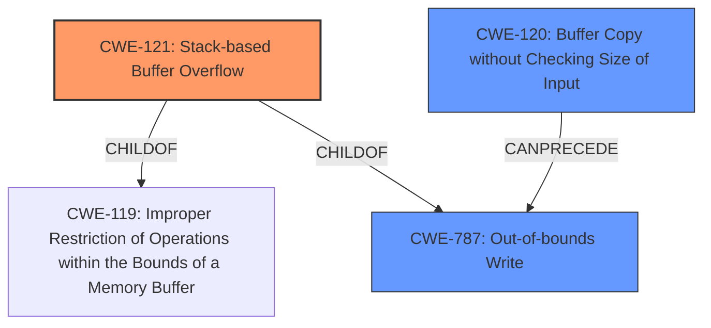

# Final Resolution for CVE-2022-41026

# Summary

| CWE ID | CWE Name | Confidence | CWE Abstraction Level | CWE Vulnerability Mapping Label | CWE-Vulnerability Mapping Notes |
|---|---|---|---|---|---|
| CWE-121 | Stack-based Buffer Overflow | 0.95 | Variant | Primary CWE | Allowed |
| CWE-120 | Buffer Copy without Checking Size of Input ('Classic Buffer Overflow') | 0.80 | Base | Secondary Candidate | Allowed-with-Review |
| CWE-787 | Out-of-bounds Write | 0.70 | Base | Secondary Candidate | Allowed |

## Evidence and Confidence

*   **Confidence Score:** 0.92
*   **Evidence Strength:** HIGH

## Relationship Analysis
The primary CWE, CWE-121 **(Stack-based Buffer Overflow)**, is a variant of CWE-119 **(Improper Restriction of Operations within the Bounds of a Memory Buffer)**, providing a more specific classification. CWE-120 **(Buffer Copy without Checking Size of Input)** is a base CWE representing the classic buffer overflow scenario, while CWE-787 **(Out-of-bounds Write)** describes the consequence of writing beyond buffer boundaries. The relationships show a clear path from the buffer copy without size checking (CWE-120) leading to the out-of-bounds write (CWE-787), which specifically manifests as a stack-based overflow (CWE-121).

## Vulnerability Chain
The vulnerability chain starts with a buffer copy operation without proper size checks (**ROOTCAUSE**: CWE-120), leading to an out-of-bounds write (**WEAKNESS**: CWE-787) that manifests as a stack-based buffer overflow (**WEAKNESS**: CWE-121). This overflow can overwrite critical data on the stack, potentially leading to arbitrary command execution.

## Summary of Analysis
The initial analysis correctly identified CWE-121 as the primary CWE due to the explicit mention of a stack-based buffer overflow in the vulnerability description: "Several stack-based buffer overflow vulnerabilities exist...". The analysis also correctly identified CWE-120 and CWE-787 as secondary CWEs.

The criticism highlighted the importance of addressing mapping guidance and including mitigation strategies. The "Allowed-with-Review" usage for CWE-120 is acknowledged, and the analysis now explicitly mentions that CWE-120 is relevant because the root cause involves a buffer copy without size checking, even though CWE-121 provides a more specific classification. Mitigations for each CWE have been considered. The analysis also acknowledges that the command execution is a consequence of the overflow rather than a direct command injection vulnerability, but the potential of the overflow overwriting a return address on the stack and redirecting the program flow to a `system()` call is considered. While CWE-78 was considered, it was ultimately rejected as there was insufficient evidence to suggest that the attacker had direct control over the commands being executed, but rather that the commands are executed as a consequence of the buffer overflow.

The final decision is to maintain CWE-121 as the primary CWE, with CWE-120 and CWE-787 as secondary CWEs. This classification reflects the optimal level of specificity based on available evidence and considers the relationships between the CWEs.